## 判断链表有环

### 题目

有一个单向链表，链表中有可能出现 “环”，就像下图这样。那么，如何用程序来判断该链表是否为有环链表。

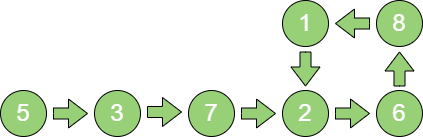

### 解题思路

**方法1：**

首先从头节点开始，依次遍历单链表中的每一个节点。每遍历一个新节点，就从头检查新节点之前的所有节点，用新节点和此节点之前所有节点依次做比较。如果发现新节点和之前的某个节点相同，则说明该节点被遍历过两次，链表有环；如果之前的所有节点中不存在与新节点相同的节点，就继续遍历下一个新节点，继续重复刚才的操作。

::: info
假设链表的节点数量为 `n`，则该解法的时间复杂度为 **O(n^2^)**。由于并没有创建额外的存储空间，所以空间复杂度为 **O(1)**
:::

**方法2：**

首先创建一个以节点ID 为 `Key` 的 `set` 集合，用来存储曾经遍历过的节点。然后同样从头节点开始，依次遍历单链表中的每一个节点。每遍历一个新节点，都用新节点和 `set` 集合中存储的节点进行比较，如果发现 `set` 中存在与之相同的节点ID，则说明链表有环，如果 `set` 中不存在与新节点相同的节点ID，就把这个新节点ID 存入 `set` 中，之后进入下一节点，继续重复刚才的操作。

::: info
假设链表的节点数量为 `n`，则该解法的时间复杂度是 **O(n)**。由于使用了额外的存储空间，所以算法的空间复杂度同样是 **O(n)**
:::

**方法3：**

首先创建两个指针 `p1` 和 `p2`（在 Python 里就是两个对象引用），让它们同时指向这个链表的头节点。然后开始一个大循环，在循环体中，让指针 `p1` 每次向后移动一个节点，让指针 `p2` 每次向后移动两个节点，然后比较两个指针指向的节点是否相同。如果相同，则可以判断出链表有环，如果不同，则继续下一次循环。

第 `1` 步，`p1` 和 `p2` 都指向节点5。

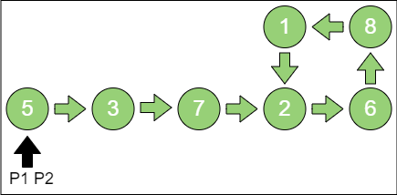

第 `2` 步，`p1` 指向节点3，`p2` 指向节点7。

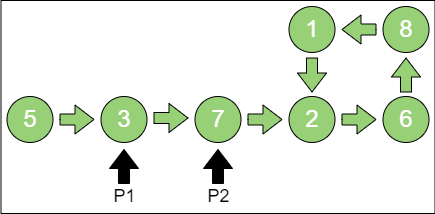

第 `3` 步，`p1` 指向节点7，`p2` 指向节点6。

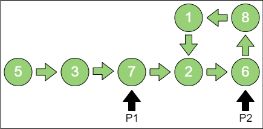

第 `4` 步，`p1`指向节点2，`p2`指向节点1。

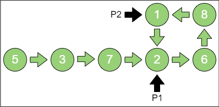

第 `5` 步，`p1`指向节点6，`p2`也指向节点6，`p1` 和 `p2` 所指相同，说明链表有环。

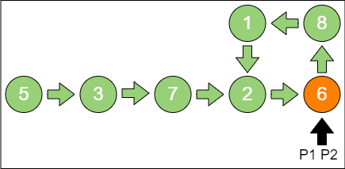

::: info
假设链表的节点数量为 `n`，则该算法的时间复杂度为 **O(n)**。除两个指针外，没有使用任何额外的存储空间，所以空间复杂度是 **O(1)**
:::

::: details 代码

```python
class Node:
    def __init__(self, data):
        self.data = data
        self.next = Node


def is_cycle(head):
    p1 = head
    p2 = head

    while p2 is not None and p2.next is not None:
        p1 = p1.next
        p2 = p2.next.next

        if p1 == p2:
            return True
    
    return False


node1 = Node(5)
node2 = Node(3)
node3 = Node(7)
node4 = Node(2)
node5 = Node(6)
node1.next = node2
node2.next = node3
node3.next = node4
node4.next = node5
node5.next = node2
print(is_cycle(node1))
```

:::

### 问题扩展

**扩展问题1**：如果链表有环，如何求出环的长度？

当两个指针首次相遇，证明链表有环的时候，让两个指针从相遇点继续循环前进，并统计前进的循环次数，直到两个指针第 `2` 次相遇。此时，统计出来的前进次数就是环长。

因为指针 `p1` 每次走一步，指针 `p2` 每次走两步，两者的速度差是一步。当两个指针再次相遇时，`p2` 比 `p1` 多走了整整一圈。因此，**环长 = 每一次速度差 × 前进次数 = 前进次数。**

**扩展问题2**：如果链表有环，如何求出入环节点？

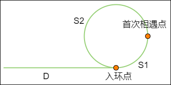

假设从链表头节点到入环点的距离是 `D`，从入环点到两个指针首次相遇点的距离是 `S1`，从首次相遇点回到入环点的距离是 `S2`。

那么，当两个指针首次相遇时，各自所走的距离是多少呢？

指针 `p1` 一次只走一步，所走的距离是 **D + S1。**

指针 `p2` 一次走两步，多走了 `n（n >= 1）` 整圈，所走的距离是 `D + S1 + n(S1 + S2)`。

由于 `p2` 的速度是 `p1` 的两倍，所以所走距离也是 `p1` 的两倍，因此：`2(D + S1) = D + S1 + n(S1 + S2)`，等式经过整理得出：`D = (n - 1)(S1 + S2) + S2`

也就是说，从链表头节点到入环点的距离，等于从首次相遇点绕环 `n - 1` 圈再回到入环点的距离。

这样一来，只要把其中一个指针放回到头节点位置，另一个指针保持在首次相遇点，两个指针都是每次向前走一步。那么，它们最终相遇的节点，就是入环节点。

## 最小栈的实现

### 题目

实现一个栈，该栈带有出栈（pop）、入栈（push）、取最小元素（get_min）三个方法。要保证这三个方法的时间复杂度都是 **O(1)。**

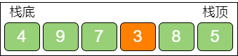

### 解题思路

第 `1` 步，设原有的栈叫作栈A，此时创建一个额外的 “备胎” 栈B，用于辅助栈A。

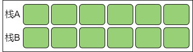

第 `2` 步，当第一个元素进入栈A 时，让新元素也进入栈B。这个唯一的元素是栈A 的当前最小值。

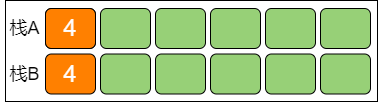

第 `3` 步，之后，每当新元素进入栈A 时，比较新元素和栈A 当前最小值的大小，如果小于栈A 当前最小值，则让新元素进入栈B，此时栈B 的栈顶元素就是栈A 当前最小值。

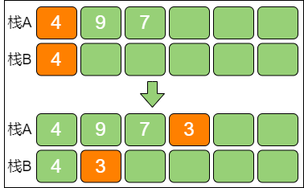

第 `4` 步，每当栈A 有元素出栈时，如果出栈元素是栈A 当前最小值，则让栈B 的栈顶元素也出栈。此时栈B 余下的栈顶元素所指向的是栈A 中原本第二小的元素，代替刚才的出栈元素成为栈A 的当前最小值。

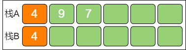

第 `5` 步，当调用 `get_min` 方法时，返回栈B 的栈顶所存储的值，这也是栈A 的最小值。

显然，这个解法中进栈、出栈、取最小值的时间复杂度都是 **O(1)**，最坏情况空间复杂度是 **O(n)。**

::: details 代码

```python
class MinStack:
    def __init__(self):
        self.main_stack = []
        self.min_stack = []
    
    def push(self, element):
        self.main_stack.append(element)
        # 若辅助栈为空，或新元素的值小于或等于辅助栈栈顶元素的值，将新元素压入辅助栈
        if (len(self.min_stack) == 0) or (element <= self.min_stack[len(self.min_stack) - 1]):
            self.min_stack.append(element)
    
    def pop(self):
        # 如果出栈元素和辅助栈栈顶元素的值相等，辅助栈的栈顶元素出栈
        if self.main_stack[len(self.main_stack) - 1] == self.min_stack[len(self.min_stack) - 1]:
            self.min_stack.pop()
        
        return self.main_stack.pop()
    
    def get_min(self):
        if len(self.main_stack) == 0:
            return None
        
        return self.min_stack[len(self.min_stack) - 1]


my_stack = MinStack()
my_stack.push(4)
my_stack.push(9)
my_stack.push(7)
my_stack.push(3)
my_stack.push(8)
my_stack.push(5)
print(my_stack.get_min())
my_stack.pop()
my_stack.pop()
my_stack.pop()
print(my_stack.get_min())
```

:::

## 求出最大公约数

### 题目

写一段代码，求出两个整数的最大公约数，要尽量优化算法的性能。

### 解题思路

**方法1：**

使用 “暴力枚举” 的方法，从较小整数的一半开始，试图找到一个合适的整数 `i`，看看这个整数能否被 `a` 和 `b` 同时整除。

::: info
时间复杂度是 **O(min(a, b))**
:::

::: details 代码

```python
def get_greatest_common_divisor(a, b):
    big = max(a, b)
    small = min(a, b)

    if big % small == 0:
        return small
    
    for i in range(small // 2, 1, -1):
        if small % i == 0 and big % i == 0:
            return i
    
    return 1


print(get_greatest_common_divisor(25, 5))
print(get_greatest_common_divisor(100, 75))
print(get_greatest_common_divisor(99, 55))
```

:::

**方法2：**

::: info
**辗转相除法**，又名 [欧几里得算法（Euclidean algorithm）](https://baike.baidu.com/item/%E6%AC%A7%E5%87%A0%E9%87%8C%E5%BE%97%E7%AE%97%E6%B3%95/1647675)，该算法的目的是求出两个正整数的最大公约数。它是已知最古老的算法，其产生时间可追溯至公元前 300 年。
:::

这条算法基于一个定理：**两个正整数 a 和 b（a > b），它们的最大公约数等于 a 除以 b 的余数 c 和 b 之间的最大公约数**。例如：`10` 和 `25`，`25` 除以 `10` 商 `2` 余 `5`，那么 `10` 和 `25` 的最大公约数，等于 `10` 和 `5` 的最大公约数。

::: info
时间复杂度可以近似为 **O(log(max(a, b)))**，但是取模运算性能较差
:::

首先，计算出 `a` 除以 `b` 的余数 `c`，把问题转化成求 `b` 和 `c` 的最大公约数；然后计算出 `b` 除以 `c` 的余数 `d`，把问题转化成求 `c` 和 `d` 的最大公约数；再计算出 `c` 除以 `d` 的余数 `e`，把问题转化成求 `d` 和 `e` 的最大公约数……

以此类推，逐渐把两个较大整数之间的运算简化成两个较小整数之间的运算，直到两个数可以整除，或者其中一个数减小到 `1` 为止。

::: details 代码

```python
def get_greatest_common_divisor_v2(a, b):
    big = max(a, b)
    small = min(a, b)

    if big % small == 0:
        return small
    
    return get_greatest_common_divisor_v2(big % small, small)


print(get_greatest_common_divisor_v2(25, 5))
print(get_greatest_common_divisor_v2(100, 75))
print(get_greatest_common_divisor_v2(99, 55))
```

:::

当两个整数较大时，做 `a % b` 取模运算的性能会比较差。这时需要用到另一个算法 **更相减损术。**

**方法3：**

::: info
[更相减损术](https://baike.baidu.com/item/%E6%9B%B4%E7%9B%B8%E5%87%8F%E6%8D%9F%E6%9C%AF/449183) 出自中国古代的 《九章算术》，也是一种求最大公约数的算法。
:::

它的原理更加简单：**两个正整数 a 和 b（a > b），它们的最大公约数等于 a - b 的差值 c 和较小数 b 的最大公约数**。例如：`10` 和 `25`，`25` 减 `10` 的差是 `15`，那么 `10` 和 `25` 的最大公约数，等同于 `10` 和 `15` 的最大公约数。

::: info
避免了取模运算，但是算法性能不稳定，最坏时间复杂度为 **O(max(a, b))**
:::

由此，同样可以通过递归来简化问题。首先，计算出 `a` 和 `b` 的差值 `c`（假设 `a > b`），把问题转化成求 `b` 和 `c` 的最大公约数；然后计算出 `c` 和 `b` 的差值 `d`（假设 `c > b`），把问题转化成求 `b` 和 `d` 的最大公约数；再计算出 `b` 和 `d` 的差值 `e`（假设 `b > d`），把问题转化成求 `d` 和 `e` 的最大公约数……

以此类推，逐渐把两个较大整数之间的运算简化成两个较小整数之间的运算，直到两个数相等为止，最大公约数就是最终相等的这两个数的值。

::: details 代码

```python
def get_greatest_common_divisor_v3(a, b):
    if a == b:
        return a
    
    big = max(a, b)
    small = min(a, b)
    
    return get_greatest_common_divisor_v3(big - small, small)


print(get_greatest_common_divisor_v3(25, 5))
print(get_greatest_common_divisor_v3(100, 75))
print(get_greatest_common_divisor_v3(99, 55))
```

:::

更相减损术依靠两数求差的方式来递归，运算次数远大于辗转相除法的取模方式。

更相减损术是不稳定的算法，当两数相差悬殊时，如计算 `10000` 和 `1` 的最大公约数，就要递归 `9999` 次！

**方法4：**

把 **辗转相除法** 和 **更相减损术** 的优势结合起来，在更相减损术的基础上使用 **移位运算。**

::: info
不但避免了取模运算，而且算法性能稳定，时间复杂度为 **O(log(max(a, b)))**
:::

众所周知，移位运算的性能非常好。对于给出的正整数 `a` 和 `b`，不难得到如下的结论：

（下面获得最大公约数的方法 `get_greatest_common_divisor` 简写为 `gcd`。）

- 当 `a` 和 `b` 均为偶数时，`gcd(a, b) = 2 × gcd(a / 2, b / 2) = 2 × gcd(a >> 1, b >> 1)`
- 当 `a` 为偶数，`b` 为奇数时，`gcd(a, b) = gcd(a / 2, b) = gcd(a >> 1, b)`
- 当 `a` 为奇数，`b` 为偶数时，`gcd(a, b) = gcd(a, b / 2) = gcd(a , b >> 1)`
- 当 `a` 和 `b` 均为奇数时，先利用更相减损术运算一次，`gcd(a, b) = gcd(b, a - b)`，此时 `a - b` 必然是偶数，然后又可以继续进行移位运算

例如：计算 `10` 和 `25` 的最大公约数的步骤如下：

1. 整数 `10` 通过移位，可以转换成求 `5` 和 `25` 的最大公约数。

2. 利用更相减损术，计算出 `25 - 5 = 20`，转换成求 `5` 和 `20` 的最大公约数。

3. 整数 `20` 通过移位，可以转换成求 `5` 和 `10` 的最大公约数。

4. 整数 `10` 通过移位，可以转换成求 `5` 和 `5` 的最大公约数。

5. 利用更相减损术，因为两数相等，所以最大公约数是 `5`。

这种方式在两数都比较小时，可能看不出计算次数的优势；当两数越大时，计算次数的减少就会越明显。

::: details 代码

```python
def get_greatest_common_divisor_v4(a, b):
    if a == b:
        return a
    
    if (a & 1) == 0 and (b & 1) == 0:
        return get_greatest_common_divisor_v4(a >> 1, b >> 1) << 1
    elif (a & 1) == 0 and (b & 1) != 0:
        return get_greatest_common_divisor_v4(a >> 1, b)
    elif (a & 1) != 0 and (b & 1) == 0:
        return get_greatest_common_divisor_v4(a, b >> 1)
    else:
        big = max(a, b)
        small = min(a, b)
        
        return get_greatest_common_divisor_v4(big - small, small)


print(get_greatest_common_divisor_v4(25, 5))
print(get_greatest_common_divisor_v4(100, 75))
print(get_greatest_common_divisor_v4(99, 55))
```

:::

在上述代码中，判断整数奇偶性的方式是让整数和 `1` 进行与运算，如果 `(a & 1) == 0`，则说明整数 `a` 是偶数；如果 `(a & 1) != 0`，则说明整数 `a` 是奇数。

## 判断一个数是否为 2 的整数次幂

### 题目

一个正整数，如何判断它是不是 `2` 的整数次幂？

实现一个方法，来判断一个正整数是否是 `2` 的整数次幂（如：`16` 是 `2` 的 `4` 次方，返回 `true`；`18` 不是 `2` 的整数次幂，则返回 `false`），要求性能尽可能高。

### 解题思路

**方法1：**

创建一个中间变量 `temp`，初始值是 1。然后进入一个循环，每次循环都让 `temp` 乘以 `2`，并和目标整数相比较，如果相等，则说明目标整数是 `2` 的整数次幂；如果不相等，则让 `temp` 增大一倍，继续循环并进行比较。当 `temp` 的值大于目标整数时，说明目标整数不是 `2` 的整数次幂。

::: info
如果目标整数的大小是 `n`，则此方法的时间复杂度是 **O(log~2~n)**
:::

::: details 代码

```python
def is_power_of_2(num):
    temp = 1

    while temp <= num:
        if temp == num:
            return True
        
        temp = temp * 2
    
    return False


print(is_power_of_2(19))
print(is_power_of_2(32))
```

:::

**方法2：**

将乘法操作改成向左移位，移位的性能比乘法高。这样确实有一定优化。但目前算法的时间复杂度仍然是 **O(log~2~n)**，本质上没有变。

::: details 代码

```python
def is_power_of_2_v2(num):
    temp = 1

    while temp <= num:
        if temp == num:
            return True
        
        temp = temp << 1
    
    return False


print(is_power_of_2_v2(19))
print(is_power_of_2_v2(32))
```

:::

**方法3：**

如果把 `2` 的整数次幂转换成二进制数时，只有最高位是 `1`，其他位都是 `0`。

|  十进制数  |  二进制数  |  是否为 2 的整数次幂  |
|  :----:  |  :----:  |  :----:  |
|  8  |  1 000B  |  是  |
|  16  |  10 000B  |  是  |
|  32  |  100 000B  |  是  |
|  64  |  1 000 000B  |  是  |
|  100  |  1 100 100B  |  否  |

接下来，如果把这些 `2` 的整数次幂各自减 `1`，再转化成二进制数时，它的二进制数的数字就全部变成了 `1`。

|  十进制数  |  二进制数  |  原数值 - 1  |  是否为 2 的整数次幂  |
|  :----:  |  :----:  |  :----:  |  :----:  |
|  8  |  1 000B  |  111B  |  是  |
|  16  |  10 000B  |  1 111B  |  是  |
|  32  |  100 000B  |  11 111B  |  是  |
|  64  |  1 000 000B  |  111 111B  |  是  |
|  100  |  1 100 100B  |  1 100 011B  |  否  |

这时候如果用原数值（`2` 的整数次幂）和它减 `1` 的结果进行按位与运算，也就是 `n & (n - 1)`。`0` 和 `1` 按位与运算的结果是 `0`，所以凡是 `2` 的整数次幂和它本身减 `1` 的结果进行与运算，结果都必定是 `0`。反之，如果一个整数不是 `2` 的整数次幂，结果一定不是 `0`。

|  十进制数  |  二进制数  |  原数值 - 1  |  n & (n -1)  |  是否为 2 的整数次幂  |
|  :----:  |  :----:  |  :----:  |  :----:  |  :----:  |
|  8  |  1 000B  |  111B  |  0  |  是  |
|  16  |  10 000B  |  1 111B  |  0  |  是  |
|  32  |  100 000B  |  11 111B  |  0  |  是  |
|  64  |  1 000 000B  |  111 111B  |  0  |  是  |
|  100  |  1 100 100B  |  1 100 011B  |  1 100 000B  |  否  |

::: info
所以对于一个整数 `n`，只需要计算 `n & (n - 1)` 的结果是不是 `0`。这个方法的时间复杂度只有 **O(1)**
:::

::: details 代码

```python
def is_power_of_2_v3(num):
    return (num & (num - 1)) == 0


print(is_power_of_2_v3(19))
print(is_power_of_2_v3(32))
```

:::

## 无序数组排序后的最大相邻差

### 题目

有一个无序整型数组，如何求出该数组排序后的任意两个相邻元素的最大差值？要求时间复杂度和空间复杂度尽可能低。例如：

无序数组：`2 6 3 4 5 10 9`

排序结果：`2 3 4 5 6 9 10`

最大相邻差为 `9 - 6 = 3`

### 解题思路

**方法1：**

使用任意一种时间复杂度为 **O(nlog~2~n)** 的排序算法（如：快速排序）给原数组排序，然后遍历排好序的数组，并对每两个相邻元素求差，最终得到最大差值。

::: info
该解法的时间复杂度是 **O(nlog~2~n)**，在不改变原数组的情况下，空间复杂度是 **O(n)**
:::

**方法2：**

1. 利用 **计数排序** 的思想，先求出原数组中的 **最大值（max）** 与 **最小值（min）** 的区间长度 `k（k = max - min + 1）`，以及偏移量 `d = min`。

2. 创建一个长度为 `k` 的新 **数组（Array）。**

3. 遍历原数组，每遍历一个元素，就把新数组 `Array` 对应下标的值加 `1`。例如：原数组元素的值为 `n`，则将 `Array[n - min]` 的值加 `1`。遍历结束后，`Array` 的一部分元素的值变成了 `1` 或更高的数值，一部分元素的值仍然是 `0`。

4. 遍历新数组 `Array`，统计出 `Array` 中最大连续出现 `0` 值的次数加 `1`，即为相邻元素最大差值。

例如：给定一个无序数组 `{2, 6, 3, 4, 5, 10, 9}`，处理过程如下。

第一步，确定 `k`（数组长度）和 `d`（偏移量）。

```python
min = 2
max = 10
k = max - min + 1 = 10 - 2 + 1 = 9
d = min = 2
```

第二步，创建数组。

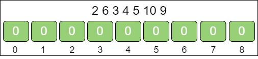

第三步，遍历原数组，对号入座。

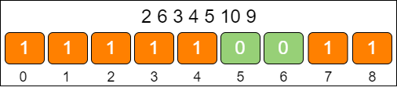

第四步，判断 `0` 值最多连续出现的次数，计算出最大相邻差。

最大相邻差：`7 - 4 = 3`

::: note
如果原数组只有 `3` 个元素：`1`、`2`、`1000000`，那就要创建长度是 `1000000` 的数组
:::

**方法3：**

1. 利用 **桶排序** 的思想，根据原数组的长度 `n`，创建出 `n` 个桶，每一个桶代表一个区间范围。其中第一个桶从原数组的最小值 `min_value` 开始，区间跨度是 `(max_value - min_value) / (n - 1)`。

2. 遍历原数组，把原数组中的每一个元素插入对应的桶中，记录每一个桶的最大值和最小值。

3. 遍历所有的桶，统计出每一个桶的最大值，和这个桶右侧非空桶的最小值的差，数值最大的差即为原数组排序后的相邻最大差值。

例如：给出一个无序数组 `{2, 6, 3, 4, 5, 10, 9}`，处理过程如下。

第一步，根据原数组，创建桶，确定每个桶的区间范围。

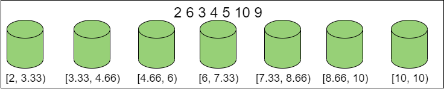

第二步，遍历原数组，确定每个桶内的最大和最小值。

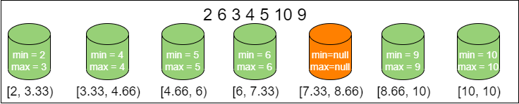

第三步，遍历所有的桶，找出最大相邻差。

最大相邻差：`9 - 6 = 3`

::: info
这个方法不需要像标准桶排序那样在每一个桶内部进行排序，只需要记录桶内的最大值和最小值即可，所以时间复杂度稳定在 **O(n)**
:::

::: details 代码

```python
class Bucket:
    def __init__(self):
        self.min = None
        self.max = None


def get_max_sorted_distance(array = []):
    # 1. 得到数列的最大值和最小值
    max_value = array[0]
    min_value = array[0]

    for i in range(1, len(array)):
        if array[i] > max_value:
            max_value = array[i]
        
        if array[i] < min_value:
            min_value = array[i]
    
    d = max_value - min_value

    # 如果 max_value 和 min_value 相等，说明数组所有元素都相等，返回 0
    if d == 0:
        return 0
    
    # 2. 初始化桶
    bucket_num = len(array)
    buckets = []

    for i in range(0, bucket_num):
        buckets.append(Bucket())
    
    # 3. 遍历原始数组，确定每个桶的最大值和最小值
    for i in range(0, len(array)):
        # 确定数组元素所归属的桶下标
        index = int((array[i] - min_value) * (bucket_num - 1) / d)

        if buckets[index].min is None or buckets[index].min > array[i]:
            buckets[index].min = array[i]
        
        if buckets[index].max is None or buckets[index].max < array[i]:
            buckets[index].max = array[i]
    
    # 4. 遍历桶，找到最大差值
    left_max = buckets[0].max
    max_distance = 0

    for i in range(1, len(buckets)):
        if buckets[i].min is None:
            continue

        if buckets[i].min - left_max > max_distance:
            max_distance = buckets[i].min - left_max
        
        left_max = buckets[i].max
    
    return max_distance


my_array = list([2, 6, 3, 4, 5, 10, 9])
print(get_max_sorted_distance(my_array))
```

:::

代码的前几步都比较直观，唯独第四步稍微有些不好理解：使用临时变量 `left_max`，在每一轮迭代时存储当前左侧桶的最大值。而两个桶之间的差值，则是 `buckets[i].min- left_max`。

## 用栈实现队列

### 题目

用栈来模拟一个队列，要求实现队列的两个基本操作：入队、出队。

### 解题思路

栈的特点是 **先入后出**，出入元素都是在同一端（栈顶）。队列的特点是 **先入先出**，出入元素是在两端（队头和队尾）。

用两个栈来模拟一个队列，可以让其中一个栈作为队列的入口，负责插入新元素；另一个栈作为队列的出口，负责移除老元素。

队列的主要操作无非有两个：入队和出队。

在模拟入队操作时，每一个新元素都被压入栈A 当中。让元素1 入队、让元素2 入队、让元素3 入队。

这时，希望最先入队的元素1 出队，让栈A 中的所有元素按顺序出栈，再按照出栈顺序压入栈B。这样一来，元素从栈A 弹出并压入栈B 的顺序是 3、2、1，和当初进入栈A 的顺序 1、2、3 是相反的。此时让元素1 出队，也就是让元素1 从栈B 中弹出。

::: details 代码

```python
class StackQueue:
    def __init__(self):
        self.stackA = []
        self.stackB = []
    
    def en_queue(self, element):
        self.stackA.append(element)
    
    def de_queue(self):
        if len(self.stackB) == 0:
            if len(self.stackA) == 0:
                raise Exception('栈已经空了！')
            
            self.transfer()
        
        return self.stackB.pop()
    
    def transfer(self):
        while len(self.stackA) > 0:
            self.stackB.append(self.stackA.pop())


stack_queue = StackQueue()
stack_queue.en_queue(1)
stack_queue.en_queue(2)
stack_queue.en_queue(3)
print(stack_queue.de_queue())
print(stack_queue.de_queue())
stack_queue.en_queue(4)
print(stack_queue.de_queue())
print(stack_queue.de_queue())
```

:::

::: info
入队操作的时间复杂度显然是 **O(1)**。

至于出队操作，如果涉及栈A 和栈B 的元素迁移，那么一次出队的时间复杂度是 **O(n)**；如果不用迁移，时间复杂度是 **O(1)**

这里涉及一个新的概念，叫作 **均摊时间复杂度**。需要元素迁移的出队操作只是少数情况，并且不可能连续出现，其后的大多数出队操作都不需要元素迁移。所以把时间均摊到每一次出队操作上面，其时间复杂度是 **O(1)**。这个概念并不常用，稍做了解即可
:::

## 寻找全排列的下一个数

### 题目

给出一个正整数，找出这个正整数所有数字全排列的下一个数。就是，在一个整数所包含数字的全部组合中，找到一个大于且仅大于原数的新整数。例如：

- 如果输入 `12345`，则返回 `12354`
- 如果输入 `12354`，则返回 `12435`
- 如果输入 `12435`，则返回 `12453`

### 解题思路

由固定几个数字组成的整数，在逆序排列的情况下最大，在顺序排列的情况下最小。

例如：给出 1、2、3、4、5 这几个数字。

最大的组合：`54321`。
最小的组合：`12345`。

数字的顺序和逆序，是全排列中的两种极端情况。那么普遍情况下，一个数和它最近的全排列数存在的关联如下：

例如：给出整数 `12354`，它包含的数字是 1、2、3、4、5，找到这些数字全排列之后仅大于原数的新整数。

为了和原数接近，需要 **尽量保持高位不变，低位在最小的范围内变换顺序**。至于变换顺序的范围大小，则取决于当前整数的 **逆序区域。**

```text
1   2   3   5   4
           ╰┈┈┬┈┈╯
           逆序区域
```

如上所示，`12354` 的逆序区域是 **最后两位**，仅看这两位已经是当前的最大组合。若想最接近原数，又比原数更大，必须从 **倒数第三位** 开始改变。

`12354` 的倒数第三位是 `3`，需要从后面的逆序区域中找到大于 `3` 的最小的数字，让其和 `3` 的位置进行互换。

互换后的临时结果是 `12453`，倒数第三位已经确定，这个时候最后两位仍然是逆序状态。需要把最后两位转变为顺序状态，以此保证在倒数第三位数值为 `4` 的情况下，后两位尽可能小。这样一来，就得到了想要的结果 `12435`。

**获得全排列下一个数的三个步骤：**

1. 从后向前查看 **逆序区域**，找到逆序区域的前一位，也就是数字置换的边界。

2. 让逆序区域的前一位和逆序区域中大于它的最小的数字 **交换位置。**

3. 把原来的逆序区域转为顺序状态。

::: details 代码

```python
def find_nearest_number(numbers = []):
    # 1. 从后向前查看逆序区域，找到逆序区域的前一位，也就是数字置换的边界
    index = find_transfer_point(numbers)

    # 如果数字置换边界是 0，说明整个数组已经逆序，无法得到更大的相同数字组成的整数，返回 null
    if index == 0:
        return None
    
    # 2. 让逆序区域的前一位和逆序区域中大于它的最小的数字交换位置，复制入参，避免直接修改入参
    numbers_copy = numbers.copy()
    exchange_head(index, numbers_copy)

    # 3. 把原来的逆序区域转为顺序状态
    reverse(index, numbers_copy)
    return numbers_copy


def find_transfer_point(numbers = []):
    for i in range(len(numbers) - 1, 0, -1):
        if numbers[i] > numbers[i - 1]:
            return i
    
    return 0


def exchange_head(index, numbers = []):
    head = numbers[index - 1]

    for i in range(len(numbers) - 1, 0, -1):
        if head < numbers[i]:
            numbers[index - 1] = numbers[i]
            numbers[i] = head
            break
    
    return numbers


def reverse(index, numbers = []):
    i = index
    j = len(numbers) - 1

    while i < j:
        temp = numbers[i]
        numbers[i] = numbers[j]
        numbers[j] = temp
        i += 1
        j -= 1
    
    return numbers


def output_numbers(numbers = []):
    for i in numbers:
        print(i, end='')
    
    print()


my_numbers = list([1, 2, 3, 4, 5])
# 打印 12345 之后的十个全排列整数
for k in range(0, 10):
    my_numbers = find_nearest_number(my_numbers)
    output_numbers(my_numbers)
```

:::

这种解法拥有一个 “高大上” 的名字：**字典序算法。**

::: info
该算法三个步骤每一步的时间复杂度都是 **O(n)**，所以整体时间复杂度也是 **O(n)**
:::

## 删去 k 个数字后的最小值

### 题目

给出一个整数，从该整数中去掉 `k` 个数字，要求剩下的数字形成的新整数尽可能小。应该如何选取被去掉的数字？

其中整数的长度大于或等于 `k`，给出的整数的大小可以超越 Python 语言中整型类型的最大值。例如：

假设给出一个整数 `1593212`，删去 `3` 个数字（5、9、3），新整数最小的情况是 `1212`。

假设给出一个整数 `30200`，删去 `1` 个数字（3），新整数最小的情况是 `200`。

假设给出一个整数 `10`，删去 `2` 个数字（1、0。**注意**，这里要求删去的不是 `1` 个数字，而是 `2` 个），新整数的最小情况是 `0`。

### 解题思路

例如：给出一个整数 `541270936`，要求删去 `1` 个数字，让剩下的整数尽可能小。

此时，无论删除哪一个数字，最后的结果都是从 `9` 位整数变成 `8` 位整数。既然同样是 `8` 位整数，显然应该优先把 **高位的数字降低**，这样对新整数的值影响最大。

把 **原整数的所有数字从左到右进行比较，如果发现某一位数字大于它右面的数字，那么在删除该数字后，必然会使该数位的值降低**，因为右面比它小的数字顶替了它的位置。

所以，对于整数 `541270936`，删除一个数字所能得到的最小值是 `41270936`。那么对于 `41270936`，删除一个数字后的最小值是 `1270936`。那么对于 `1270936`，删除一个数字后的最小值是 `120936`。

像这样依次求得局部最优解，最终得到全局最优解的思想，叫作 **贪心算法。**

::: details 代码

```python
def remove_k_digits(num, k):
    for i in range(0, k):
        has_cut = False

        # 从左向右遍历，找到比自己右侧大的数字并删除
        for j in range(0, len(num) - 1):
            if num[j] > num[j + 1]:
                num = num[0:j] + num[j + 1: len(num)]
                has_cut = True
                break
        
        # 如果没有找到要删除的数字，则删除最后一个数字
        if not has_cut:
            num = num[0:len(num) - 1]
    
    # 清除整数左侧的数字 0
    for j in range(0, len(num) - 1):
        if num[0] != '0':
            break

        num = num[1:len(num)]
    
    # 如果整数的所有数字都被删除了，直接返回 0
    if len(num) == 0:
        return '0'
    
    return num


print(remove_k_digits('1593212', 3))
print(remove_k_digits('30200', 2))
print(remove_k_digits('10', 2))
print(remove_k_digits('541270936', 3))
print(remove_k_digits('1593212', 4))
```

:::

代码使用了两层循环，外层循环次数就是要删除的数字个数 `k`，内层循环从左到右遍历所有数字。当遍历到需要删除的数字时，利用 Python 的字符串截取方法把对应的数字删除，并重新拼接字符串。

::: info
这段代码的时间复杂度是 **O(kn)**
:::

以上代码性能不太好，主要是以下两个方面：

1. 每一次内层循环都需要从头开始遍历所有数字。

    例如：给出的整数是 `11111111111114132`，在第一轮循环中，需要遍历大部分数字，一直遍历到数字 `4`，发现 `4 > 1`，从而删除 `4`。

    以目前的代码逻辑，下一轮循环时，还要从头开始遍历，再次重复遍历大部分数字，一直遍历到数字 `3`，发现 `3 > 2`，从而删除 `3`。

    事实上，应该停留在上一次删除的位置继续进行比较，而不是再次从头开始遍历。

2. 字符串截取方法本身性能不高。

    字符串截取方法的底层实现，涉及新字符串的创建，以及逐个字符的复制。这个方法自身的时间复杂度是 **O(n)。**

    因此，应该避免在每删除一个数字后就进行字符串的截取和拼接。

以遍历数字作为外循环，以 `k` 作为内循环代码：

::: details 优化代码

```python
def remove_k_digits_v2(num, k):
    # 新整数的最终长度 = 原整数长度 - k
    new_length = len(num) - k
    # 创建一个栈，用于接收所有的数字
    stack = []

    for i in range(0, len(num)):
        # 遍历当前数字
        c = num[i]

        # 当栈顶数字大于遍历到的当前数字时，栈顶数字出栈（相当于删除数字）
        while (len(stack) > 0) and (stack[len(stack) - 1] > c) and (k > 0):
            stack.pop()
            k -= 1
        
        # 如果遇到数字 0，且栈为空，0 不入栈
        if ('0' == c) and (len(stack) == 0):
            new_length -= 1

            if new_length <= 0:
                return '0'
            
            continue

        # 遍历到的当前数字入栈
        stack.append(c)
    
    # 找到栈中第一个非零数字的位置，以此构建新的整数字符串
    if new_length <= 0:
        return '0'
    
    return ''.join(stack)


print(remove_k_digits_v2('1593212', 3))
print(remove_k_digits_v2('30200', 2))
print(remove_k_digits_v2('10', 2))
print(remove_k_digits_v2('541270936', 3))
print(remove_k_digits_v2('1593212', 4))
```

:::

上述代码非常巧妙地运用了栈的特性，在遍历原整数的数字时，让所有数字一个一个入栈，当某个数字需要被删除时，让该数字出栈。最后，程序把栈中的元素转化为字符串类型的结果。

下面仍然以整数 `541270936`，`k = 3` 为例。当遍历到数字 `5` 时，数字 `5` 入栈。

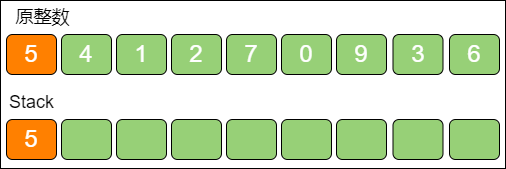

当遍历到数字 `4` 时，发现栈顶 `5 > 4`，栈顶5 出栈，数字 `4` 入栈。

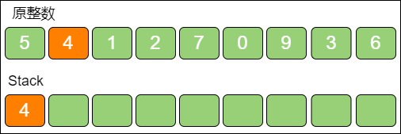

当遍历到数字 `1` 时，发现栈顶 `4 > 1`，栈顶4 出栈，数字 `1` 入栈。


继续遍历数字 `2`、数字 `7`，并依次入栈。

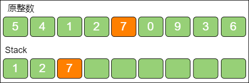

最后，遍历数字 `0`，发现栈顶 `7 > 0`，栈顶7 出栈，数字 `0` 入栈。

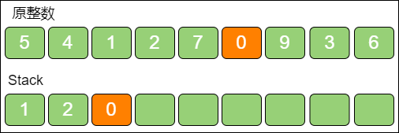

此时 `k` 的次数已经用完，无须再比较，让剩下的数字一起入栈即可。

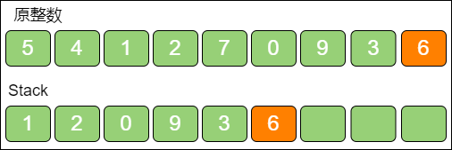

此时栈中的元素就是最终的结果。

::: info
上面的方法只对所有数字遍历了一次，遍历的时间复杂度是 **O(n)**，把栈转化为字符串的时间复杂度也是 **O(n)**，所以最终的时间复杂度是 **O(n)**

同时，程序中利用栈来回溯遍历过的数字及删除数字，所以程序的空间复杂度是 **O(n)**
:::

## 找到两个数组的中位数

### 题目

给定两个升序数组，如何找出这两个数组归并以后新的升序数组的中位数。例如：


上图这两个给定数组A 和数组B，一个长度是 `6`，一个长度是 `5`，归并之后的大数组仍然要保持升序，结果如下：


大数组的长度是奇数（`11`），中位数显然是位于正中的第六个元素，也就是元素5。

上面的例子是奇数个元素的情况。那么如果是偶数个元素。例子：


上图这两个给定数组A 和数组B，长度都是 `5`，归并之后的大数组如下：


大数组的长度是偶数（`10`），位于正中的元素有两个，分别是 `6` 和 `7`，这时候的中位数就是两个数的平均值，也就是 `6.5`。

### 解题思路

**方法1：**

直接把两个数组进行归并操作，中位数结果就出来。

::: info
如果两个数组长度分别是 `m` 和 `n`，这样做的时间复杂度和空间复杂度都是 **O(m + n)**
:::

**方法2：**

中位数把一个升序数组分成了长度相等的两部分，其中左半部分的最大值永远小于或等于右半部分的最小值。

- 对于偶数长度的数组，例如：`1, 2, 3, 5, 6, 7, 7, 8, 9, 15`。可以根据中位数分成长度相等的两部分，左半部分的最大元素（`6`），永远小于或等于右半部分的最小元素（`7`）
- 对于奇数长度的数组，例如：`1, 2, 3, 4, 5, 5, 6, 8, 9, 10, 11`。如果把中位数本身归入左半部分，则 **左半边长度 = 右半边长度 + 1**。左半部分的最大元素（`5`），永远小于或等于右半部分的最小元素（`6`）

大数组的左右两部分，分别来源于两个初始数组A 和数组B 的左右部分。

大数组被中位数等分的左右两部分，每一部分根据来源又可以再划分成两部分，其中一部分来自数组A 的元素，另一部分来自数组B 的元素：

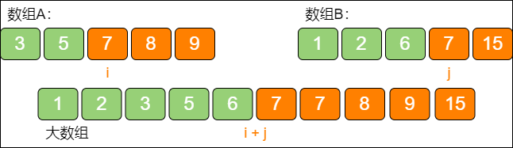

如上图所示，原始数组A 和数组B，各自分成绿色和橙色两部分。其中数值较小的绿色元素组成了大数组的左半部分，数值较大的橙色元素组成了大数组的右半部分。

最重要的是，**绿色元素和橙色元素的数量是相等的（偶数情况），而且最大的绿色元素小于或等于最小的橙色元素。**

假设数组A 的长度是 `m`，绿色和橙色元素的分界点是 `i`，数组B 的长度是 `n`，绿色和橙色元素的分界点是 `j`，那么为了让大数组的左右两部分长度相等，则 `i` 和 `j` 需要符合如下两个条件：

`i + j = (m + n + 1) / 2`（之所以 `m + n` 后面要再加 `1`，是为了应对大数组长度为奇数的情况）。

`Max(A[i - 1], B[j - 1]) <= Min(A[i], B[j])`（直白地说，就是最大的绿色元素小于或等于最小的橙色元素）。

由于 `m + n` 的值是恒定的，所以只要确定一个合适的 `i`，就可以确定 `j`，从而找到大数组左半部分和右半部分的分界，也就找到了归并之后大数组的中位数。

利用 **二分查找** 来确定 `i` 值。例如：


第一步，就像二分查找那样，把 `i` 设在数组A 的正中位置，也就是让 `i = 3`：


第二步，根据 `i` 的值来确定 `j` 的值，`j = (m + n + 1) / 2 - i = 5`：


第三步，验证 `i` 和 `j`，分为下面三种情况：

1. `B[j - 1] ≤ A[i] && A[i - 1] ≤ B[j]`

    说明 `i` 和 `j` 左侧的元素都小于或等于右侧的元素，这一组 `i` 和 `j` 是合适的。

2. `A[i] < B[j - 1]`

    说明 `i` 对应的元素偏小了，`i` 应该向右侧移动。

3. `A[i - 1] > B[j]`

    说明 `i - 1` 对应的元素偏大了，`i` 应该向左侧移动。

显然，图中的例子属于情况 `2`，`A[3] < B[5]`，所以 `i` 应该向右移动。

第四步，在数组A 的右半部分，重新确定 `i` 的位置，就像二分查找一样：


第五步，同第二步，根据 `i` 的值来确定 `j` 的值，`j = (m + n + 1) / 2 - i = 3`：


第六步，同第三步，验证 `i` 和 `j`：

由于 `A[5] >= B[2] 且 B[3] >= A[4]`，所以这一组 `i` 和 `j` 是合适的。

第七步，找出中位数：

如果大数组的长度是奇数，那么：`中位数 = Max(A[i - 1], B[j - 1])`（也就是大数组左半部分的最大值）。

如果大数组的长度是偶数，那么：`中位数 = (Max(A[i - 1], B[j - 1]) + Min(A[i], B[i])) / 2`（也就是大数组左半部分的最大值和大数组右半部分的最小值取平均）。

在本例中，大数组的长度是奇数，所以 `中位数 = Max(8, 12) = 12`。

不过有些特殊情况，比如：数组A 的长度远大于数组B 的长度，或者在数组A 中无法找到合适的 `i` 值……处理方法如下：

1. 数组A 的长度远大于数组B。

    

    也就是 `m` 远大于 `n` 时，当设定了 `i` 的初值，也就是数组A 正中间的元素，再计算 `j` 的时候有可能发生数组越界。

    因此，可以提前把数组A 和数组B 进行交换，较短的数组放在前面，`i` 从较短的数组中取。这样做还有一个好处，由于数组A 是较短数组，`i` 的搜索次数减少了。

2. 无法找到合适的 `i` 值。

    有两种情况：

    - 数组A 的长度小于数组B 的长度，并且数组A 的所有元素都大于数组B 的元素

        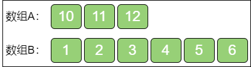

        在这种情况下，无法通过二分查找寻找到符合 `B[j - 1] ≤ A[i] && A[i - 1] ≤ B[j]` 的 `i` 值，一直到 `i = 0` 为止。

        此时可以跳出二分查找的循环，所求的中位数是 `B[j - 1]`（仅限奇数情况）。

    - 数组A 的长度小于数组B 的长度，并且数组A 的所有元素都小于数组B 的元素

        

        在这种情况下，同样无法通过二分查找寻找到符合 `B[j - 1] ≤ A[i] && A[i - 1] ≤ B[j]` 的 `i` 值，一直到 `i = (数组A 的长度 - 1)` 为止。

        此时可以跳出二分查找的循环，所求的中位数是 `Max(A[i - 1], B[j - 1])`（仅限奇数情况）。

::: details 代码

```python
def find_median_sorted_arrays(array_A, array_B):
    m, n = len(array_A), len(array_B)

    # 如果数组A 的长度大于等于数组B 的长度，则交换数组
    if m > n:
        array_A, array_B, m, n = array_B, array_A, n, m
    
    if n == 0:
        raise ValueError
    
    start, end, half_len = 0, m, (m + n + 1) // 2

    while start <= end:
        i = (start + end) // 2
        j = half_len - i

        if (i < m) and (array_B[j - 1] > array_A[i]):
            # i 偏小了，需要右移
            start = i + 1
        elif (i > 0) and (array_A[i - 1] > array_B[j]):
            # i 偏大了，需要左移
            end = i - 1
        else:
            # i 刚好合适，或 i 已达到数组边界
            if i == 0:
                max_of_left = array_B[j - 1]
            elif j == 0:
                max_of_left = array_A[i - 1]
            else:
                max_of_left = max(array_A[i - 1], array_B[j - 1])
            
            if (m + n) % 2 == 1:
                # 如果大数组的长度是奇数，中位数就是左半部分的最大值
                return max_of_left
            
            if i == m:
                min_of_right = array_B[j]
            elif j == n:
                min_of_right = array_A[i]
            else:
                min_of_right = min(array_A[i], array_B[j])
            
            # 如果大数组的长度是偶数，取左侧最大值和右侧最小值的平均
            return (max_of_left + min_of_right) / 2.0


my_array_A = list([3, 5, 6, 7, 8, 12, 20])
my_array_B = list([1, 10, 17, 18])
print(find_median_sorted_arrays(my_array_A, my_array_B))
```

:::

::: info
由于最初的交换，数组A 的长度是 m、n 中的较小值，而确定 `i` 的过程类似二分查找，所以时间复杂度是 **O(log~2~min(m, n))**
:::

## 如何求解金矿问题

### 题目

很久很久以前，有一位国王拥有 `5` 座金矿，每座金矿的黄金储量不同，需要参与挖掘的工人人数也不同。例如：

- 金矿储量是 `200kg` 黄金，需要 `3` 个工人来挖掘
- 金矿储量是 `300kg` 黄金，需要 `4` 个工人来挖掘
- 金矿储量是 `350kg` 黄金，需要 `3` 个工人来挖掘
- 金矿储量是 `400kg` 黄金，需要 `5` 个工人来挖掘
- 金矿储量是 `500kg` 黄金，需要 `5` 个工人来挖掘

如果参与挖矿的工人的总数是 `10`。每座金矿要么全挖，要么不挖，不能派出一半人挖取一半的金矿。要求用程序求出，要想得到尽可能多的黄金，应该选择挖取哪几座金矿？

### 解题思路

**方法1：**

可以按照金矿的性价比从高到低进行排序，优先选择性价比最高的金矿来挖掘，然后是性价比第二的……

金矿按照性价比从高到低进行排序，排名结果如下：

- 第一名，350kg黄金/3人的金矿，人均产量约为 `116.6kg` 黄金
- 第二名，500kg黄金/5人的金矿，人均产量为 `100kg` 黄金
- 第三名，400kg黄金/5人的金矿，人均产量为 `80kg` 黄金
- 第四名，300kg黄金/4人的金矿，人均产量为 `75kg` 黄金
- 第五名，200kg黄金/3人的金矿，人均产量约为 `66.6kg` 黄金

由于工人数量是 `10` 人，按优先挖掘性价比排名为第一名和第二名的金矿之后，工人还剩下 `2` 人，不够再挖掘其他金矿了。

所以，得出的最佳金矿收益是 `350 + 500` 即 `850kg` 黄金。使用 **贪心算法** 在局部情况下是最优解，但是在整体上却未必是最优的。

**方法2：**

使用 **动态规划** 方法，就是将复杂的问题简化成规模较小的子问题，再从简单的子问题自底向上一步一步递推，最终得到复杂问题的最优解。

首先，对于问题中的金矿来说，每一个金矿都存在着 “挖” 和 “不挖” 两种选择。假设一下，如果最后一个金矿注定不被挖掘，那么问题将简化成了 `10` 个工人在前 `4` 个金矿中做出最优选择。

- **10 人 5 金矿的最优选择：**

    - 400kg黄金/5人的金矿；500kg黄金/5人的金矿
    - 200kg黄金/3人的金矿；300kg黄金/4人的金矿；350kg黄金/3人的金矿

- **10 人 4 金矿的最优选择：**

    - 400kg黄金/5人的金矿；500kg黄金/5人的金矿
    - 200kg黄金/3人的金矿；300kg黄金/4人的金矿；~~350kg黄金/3人的金矿~~

相应地，假设最后一个金矿一定会被挖掘，那么问题将简化成了 `7` 个工人在前 `4` 个金矿中做出最优选择。

- **10 人 5 金矿的最优选择：**

    - 400kg黄金/5人的金矿；500kg黄金/5人的金矿
    - 200kg黄金/3人的金矿；300kg黄金/4人的金矿；350kg黄金/3人的金矿

- **7 人 4 金矿的最优选择：**

    - 400kg黄金/5人的金矿；500kg黄金/5人的金矿 **+ 350kg黄金/3人的金矿**
    - 200kg黄金/3人的金矿；300kg黄金/4人的金矿 **+ 350kg黄金/3人的金矿**

这两种简化情况，被称为全局问题的两个 **最优子结构**。

最后一个金矿到底该不该挖，那就要看 `10` 个工人在前 `4` 个金矿的收益，和 `7` 个工人在前 `4` 个金矿的收益加最后一个金矿的收益谁大谁小了。

同样的道理，对于前 `4` 个金矿的选择，还可以做进一步简化。

首先针对 `10` 个工人 `4` 个金矿这个子结构，第 `4` 个金矿（300kg黄金/4人）可以选择挖与不挖。根据第 `4` 个金矿的选择，问题又简化成了两种更小的子结构：

1. `10` 个工人在前 `3` 个金矿中做出最优选择。

2. `6（10 - 4 = 6）` 个工人在前 `3` 个金矿中做出最优选择。

相应地，对于 `7` 个工人 `4` 个金矿这个子结构，第 `4` 个金矿同样可以选择挖与不挖。根据第 `4` 个金矿的选择，问题也简化成了两种更小的子结构：

1. `7` 个工人在前 `3` 个金矿中做出最优选择。

2. `3（7 - 4 = 3）` 个工人在前 `3` 个金矿中做出最优选择。
……

就这样，问题一分为二，二分为四，一直把问题简化成在 `0` 个金矿或 `0` 个工人时的最优选择，这个收益结果显然是 `0`，也就是问题的 **边界。**

这就是动态规划的要点：**确定全局最优解和最优子结构之间的关系，以及问题的边界。**

这个关系用数学公式来表达的话，叫作 **状态转移方程式。**

把金矿数量设为 `n`，工人数量设为 `w`，金矿的含金量设为数组 `g[]`，金矿所需开采人数设为数组 `p[]`，设 `F(n, w)` 为 `n` 个金矿、`w` 个工人时的最优收益函数，那么状态转移方程式如下：

`F(n, w) = 0（n = 0 或 w = 0）`

问题边界，金矿数为 `0` 或工人数为 `0` 的情况：

`F(n, w) = F(n - 1, w)（n ≥ 1, w < p[n - 1]）`

当所剩工人不够挖掘当前金矿时，只有一种最优子结构：

`F(n, w)= max(F(n - 1, w), F(n - 1, w - p[n - 1]) + g[n - 1])（n ≥ 1, w ≥ p[n - 1]）`

在常规情况下，具有两种最优子结构（挖当前金矿或不挖当前金矿）。

::: details 递归方式代码

```python
def get_best_gold_mining(w, n, p = [], g = []):
    """
    :param w：工人数量
    :param n：可选金矿数量
    :param p：金矿开采所需工人数量
    :param g：金矿储量
    :return：最优收益
    """
    if (w == 0) or (n == 0):
        return 0
    
    if w < p[n - 1]:
        return get_best_gold_mining(w, n - 1, p, g)
    
    return max(get_best_gold_mining(w, n - 1, p, g), 
               get_best_gold_mining(w - p[n - 1], n - 1, p, g) + g[n - 1])


print(get_best_gold_mining(10, 5, p = [5, 5, 3, 4, 3], g = [400, 500, 200, 300, 350]))
```

:::

全局问题经过简化，会拆解成两个子结构；两个子结构再次简化，会拆解成 `4` 个更小的子结构……如果金矿数量是 `n`，工人数量充足，时间复杂度就是 **O(2^n^)。**

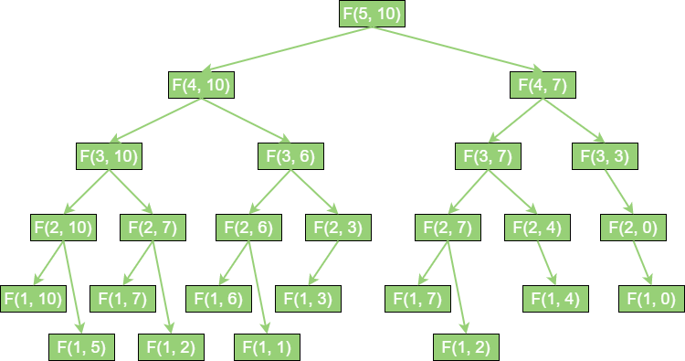

如果只有 `5` 个金矿，问题还不算严重。如果金矿数量有 `50` 个，甚至 `100` 个，这样的时间复杂度是根本无法接受的。递归之所以低效的根本原因，那就是因为递归做了许多重复的计算。如下所示：

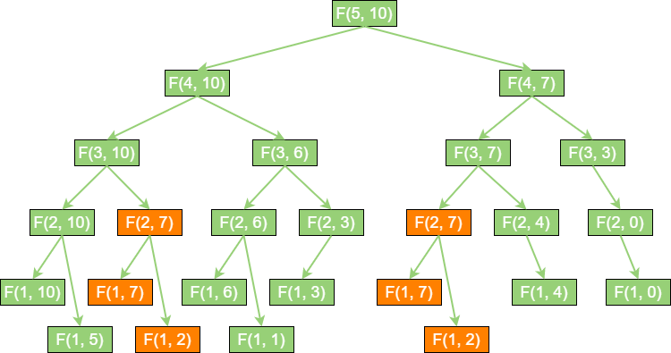

在上图中，标为橘色的方法调用是重复的。可以看到 `F(2, 7)`、`F(1, 7)`、`F(1, 2)` 这几个入参相同的方法都被调用了两次。

当金矿数量为 `5` 时，重复调用的问题还不太明显。金矿数量越多，递归层次越深，重复调用也就越多，这些无谓的调用必然会降低程序的性能。

为了避免这些重复调用，就用到动态规划的另一个核心要点：**自底向上求解**。例如：

在进行求解之前，先准备一张表格，用于记录选择金矿的中间数据。

|    |  1 个工人  |  2 个工人  |  3 个工人  |  4 个工人  |  5 个工人  |  6 个工人  |  7 个工人  |  8 个工人  |  9 个工人  |  10 个工人  |
|  :----:  |  :----:  |  :----:  |  :----:  |  :----:  |  :----:  |  :----:  |  :----:  |  :----:  |  :----:  |  :----:  |
|  400kg黄金/5人  |    |    |    |    |    |    |    |    |    |    |
|  500kg黄金/5人  |    |    |    |    |    |    |    |    |    |    |
|  200kg黄金/3人  |    |    |    |    |    |    |    |    |    |    |
|  300kg黄金/4人  |    |    |    |    |    |    |    |    |    |    |
|  350kg黄金/3人  |    |    |    |    |    |    |    |    |    |    |

表格最左侧代表不同的金矿选择范围，从上到下，每多增加 `1` 行，可就代表多 `1` 个金矿供选择，也就是 `F(n, w)` 函数中的 `n` 值。表格的最上方代表工人数量，从 `1` 个工人到 `10` 个工人，也就是 `F(n, w)` 函数中的 `w` 值。其余空白的格子，都是等待填写的，代表当给出 `n` 个金矿、`w` 个工人时的最优收益，也就是 `F(n, w)` 的值。

下面从第 `1` 行第 `1` 列开始，尝试把空白的格子一一填满，填充的依据就是 **状态转移方程式。**

对于第 `1` 行的前 `4` 个格子，由于 `w < p[n - 1]`，对应的状态转移方程式如下：

`F(n, w) = F(n - 1, w)（n > 1, w < p[n - 1])`

**带入求解：**

```python
F(1, 1) = F(1 - 1, 1) = F(0, 1) = 0
F(1, 2) = F(1 - 1, 2) = F(0, 2) = 0
F(1, 3) = F(1 - 1, 3) = F(0, 3) = 0
F(1, 4) = F(1 - 1, 4) = F(0, 4) = 0
```

|    |  1 个工人  |  2 个工人  |  3 个工人  |  4 个工人  |  5 个工人  |  6 个工人  |  7 个工人  |  8 个工人  |  9 个工人  |  10 个工人  |
|  :----:  |  :----:  |  :----:  |  :----:  |  :----:  |  :----:  |  :----:  |  :----:  |  :----:  |  :----:  |  :----:  |
|  400kg黄金/5人  |  0  |  0  |  0  |  0  |    |    |    |    |    |    |
|  500kg黄金/5人  |    |    |    |    |    |    |    |    |    |    |
|  200kg黄金/3人  |    |    |    |    |    |    |    |    |    |    |
|  300kg黄金/4人  |    |    |    |    |    |    |    |    |    |    |
|  350kg黄金/3人  |    |    |    |    |    |    |    |    |    |    |

第 `1` 行的后 `6` 个格子计算，此时 `w ≥ p[n - 1]`，对应的状态转移方程式如下：

`F(n, w) = max(F(n - 1, w), F(n - 1, w - p[n - 1]) + g[n - 1])（n > 1, w ≥ p[n - 1]）`

**带入求解：**

```python
F(1, 5) = max(F(1 - 1, 5), F(1 - 1, 5 - 5) + 400) = max(F(0, 5), F(0, 0) + 400) = max(0, 400) = 400
F(1, 6) = max(F(1 - 1, 6), F(1 - 1, 6 - 5) + 400) = max(F(0, 6), F(0, 1) + 400) = max(0, 400) = 400
……
F(1, 10) = max(F(1 - 1, 10), F(1 - 1, 10 - 5) + 400) = max(F(0, 10), F(0, 5) + 400) = max(0, 400) = 400
```

|    |  1 个工人  |  2 个工人  |  3 个工人  |  4 个工人  |  5 个工人  |  6 个工人  |  7 个工人  |  8 个工人  |  9 个工人  |  10 个工人  |
|  :----:  |  :----:  |  :----:  |  :----:  |  :----:  |  :----:  |  :----:  |  :----:  |  :----:  |  :----:  |  :----:  |
|  400kg黄金/5人  |  0  |  0  |  0  |  0  |  400  |  400  |  400  |  400  |  400  |  400  |
|  500kg黄金/5人  |    |    |    |    |    |    |    |    |    |    |
|  200kg黄金/3人  |    |    |    |    |    |    |    |    |    |    |
|  300kg黄金/4人  |    |    |    |    |    |    |    |    |    |    |
|  350kg黄金/3人  |    |    |    |    |    |    |    |    |    |    |

对于第 `2` 行的前 `4` 个格子，和第 `1` 行同理，由于 `w < p[n - 1]`，对应的状态转移方程式如下：

`F(n, w) = F(n - 1, w)（n > 1, w < p[n - 1])`

**带入求解：**

```python
F(2, 1) = F(2 - 1, 1) = F(1, 1) = 0
F(2, 2) = F(2 - 1, 2) = F(1, 2) = 0
F(2, 3) = F(2 - 1, 3) = F(1, 3) = 0
F(2, 4) = F(2 - 1, 4) = F(1, 4) = 0
```

|    |  1 个工人  |  2 个工人  |  3 个工人  |  4 个工人  |  5 个工人  |  6 个工人  |  7 个工人  |  8 个工人  |  9 个工人  |  10 个工人  |
|  :----:  |  :----:  |  :----:  |  :----:  |  :----:  |  :----:  |  :----:  |  :----:  |  :----:  |  :----:  |  :----:  |
|  400kg黄金/5人  |  0  |  0  |  0  |  0  |  400  |  400  |  400  |  400  |  400  |  400  |
|  500kg黄金/5人  |  0  |  0  |  0  |  0  |    |    |    |    |    |    |
|  200kg黄金/3人  |    |    |    |    |    |    |    |    |    |    |
|  300kg黄金/4人  |    |    |    |    |    |    |    |    |    |    |
|  350kg黄金/3人  |    |    |    |    |    |    |    |    |    |    |

第 `2` 行的后 `6` 个格子，和第 `1` 行同理，此时 `w ≥ p[n - 1]`，对应的状态转移方程式如下：

`F(n, w) = max(F(n - 1, w), F(n - 1, w - p[n - 1]) + g[n - 1])（n > 1, w ≥ p[n - 1]）`

**带入求解：**

```python
F(2, 5) = max(F(2 - 1, 5), F(2 - 1, 5 - 5) + 500) = max(F(1, 5), F(1, 0) + 500) = max(400, 500) = 500
F(2, 6) = max(F(2 - 1, 6), F(2 - 1, 6 - 5) + 500) = max(F(1, 6), F(1, 1) + 500) = max(400, 500) = 500
……
F(2, 10) = max(F(2 - 1, 10), F(2 - 1, 10 - 5) + 500) = max(F(1, 10), F(1, 5) + 500) = max(400, 400 + 500) = 900
```

|    |  1 个工人  |  2 个工人  |  3 个工人  |  4 个工人  |  5 个工人  |  6 个工人  |  7 个工人  |  8 个工人  |  9 个工人  |  10 个工人  |
|  :----:  |  :----:  |  :----:  |  :----:  |  :----:  |  :----:  |  :----:  |  :----:  |  :----:  |  :----:  |  :----:  |
|  400kg黄金/5人  |  0  |  0  |  0  |  0  |  400  |  400  |  400  |  400  |  400  |  400  |
|  500kg黄金/5人  |  0  |  0  |  0  |  0  |  500  |  500  |  500  |  500  |  500  |  900  |
|  200kg黄金/3人  |    |    |    |    |    |    |    |    |    |    |
|  300kg黄金/4人  |    |    |    |    |    |    |    |    |    |    |
|  350kg黄金/3人  |    |    |    |    |    |    |    |    |    |    |

**同理可得出之后的答案：**

|    |  1 个工人  |  2 个工人  |  3 个工人  |  4 个工人  |  5 个工人  |  6 个工人  |  7 个工人  |  8 个工人  |  9 个工人  |  10 个工人  |
|  :----:  |  :----:  |  :----:  |  :----:  |  :----:  |  :----:  |  :----:  |  :----:  |  :----:  |  :----:  |  :----:  |
|  400kg黄金/5人  |  0  |  0  |  0  |  0  |  400  |  400  |  400  |  400  |  400  |  400  |
|  500kg黄金/5人  |  0  |  0  |  0  |  0  |  500  |  500  |  500  |  500  |  500  |  900  |
|  200kg黄金/3人  |  0  |  0  |  200  |  200  |  500  |  500  |  500  |  700  |  700  |  900  |
|  300kg黄金/4人  |  0  |  0  |  200  |  300  |  500  |  500  |  500  |  700  |  800  |  900  |
|  350kg黄金/3人  |  0  |  0  |  350  |  350  |  500  |  550  |  650  |  850  |  850  |  900  |

此时，最后 `1` 行最后 `1` 个格子所填的 `900` 就是最终要求的结果，即 `5` 个金矿、`10` 个工人的最优收益是 900kg 黄金。

::: details 二维数组方式代码

```python
def get_best_gold_mining_v2(w, p = [], g = []):
    """
    :param w：工人数量
    :param p：金矿开采所需工人数量
    :param g：金矿储量
    :return：最优收益
    """
    result_table = [[0 for i in range(w + 1)] for i in range(len(g) + 1)]

    # 填充表格
    for i in range(1, len(g) + 1):
        for j in range(1, w + 1):
            if j < p[i - 1]:
                result_table[i][j] = result_table[i - 1][j]
            else:
                result_table[i][j] = max(result_table[i - 1][j], result_table[i - 1][j - p[i - 1]] + g[i - 1])
    
    # 返回最后一个格子的值
    return result_table[len(g)][w]


print(get_best_gold_mining_v2(10, p = [5, 5, 3, 4, 3], g = [400, 500, 200, 300, 350]))
```

:::

::: info
程序利用双循环来填充一个二维数组，所以时间复杂度和空间复杂度都是 **O(nw)**
:::

上述代码在时间上已经没有什么可优化的了，但是在空间上还可以做一些优化。在表格中除第 `1` 行之外，每一行的结果都是由上一行数据推导出来的。以 `4` 个金矿 `9` 个工人为例：

`4` 个金矿、`9` 个工人的最优结果，是由它的两个最优子结构，也就是 `3` 个金矿、`5` 个工人和 `3` 个金矿、`9` 个工人的结果推导而来的。这两个最优子结构都位于它的上一行。所以，在程序中并不需要保存整个表格，无论金矿有多少座，只保存 `1` 行的数据即可。在计算下一行时，要 **从右向左** 统计，把旧的数据一个一个替换掉。

::: details 二维数组方式代码优化

```python
def get_best_gold_mining_v3(w, p = [], g = []):
    """
    :param w：工人数量
    :param p：金矿开采所需工人数量
    :param g：金矿储量
    :return：最优收益
    """
    result = [0] * (w + 1)

    # 填充一维数组
    for i in range(1, len(g) + 1):
        for j in range(w, 0, -1):
            if j >= p[i - 1]:
                result[j] = max(result[j], result[j - p[i - 1]] + g[i - 1])
    
    # 返回最后一个格子的值
    return result[w]


print(get_best_gold_mining_v3(10, p = [5, 5, 3, 4, 3], g = [400, 500, 200, 300, 350]))
```

:::

::: info
优化后的空间复杂度降低到了 **O(n)**
:::

::: tip 从右向左统计原因
在计算 `result[j - p[i - 1]] + g[i - 1]` 值时，要获取上一行的旧数据（比当前下标小），如果从左往右统计，当前位置左侧的数据已经全是本行的新数据，获取不到上一行的旧数据导致结果错误
:::

## 寻找缺失的整数

### 题目

在一个无序数组里有 `99` 个不重复的正整数，范围是 `1~100`，唯独缺少 `1` 个 `1~100` 中的整数。如何找出这个缺失的整数？

### 解题思路

**方法1：**

创建一个哈希表，以 `1~100` 这 `100` 个整数为 `Key`。然后遍历整个数组，每读到一个整数，就定位到哈希表中对应的 `Key`，然后删除这个 `Key`。

由于数组中缺少 `1` 个整数，哈希表最终一定会有 `99` 个 `Key` 被删除，从而剩下 `1` 个 `Key`。这个剩下的 `Key` 就是那个缺失的整数。

::: info
假设数组长度是 `n`，那么该解法的时间复杂度是 **O(n)**，空间复杂度是 **O(n)**
:::

**方法2：**

先把数组元素从小到大进行排序，然后遍历已经有序的数组，如果发现某两个相邻元素并不连续，说明缺少的就是这两个元素之间的整数。

::: info
假设数组长度是 `n`，如果用时间复杂度为 **O(nlog~2~n)** 的排序算法进行排序，那么该解法的时间复杂度是 **O(nlog~2~n)**，空间复杂度是 **O(1)**
:::

**方法3：**

先算出 `1 + 2 + 3 + … + 100` 的和，然后依次减去数组里的元素，最后得到的差值，就是那个缺失的整数。

::: info
假设数组长度是 `n`，那么该解法的时间复杂度是 **O(n)**，空间复杂度是 **O(1)**
:::

### 问题扩展

**扩展问题1**：一个无序数组里有若干个正整数，范围是 `1~100`，其中 `99` 个整数都出现了偶数次，只有 `1` 个整数出现了奇数次，如何找到这个出现奇数次的整数？

遍历整个数组，依次做 **异或运算**。由于异或运算在进行位运算时，相同为 `0`，不同为 `1`，因此所有出现偶数次的整数都会相互抵消变成 `0`，只有唯一出现奇数次的整数会被留下。例如：给出一个无序数组 `{3, 1, 3, 2, 4, 1, 4}`。

异或运算像加法运算一样，满足交换律和结合律，所以这个数组元素的异或运算的结果为：

```text
  3 xor 1 xor 3 xor 2 xor 4 xor 1 xor 4
= 1 xor 1 xor 3 xor 3 xor 4 xor 4 xor 2
= 2
```

::: info
假设数组长度是 `n`，那么该解法的时间复杂度是 **O(n)**，空间复杂度是 **O(1)**
:::

**扩展问题2**：假设一个无序数组里有若干个正整数，范围是 `1~100`，其中有 `98` 个整数出现了偶数次，只有 `2` 个整数出现了奇数次，如何找到这 `2` 个出现奇数次的整数？

通过 **分治法** 把 `2` 个出现了奇数次的整数命名为 `A` 和 `B`。遍历整个数组，然后依次做异或运算，进行异或运算的最终结果，等同于 `A` 和 `B` 进行异或运算的结果。在这个结果中，至少会有一个二进制位是 `1`（如果都是 `0`，说明 `A` 和 `B` 相等，和题目不相符）。

例如：给出一个无序数组 `{4, 1, 2, 2, 5, 1, 4, 3}`，所有元素进行异或运算的结果是为：

```text
  4 xor 1 xor 2 xor 2 xor 5 xor 1 xor 4 xor 3
= 1 xor 1 xor 2 xor 2 xor 4 xor 4 xor 3 xor 5
= 3 xor 5
= 00000110B
```

选定该结果中值为 `1` 的某一位数字，如 `00000110B` 的倒数第 `2` 位是 `1`，这说明 `A` 和 `B` 对应的二进制的倒数第二位是不同的。其中必定有一个整数的倒数第二位是 `0`，另一个整数的倒数第二位是 `1`。

根据这个结论，可以把原数组按照二进制位的倒数第二位的不同，分成两部分，一部分的倒数第二位是 `0`，另一部分的倒数第二位是 `1`。由于 `A` 和 `B` 的倒数第二位不同，所以 `A` 被分配到其中一部分，`B` 被分配到另一部分，绝不会出现 `A` 和 `B` 在同一部分，另一部分既没有 `A`，也没有 `B` 的情况。

无序数组 `{4, 1, 2, 2, 5, 1, 4, 3}` 分为 `{4, 1, 5, 1, 4}` 到数第二位为 `0` 和 `{2, 2, 3}` 到数第二位为 `1` 的两组数组。按照原先的异或算法，从每一部分中找出唯一的奇数次整数即可。

::: info
假设数组长度是 `n`，那么该解法的时间复杂度是 **O(n)**。把数组分成两部分，并不需要借助额外的存储空间，完全可以在按二进制位分组的同时来做异或运算，所以空间复杂度仍然是 **O(1)**
:::

::: details 代码

```python
def find_lost_num(array = []):
    # 用于存储两个出现奇数次的整数
    result = [0, 0]
    # 第一次整体异或
    xor_result = 0

    for i in range(0, len(array)):
        xor_result ^= array[i]
    
    # 如果异或结果为 0，说明输入数组不符合要求
    if xor_result == 0:
        raise ValueError
    
    # 确定两个整数的不同位，以此来做分组
    separator = 1

    while 0 == (xor_result & separator):
        separator <<= 1
    
    # 第二次分组异或
    for i in range(0, len(array)):
        if 0 == (array[i] & separator):
            result[0] ^= array[i]
        else:
            result[1] ^= array[i]
    
    return result


my_array = list([4, 1, 2, 2, 5, 1, 4, 3])
print(find_lost_num(my_array))
```

:::
