根据时间复杂度的不同，主流的排序算法可以分为三大类：

- **时间复杂度为 O(n^2^) 的排序算法**

    - **冒泡排序**
    - **选择排序**
    - **插入排序**
    - **希尔排序**（希尔排序比较特殊，它的性能略优于 **O(n^2^)**，但又比不上 **O(nlog~2~n)**，姑且把它归入本类）

- **时间复杂度为 O(nlog~2~n) 的排序算法**

    - **快速排序**
    - **归并排序**
    - **堆排序**

- **时间复杂度为线性的排序算法**

    - **计数排序**
    - **桶排序**
    - **基数排序**

当然，以上列举的只是主流的排序算法，在算法界还存在着更多五花八门的排序算法，它们有些基于传统排序算法变形而来；有些则是脑洞大开，例如：鸡尾酒排序、猴子排序、睡眠排序等。

此外，排序算法还可以根据其稳定性，划分为 **稳定排序** 和 **不稳定排序**。即如果值相同的元素在排序后仍然保持着排序前的顺序，则这样的排序算法是稳定排序；如果值相同的元素在排序后打乱了排序前的顺序，则这样的排序算法是不稳定排序。

::: tip
在大多数场景中，值相同的元素谁先谁后是无所谓的。但是在某些场景下，值相同的元素必须保持原有的顺序
:::

## 冒泡排序

**冒泡排序（bubble sort）**，它是一种基础的交换排序。而冒泡排序之所以叫冒泡排序，是因为这种排序算法的每一个元素都可以像汽水中的小气泡一样，可以根据自身大小，一点一点地向着数组的一侧移动。算法的每一轮都是从左到右来比较元素，并进行 **单向** 的位置交换的。

例如：有 `8` 个数字组成一个无序数列 `{5, 8, 6, 3, 9, 2, 1, 7}`，希望按照从小到大的顺序对其进行排序。


按照冒泡排序的思想，要把 **相邻的元素两两比较**，当一个元素大于右侧相邻元素时，交换它们的位置；当一个元素小于或等于右侧相邻元素时，位置不变。详细过程如下：


这样一来，元素9 作为数列中最大的元素，就像是汽水中的小气泡一样，“漂” 到了最右侧。

这时，冒泡排序的第一轮就结束了。数列最右侧元素9 的位置可以认为是一个有序区域，有序区目前只有 `1` 个元素：`{9}`。


接着进行第二轮排序：


第二轮排序结束后，数列右侧的有序区有了 `2` 个元素，顺序如下：`{8, 9}`。


之后几轮排序和上面一样，从第三轮到第七轮的状态如下：


到此为止，所有元素都是有序的了，这就是冒泡排序的整体思路。

::: info
冒泡排序是一种稳定排序，值相等的元素并不会打乱原本的顺序。由于该排序算法的每一轮都要遍历所有元素，总共遍历（元素数量 - 1）轮，所以平均时间复杂度是 **O(n^2^)**
:::

::: details 冒泡排序算法第一版代码

代码非常简单，使用双循环进行排序。外部循环控制所有的回合，内部循环实现每一轮的冒泡处理，先进行元素比较，再进行元素交换

```python
def bubble_sort_v1(array=[]):
    for i in range(len(array) - 1):
        for j in range(len(array) -i - 1):
            if array[j] > array[j + 1]:
                temp = array[j]
                array[j] = array[j + 1]
                array[j + 1] = temp


my_array = list([3, 4, 14, 1, 5, 6, 7, 8, 1, -1, 0, 9, 11])
bubble_sort_v1(my_array)
print(my_array)
```

:::

### 冒泡排序的优化

在刚才的排序中 `{5, 8, 6, 3, 9, 2, 1, 7}` 这个数组，当排序算法分别执行到第六轮和第七轮时，很明显可以看出，经过第六轮排序后，整个数列已经是有序的了，可是排序算法仍然兢兢业业地继续执行了第七轮排序。

在这种情况下，如果能判断出数列已经有序，并做出标记，那么剩下的几轮排序就不必执行了，可以提前结束工作。

::: details 冒泡排序算法第二版代码

```python
def bubble_sort_v2(array=[]):
    for i in range(len(array) - 1):
        # 有序标记，每一轮的初始值是 True
        is_sorted = True
        
        for j in range(len(array) -i - 1):
            if array[j] > array[j + 1]:
                temp = array[j]
                array[j] = array[j + 1]
                array[j + 1] = temp
                # 有元素交换，所以不是有序的，标记变为 False
                is_sorted = False
        
        if is_sorted:
            break


my_array = list([3, 4, 14, 1, 5, 6, 7, 8, 1, -1, 0, 9, 11])
bubble_sort_v2(my_array)
print(my_array)
```

:::

与第一版代码相比，第二版代码做了小小的改动，利用布尔变量 `is_sorted` 作为标记。如果在本轮排序中，元素有交换，则说明数列无序；如果没有元素交换，则说明数列已经有序，然后直接跳出大循环。

### 进一步优化冒泡排序性能。

例如：`{3, 4, 2, 1, 5, 6, 7, 8}` 这个数组，前半部分的元素 `(3, 4, 2, 1)` 无序，后半部分的元素 `(5, 6, 7, 8)` 按升序排列，并且后半部分元素中的最小值也大于前半部分元素的最大值。

按照冒泡排序算法的思路进行排序，具体效果如下：

**第一轮：**

- 元素3 和元素4 比较，发现 3 小于 4，所以位置不变
- 元素4 和元素2 比较，发现 4 大于 2，交换元素4 和元素2 的位置
- 元素4 和元素1 比较，发现 4 大于 1，交换元素4 和元素1 的位置
- 元素4 和元素5 比较，发现 4 小于 5，所以位置不变
- 元素5 和元素6 比较，发现 5 小于 6，所以位置不变
- 元素6 和元素7 比较，发现 6 小于 7，所以位置不变
- 元素7 和元素8 比较，发现 7 小于 8，所以位置不变

第一轮结束，数列有序区包含 `1` 个元素：`{8}`。

**第二轮：**

- 元素3 和元素2 比较，发现 3 大于 2，交换元素3 和 元素2 的位置
- 元素3 和元素1 比较，发现 3 大于 1，交换元素3 和 元素1 的位置
- 元素3 和元素4 比较，发现 3 小于 4，所以位置不变
- 元素4 和元素5 比较，发现 4 小于 5，所以位置不变
- 元素5 和元素6 比较，发现 5 小于 6，所以位置不变
- 元素6 和元素7 比较，发现 6 小于 7，所以位置不变
- 元素7 和元素8 比较，发现 7 小于 8，所以位置不变

第二轮结束，数列有序区包含 `2` 个元素：`{7, 8}`。

::: note
`{3, 4, 2, 1, 5, 6, 7, 8}` 这个数组，右面的许多元素已经是有序的了，可是每一轮还是白白地比较了许多次
:::

按照现有的逻辑，有序区的长度和排序的轮数是相等的。例如：第一轮排序过后的有序区长度是 `1`，第二轮排序过后的有序区长度是 `2`……

实际上，数列真正的有序区可能会大于这个长度，如上述例子中在第二轮排序时，后面的 `5` 个元素实际上都已经属于有序区了。因此后面的多次元素比较是没有意义的。

为了避免这种情况，可以在每一轮排序后，记录下最后一次元素交换的位置，该位置即为 **无序数列的边界**，再往后就是 **有序区** 了。

::: details 冒泡排序算法第三版代码

```python
def bubble_sort_v3(array=[]):
    # 记录最后一次交换的位置
    last_exchange_index = 0
    # 无序数列的边界，每次比较只需要比到这里
    sort_border = len(array) - 1

    for i in range(len(array) - 1):
        # 有序标记，每一轮的初始值是 True
        is_sorted = True
        
        for j in range(sort_border):
            if array[j] > array[j + 1]:
                temp = array[j]
                array[j] = array[j + 1]
                array[j + 1] = temp
                # 有元素交换，所以不是有序的，标记变为 False
                is_sorted = False
                # 把无序数列的边界更新为最后一次交换元素的位置
                last_exchange_index = j
        
        sort_border = last_exchange_index
        
        if is_sorted:
            break


my_array = list([3, 4, 2, 1, 5, 6, 7, 8])
bubble_sort_v3(my_array)
print(my_array)
```

:::

在第三版代码中，`sort_border` 就是无序数列的边界。在每一轮排序过程中，处于 `sort_border` 之后的元素就不需要再进行比较了，肯定是有序的。

### 鸡尾酒排序

鸡尾酒排序的元素比较和交换过程是 **双向** 的。

例如：由 `8` 个数字组成一个无序数列 `{2, 3, 4, 5, 6, 7, 8, 1}`，希望对其进行从小到大的排序。

按照 **冒泡排序** 的思想，排序过程如下：


按照 **鸡尾酒排序** 的思想，排序过程如下：

**第一轮：**

和冒泡排序一样，元素8 和元素1 交换。


**第二轮：**

反过来从右往左比较并进行交换。


**第三轮：**

虽然实际上已经有序，但是流程并没有结束。

在鸡尾酒排序的第三轮，需要重新从左向右比较并进行交换。

元素1 和元素2 比较，位置不变；元素2 和元素3 比较，位置不变；元素3 和元素4 比较，位置不变…… 元素6 和元素7 比较，位置不变。

没有元素位置进行交换，证明已经有序，排序结束。

这就是鸡尾酒排序的思路。排序过程就像钟摆一样，第一轮从左到右，第二轮从右到左，第三轮再从左到右……

::: details 鸡尾酒排序算法代码

```python
def cock_tail_sort(array=[]):
    for i in range(len(array) // 2):
        # 有序标记，每一轮的初始值是 True
        is_sorted = True
        
        # 奇数轮，从左向右比较和交换
        for j in range(i, len(array) - i - 1):
            if array[j] > array[j + 1]:
                temp = array[j]
                array[j] = array[j + 1]
                array[j + 1] = temp
                # 有元素交换，所以不是有序的，标记变为 False
                is_sorted = False
        
        if is_sorted:
            break
        
        # 偶数轮之前，重新标记为 True
        is_sorted = True

        # 偶数轮，从右向左比较和交换
        for j in range(len(array) - i - 1, i, -1):
            if array[j] < array[j - 1]:
                temp = array[j]
                array[j] = array[j - 1]
                array[j - 1] = temp
                # 有元素交换，所以不是有序的，标记变为 False
                is_sorted = False
        
        if is_sorted:
            break


my_array = list([3, 4, 14, 1, 5, 6, 7, 8, 1, -1, 0, 9, 11])
cock_tail_sort(my_array)
print(my_array)
```

:::

这段代码是鸡尾酒排序的原始实现。代码外层的大循环控制着所有排序回合，大循环内包含 `2` 个小循环，第 `1` 个小循环从左向右比较并交换元素，第 `2` 个小循环从右向左比较并交换元素。

::: tip
之前所学的优化方法也可以在鸡尾酒排序中使用
:::

**鸡尾酒排序优点**：能够在特定条件下，减少排序的回合数；在大部分元素已经有序的情况下使用
**鸡尾酒排序缺点**：代码量几乎增加了一倍

## 快速排序

同冒泡排序一样，快速排序也属于交换排序，通过元素之间的比较和交换位置来达到排序的目的。

不同的是，冒泡排序在每一轮中只把 `1` 个元素冒泡到数列的一端，而快速排序则在每一轮挑选一个基准元素，并让其他比它大的元素移动到数列一边，比它小的元素移动到数列的另一边，从而把数列拆解成两个部分。这种思路就叫作 **分治法。**

分治法的好处是：每一轮的比较和交换，需要把数组中的全部元素都遍历一遍，时间复杂度是 **O(n)**。假如元素个数是 `n`，那么平均情况下需要 **log~2~n** 轮，因此快速排序算法总体的平均时间复杂度是 **O(nlog~2~n)。**

### 基准元素的选择

**基准元素（pivot）**，在分治过程中，以基准元素为中心，把其他元素移动到它的左右两边。

最简单的方式是选择数列的第一个元素。这种选择在绝大多数情况下是没有问题的。但是，假如有一个原本逆序的数列，期望排序成顺序数列，这种情况整个数列并没有被分成两半，每一轮都只确定了基准元素的位置。在这种极端情况下，快速排序需要进行 `n` 轮，时间复杂度退化成了 **O(n^2^)。**

为了避免这种情况发生，可以 **随机选择一个元素** 作为基准元素，并且让基准元素和数列首元素交换位置。

当然，即使是随机选择基准元素，也会有极小的概率选到数列的最大值或最小值，同样会影响分治的效果。所以，虽然快速排序的平均时间复杂度是 **O(nlog~2~n)**，但最坏情况下的时间复杂度是 **O(n^2^)。**

### 元素的交换

选定了基准元素，我们要做的就是把其他元素中小于基准元素的都交换到基准元素的一边，大于基准元素的都交换到基准元素的另一边。

**有两种方法：**

- **双边循环法**
- **单边循环法**

例如：对数列 `{4, 7, 6, 5, 3, 2, 8, 1}` 从小到大进行排序。详细过程如下：

首先，选定基准元素 `pivot`，并且设置两个指针 `left` 和 `right`，指向数列的最左和最右两个元素。


**第一次循环**

从 `right` 指针开始，让指针所指向的元素和基准元素做比较。如果大于或等于 `pivot`，则指针向左移动；如果小于 `pivot`，则 `right` 指针停止移动，切换到 `left` 指针。

在当前数列中，`1 < 4`，所以 `right` 直接停止移动，换到 `left` 指针，进行下一步行动。

轮到 `left` 指针行动，让指针所指向的元素和基准元素做比较。如果 **小于或等于** `pivot`，则指针向右移动；如果 **大于** `pivot`，则 `left` 指针停止移动。

由于 `left` 开始指向的是基准元素，判断肯定相等，所以 `left` 右移 `1` 位。


由于 `7 > 4`，`left` 指针在元素7 的位置停下。这时，让 `left` 指针和 `right` 指针所指向的元素进行交换。


**第二次循环**

重新切换到 `right` 指针，向左移动。`right` 指针先移动到 `8`，`8 > 4`，继续左移。由于 `2 < 4`，停止在 `2` 的位置。

按照这个思路，后续步骤如下图所示：

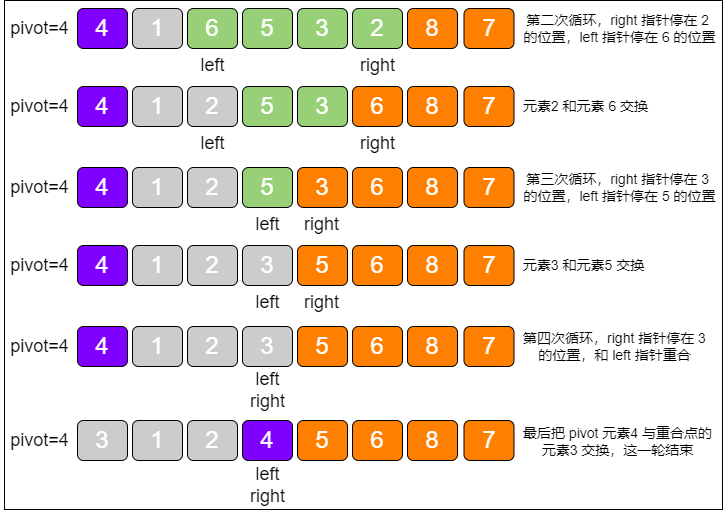

::: details 双边循环实现的快速算法排序，代码使用了递归的方式

```python
def quick_sort(start_index, end_index, array=[]):
    # 递归结束条件：start_index 大于或等于 end_index 的时候
    if start_index >= end_index:
        return
    
    # 得到基准元素位置
    pivot_index = partition_v1(start_index, end_index, array)
    # 根据基准元素，分成两部分递归排序
    quick_sort(start_index, pivot_index - 1, array)
    quick_sort(pivot_index + 1, end_index, array)


def partition_v1(start_index, end_index, array=[]):
    # 取第一个位置的元素作为基准元素（也可以选择随机位置）
    pivot = array[start_index]
    left = start_index
    right = end_index

    while left != right:
        # 控制 right 指针进行比较并左移
        while (left < right) and (array[right] > pivot):
            right -= 1
        
        # 控制 left 指针进行比较并右移
        while (left < right) and (array[left] <= pivot):
            left += 1
        
        # 交换 left 指针和 right 指针指向的元素
        if left < right:
            p = array[left]
            array[left] = array[right]
            array[right] = p
    
    # pivot 和指针重合点交换
    array[start_index] = array[left]
    array[left] = pivot
    return left


my_array = list([3, 4, 14, 1, 5, 6, 7, 8, 1, -1, 0, 9, 11])
quick_sort(0, len(my_array) - 1, my_array)
print(my_array)
```

:::

在上述代码中，`quick_sort` 方法通过递归的方式，实现了分而治之的思想。`partition_v1` 方法则实现了元素的交换，让数列中的元素依据自身大小，分别交换到基准元素的左右两边。在这里使用的交换方式是 **双边循环法。**

### 单边循环法

双边循环法从数组的两边交替遍历元素，虽然更加直观，但是代码实现相对烦琐。而单边循环法则简单得多，只从数组的一边对元素进行遍历和交换。

例如：对数列 `{4, 7, 3, 5, 6, 2, 8, 1}` 从小到大进行排序。详细过程如下：

开始和双边循环法相似，首先选定基准元素 `pivot`。同时，设置一个 `mark` 指针指向数列起始位置，这个 `mark` 指针代表 **小于基准元素的区域边界。**


接下来，从基准元素的下一个位置开始遍历数组。

如果遍历到的元素大于基准元素，就继续往后遍历。如果遍历到的元素小于基准元素，则需要做两件事：**第一**，把 `mark` 指针右移 `1` 位，因为小于 `pivot` 的区域边界增大了 `1`；**第二**，让最新遍历到的元素和 `mark` 指针所在位置的元素交换位置，因为最新遍历的元素归属于小于 `pivot` 的区域。

首先遍历到元素7，`7 > 4`，所以继续遍历。


接下来遍历到的元素是3，`3 < 4`，所以 `mark` 指针右移 `1` 位。

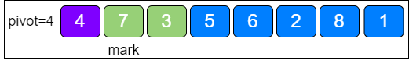

随后，让元素3 和 `mark` 指针所在位置的元素交换，因为元素3 归属于小于 `pivot` 的区域。

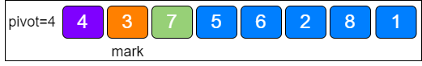

按照这个思路，继续遍历，后续步骤如下图所示：


::: details 单边循环实现的快速算法排序，代码使用了递归的方式

```python
def quick_sort(start_index, end_index, array=[]):
    # 递归结束条件：start_index 大于或等于 end_index 的时候
    if start_index >= end_index:
        return
    
    # 得到基准元素位置
    pivot_index = partition_v2(start_index, end_index, array)
    # 根据基准元素，分成两部分递归排序
    quick_sort(start_index, pivot_index - 1, array)
    quick_sort(pivot_index + 1, end_index, array)


def partition_v2(start_index, end_index, array=[]):
    # 取第一个位置的元素作为基准元素（也可以选择随机位置）
    pivot = array[start_index]
    mark = start_index

    for i in range(start_index + 1, end_index + 1):
        if array[i] < pivot:
            mark += 1
            p = array[mark]
            array[mark] = array[i]
            array[i] = p
    
    array[start_index] = array[mark]
    array[mark] = pivot
    return mark


my_array = list([3, 4, 14, 1, 5, 6, 7, 8, 1, -1, 0, 9, 11])
quick_sort(0, len(my_array) - 1, my_array)
print(my_array)
```

:::

可以很明显地看出，单边循环法只要一个大循环就搞定了，比双边循环法简单多了。

### 非递归实现

以上所讲的快速排序实现方法，都是以递归为基础的。其实快速排序也可以基于 **非递归** 的方式来实现。

绝大多数的递归逻辑，都可以用栈的方式来代替。代码中一层一层的方法调用，本身就使用了一个方法调用栈。每次进入一个新方法，就相当于入栈；每次有方法返回，就相当于出栈。所以，可以把原本的递归实现转化成一个栈的实现，在栈中存储每一次方法调用的参数。

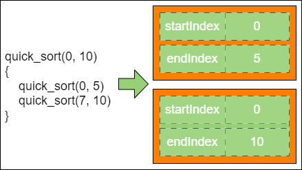

::: details 代码实现

```python
def quick_sort(start_index, end_index, array=[]):
    # 用一个集合栈来代替递归的函数栈
    quick_sort_stack = []
    # 整个数列的起止下标，以哈希的形式入栈
    root_param = {"startIndex": start_index, "endIndex": end_index}
    quick_sort_stack.append(root_param)
    
    # 循环结束条件：栈为空时结束
    while len(quick_sort_stack) > 0:
        # 栈顶元素出栈，得到起止小标
        param = quick_sort_stack.pop()
        # 得到基准元素位置
        pivot_index = partition(param.get("startIndex"), param.get("endIndex"), array)
        # 根据基准元素分成两部分，把每一部分的起止下标入栈
        if param.get("startIndex") < pivot_index - 1:
            left_param = {"startIndex": param.get("startIndex"), "endIndex": pivot_index - 1}
            quick_sort_stack.append(left_param)
        
        if pivot_index + 1 < param.get("endIndex"):
            right_param = {"startIndex": pivot_index + 1, "endIndex": param.get("endIndex")}
            quick_sort_stack.append(right_param)


def partition(start_index, end_index, array=[]):
    # 取第一个位置的元素作为基准元素（也可以选择随机位置）
    pivot = array[start_index]
    mark = start_index

    for i in range(start_index + 1, end_index + 1):
        if array[i] < pivot:
            mark += 1
            p = array[mark]
            array[mark] = array[i]
            array[i] = p
    
    array[start_index] = array[mark]
    array[mark] = pivot
    return mark


my_array = list([3, 4, 14, 1, 5, 6, 7, 8, 1, -1, 0, 9, 11])
quick_sort(0, len(my_array) - 1, my_array)
print(my_array)
```

:::

和刚才的递归实现相比，非递归方式代码的变动只发生在 `quick_sort` 方法中。该方法引入了一个栈，栈中的字典元素用于存储每一次交换时的起始下标和结束下标。

每一次循环，都会让栈顶元素出栈，通过 `partition` 方法进行分治，并且按照基准元素的位置分成左右两部分，左右两部分再分别入栈。当栈为空时，说明排序已经完毕，退出循环。

## 堆排序

二叉堆的构建、删除、自我调整等基本操作，正是实现堆排序的基础。

二叉堆的特性：

- **最大堆的堆顶是整个堆中的最大元素**
- **最小堆的堆顶是整个堆中的最小元素**

以最大堆为例，如果删除一个最大堆的堆顶（并不是完全删除，而是跟末尾的节点交换位置），经过自我调整，第 `2` 大的元素就会被交换上来，成为最大堆的新堆顶。


在删除值为 `10` 的堆顶节点后，经过调整，值为9 的新节点就会顶替上来；在删除值为9 的堆顶节点后，经过调整，值为8 的新节点就会顶替上来……

由于二叉堆的这个特性，每一次删除旧堆顶，调整后的新堆顶都是大小仅次于旧堆顶的节点。那么只要反复删除堆顶，反复调整二叉堆，所得到的集合就会成为一个有序集合，过程如下：

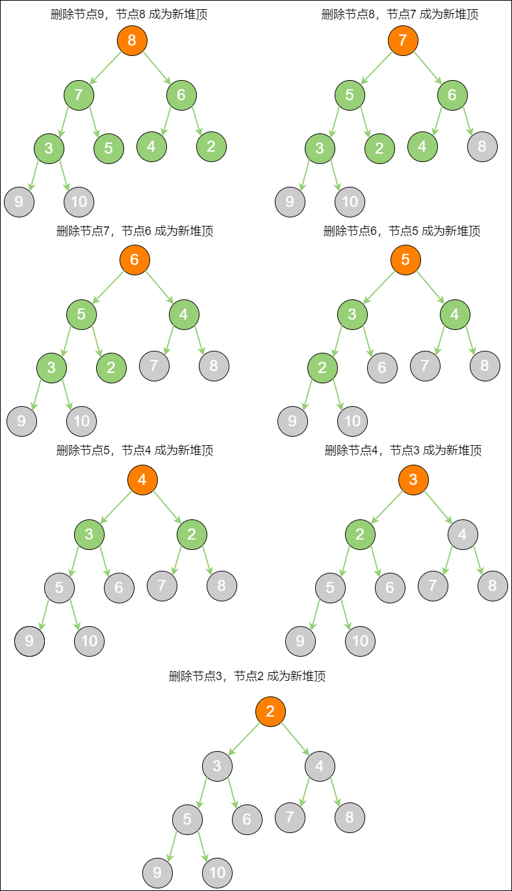

到此为止，原本的最大二叉堆已经变成了一个从小到大的有序集合。二叉堆实际存储在数组中，数组中的元素排列如下：


由此，可以归纳出 **堆排序算法的步骤：**

1. 把无序数组构建成二叉堆。需要从小到大排序，则构建成最大堆；需要从大到小排序，则构建成最小堆。
2. 循环删除堆顶元素，替换到二叉堆的末尾，调整堆产生新的堆顶。

::: details 堆排序代码实现

```python
def heap_sort(array=[]):
    # 1. 把无序数组构建成最大堆
    for i in range((len(array) - 2) // 2, -1, -1):
        down_adjust(i, len(array), array)
    
    # 2. 循环交换集合尾部元素到堆顶，并调节堆产生新的堆顶
    for i in range(len(array) - 1, 0, -1):
        # 最后一个元素和第一元素进行交换
        temp = array[i]
        array[i] = array[0]
        array[0] = temp
        # 下沉调整最大堆
        down_adjust(0, i, array)


def down_adjust(parent_index, length, array=[]):
    # temp 保存父节点值，用于最后的赋值
    temp = array[parent_index]
    child_index = 2 * parent_index + 1

    while child_index < length:
        # 如果有右孩子，且右孩子的值大于左孩子的值，则定位到右孩子
        if child_index + 1 < length and array[child_index + 1] > array[child_index]:
            child_index += 1
        
        # 如果父节点的值大于等于任何一个孩子的值，直接跳出
        if temp >= array[child_index]:
            break
            
        # 无须真正交换，单向赋值即可
        array[parent_index] = array[child_index]
        parent_index = child_index
        child_index = 2 * child_index + 1
    
    array[parent_index] = temp


my_array = list([3, 4, 14, 1, 5, 6, 7, 8, 1, -1, 0, 9, 11])
heap_sort(my_array)
print(my_array)
```

:::

::: info
堆排序的空间复杂度是 **O(1)**，因为并没有开辟额外的集合空间。

堆排序的时间复杂度是 **O(nlog~2~n)**，分析如下：

二叉堆的节点 “下沉” 调整（`down_adjust` 方法）是堆排序算法的基础，这个调节操作本身的时间复杂度是 **O(log~2~n)。**

根据堆排序算法的步骤，第 `1` 步，把无序数组构建成二叉堆，这一步的时间复杂度是 **O(n)**；第 2 步，需要进行 `n - 1` 次循环。每次循环调用一次 `down_adjust` 方法，所以第 2 步的计算规模是 **(n - 1) × log~1~n**，时间复杂度为 **O(nlog~2~n)**。两个步骤是并列关系，所以整体的时间复杂度是 **O(nlog~2~n)。**
:::

## 快速排序和堆排序对比

|  类型  |  快速排序  |  堆排序  |
|  :----:  |  :----:  |  :----:  |
|  平均时间复杂度  |  **O(nlog~2~n)**，且是不稳定排序  |  **O(nlog~2~n)**，且是不稳定排序  |
|  最坏时间复杂度  |  **O(n^2^)**  |  **O(nlog~2~n)**  |
|  平均空间复杂度  |  **O(log~2~n)**  |  **O(1)**  |

## 计数排序和桶排序

### 线性时间的排序

无论是冒泡排序，还是快速排序，都是基于 **元素之间** 的比较来进行排序的。有一些特殊的排序并不基于元素比较，如：**计数排序**、**桶排序**、**基数排序**。以计数排序来说，这种排序算法是利用 **数组下标** 来确定元素的正确位置的。

### 计数排序

假设数组中有 `20` 个随机整数，取值范围为 `0~10`，要求用最快的速度把这 `20` 个整数从小到大进行排序。


由于取值范围有限，所以，可以根据这有限的范围，建立一个长度为 `11` 的数组。数组下标从 `0~10`，元素初始值全为 `0`：

假设 `20` 个随机整数的值是：`9, 3, 5, 4, 9, 1, 2, 7, 8, 1, 3, 6, 5, 3, 4, 0, 10, 9, 7, 9`

下面就开始遍历这个无序的随机数列，每一个整数按照其值对号入座，同时，对应数组下标的元素进行加 `1` 操作。

第一个整数是 `9`，那么数组下标为 `9` 的元素加 `1`：


第二个整数是 `3`，那么数组下标为 `3` 的元素加 `1`：

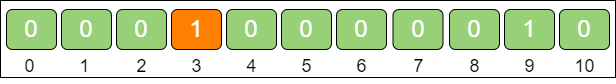
 
继续遍历数列并修改数组……最终，当数列遍历完毕时，数组的状态如下：

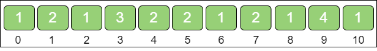

该数组中每一个下标位置的值代表数列中对应整数出现的次数。有了这个统计结果，排序就很简单了。直接遍历数组，输出数组元素的下标值，元素的值是几，就输出几次：

`0, 1, 1, 2, 3, 3, 3, 4, 4, 5, 5, 6, 7, 7, 8, 9, 9, 9, 9, 10`

显然，现在输出的数列已经是有序的了。

这就是计数排序的基本过程，它适用于一定范围内的整数排序。在取值范围不是很大的情况下，它的性能甚至快过那些时间复杂度为 **O(nlog~2~n)** 的排序。

::: details 计数排序代码实现

```python
def count_sort(array=[]):
    # 1. 得到数列的最大值
    max_value = array[0]

    for i in range(1, len(array)):
        if array[i] > max_value:
            max_value = array[i]

    # 2. 根据数列最大值确定统计数组的长度
    count_array = [0] * (max_value + 1)

    # 3. 遍历数列，填充统计数组
    for i in range(0, len(array)):
        count_array[array[i]] += 1
    
    # 4. 遍历统计数组，输出结果
    sorted_array = []

    for i in range(0, len(count_array)):
        for j in range(0, count_array[i]):
            sorted_array.append(i)
    
    return sorted_array


my_array = list([4, 4, 6, 5, 3, 2, 8, 1, 7, 5, 6, 0, 10])
print(count_sort(my_array))
```

:::

这段代码在开头有一个步骤，就是求数列的最大整数值 `max_value`。后面创建的统计数组 `count_array`，长度是 `max_value + 1`，以此来保证数组的最后一个下标是 `max_value`。

### 计数排序的优化

上面代码以数列的最大值来决定统计数组的长度，其实并不严谨。例如数列：`95, 94, 91, 98, 99, 90, 99, 93, 91, 92`。这个数列的最大值是 `99`，但最小的整数是 `90`。如果创建长度为 `100` 的数组，那么前面从 `0~89` 的空间位置就都浪费了！

解决这个问题只要不再以输入数列的 **最大值 + 1** 作为统计数组的长度，而是以数列 **最大值 - 最小值 + 1** 作为统计数组的长度即可。同时，数列的最小值作为一个偏移量，用于计算整数在统计数组中的下标。

以刚才的数列为例，统计出数组的长度为 `99 - 90 + 1 = 10`，偏移量等于数列的最小值 `90`。

对于第一个整数 `95`，对应的统计数组下标是 `95 - 90 = 5`，如下图所示：

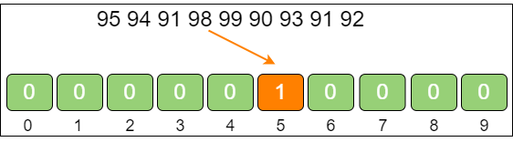

这确实对计数排序进行了优化。此外，朴素版的计数排序只是简单地按照统计数组的下标输出元素值，并没有真正给原始数列进行排序。

如果只是单纯地给整数排序，这样做并没有问题。但如果在现实业务里，例如：给学生的考试分数进行排序，遇到相同的分数就会分不清谁是谁。

|  姓名  |  成绩  |
|  :----:  |  :----:  |
|  张三  |  90  |
|  李四  |  99  |
|  王五  |  95  |
|  赵六  |  94  |
|  孙七  |  95  |

给出一个学生成绩表，要求按成绩从低到高进行排序，如果成绩相同，则遵循原表固有顺序。当填充统计数组以后，只知道有两个成绩并列为 `95` 分的同学，却不知道哪一个是王五，哪一个是孙七。


在这种情况下，需要稍微改变之前的逻辑，在填充完统计数组以后，对统计数组做一下变形。仍然以刚才的学生成绩表为例，将之前的统计数组变形成下面的样子：

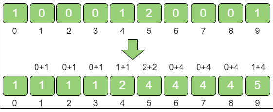

数组变形就是从统计数组的第二个元素开始，每一个元素都加上前面所有元素之和。这样相加的目的，是让统计数组存储的元素值，等于相应整数的最终排序位置的序号。例如：下标是 `9` 的元素值为 `5`，代表原始数列的整数 `9`，最终的排序在第 `5` 位。

接下来，创建输出数组 `sorted_array`，长度和输入数列一致。然后从后向前遍历输入数列。

第一步，遍历成绩表最后一行的孙七同学的成绩。

孙七的成绩是 `95` 分，找到 `count_array` 下标是 `5` 的元素，值是 `4`，代表孙七的成绩排名位置在第 `4` 位。

同时，给 `count_array` 下标是 `5` 的元素值减 `1`，从 `4` 变成 `3`，代表下次再遇到 `95` 分的成绩时，最终排名是第 `3`。

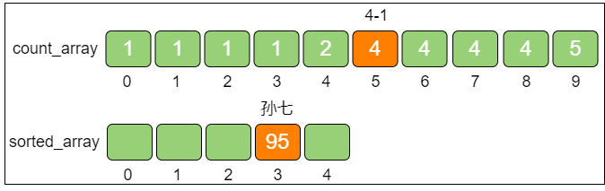

第二步，遍历成绩表倒数第二行的赵六同学的成绩。

赵六的成绩是 `94` 分，找到 `count_array` 下标是 `4` 的元素，值是 `2`，代表赵六的成绩排名位置在第 `2` 位。

同时，给 `count_array` 下标是 `4` 的元素值减 `1`，从 `2` 变成 `1`，代表下次再遇到 `94` 分的成绩时（实际上已经遇不到了），最终排名是第 `1`。


第三步，遍历成绩表倒数第三行的王五同学的成绩。

王五的成绩是 `95` 分，找到 `count_array` 下标是 `5` 的元素，值是 `3`（最初是 `4`，减 `1` 变成了 `3`），代表王五的成绩排名位置在第 `3` 位。

同时，给 `count_array` 下标是 `5` 的元素值减 `1`，从 `3` 变成 `2`，代表下次再遇到 `95` 分的成绩时（实际上已经遇不到了），最终排名是第 `2`。

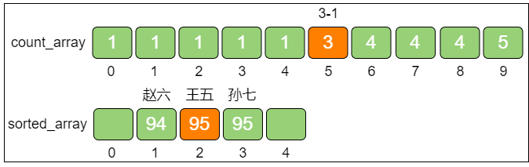

这样一来，同样是 `95` 分的王五和孙七就能够清楚地排出顺序了，也正因为这样，优化版本的计数排序属于 **稳定排序**。后面的遍历过程以此类推。

::: details 计数排序的优化代码实现

```python
def count_sort_v2(array=[]):
    # 1. 得到数列的最大值和最小值，并算出差值 d
    max_value = array[0]
    min_value = array[0]
    
    for i in range(1, len(array)):
        if array[i] > max_value:
            max_value = array[i]
        
        if array[i] < min_value:
            min_value = array[i]
    
    d = max_value - min_value

    # 2. 创建统计数组并统计对应元素个数
    count_array = [0] * (d + 1)

    for i in range(0, len(array)):
        count_array[array[i] - min_value] += 1
    
    # 3. 统计数组做变形，后面的元素等于前面的元素之和
    for i in range(1, len(array)):
        count_array[i] += count_array[i - 1]
    
    # 4. 倒序遍历原始数列，从统计数组找到正确位置，输出到结果数组
    sorted_array = [0] * len(array)
    
    for i in range(len(array) - 1, -1, -1):
        sorted_array[count_array[array[i] - min_value] - 1] = array[i]
        count_array[array[i] - min_value] -= 1
    
    return sorted_array


my_array = list([95, 94, 91, 98, 99, 90, 99, 93, 91, 92])
print(count_sort_v2(my_array))
```

:::

::: info
如果原始数列的规模是 `n`，最大整数和最小整数的差值是 `m` 那么：

代码第1、2、4步都涉及遍历原始数列，运算量都是 `n`，第 3 步遍历统计数列，运算量是 `m`，所以总体运算量是 `3n + m`，去掉系数，时间复杂度是 **O(n + m)**

如果不考虑结果数组，只考虑统计数组大小的话，空间复杂度是 **O(m)**
:::

计数排序有它的 **局限性**，主要表现为如下两点：

1. 当数列最大和最小值差距过大时，并不适合用计数排序。

    例如：给出 `20` 个随机整数，范围在 `0~1亿` 之间，这时如果使用计数排序，需要创建长度为 `1亿` 的数组。不但严重浪费空间，而且时间复杂度也会随之升高。

2. 当数列元素不是整数时，也不适合用计数排序。

    如果数列中的元素都是小数，如：`25.213` 或 `0.00000001` 这样的数字，则无法创建对应的统计数组。这样显然无法进行计数排序。

### 桶排序

桶排序同样是一种线性时间的排序算法，它类似于计数排序所创建的统计数组，桶排序需要创建若干个桶来协助排序。每一个桶（bucket）代表一个 **区间范围**，里面可以承载一个或多个元素。

假设有一个非整数数列，如：`4.5, 0.84, 3.25, 2.18, 0.5`

**桶排序的工作原理如下：**

第一步，创建这些桶，并确定每一个桶的区间范围。

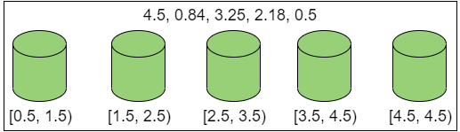

具体需要建立多少个桶，如何确定桶的区间范围，有很多种不同的方式。这里创建的桶数量等于原始数列的元素数量，除最后一个桶只包含数列最大值外，前面各个桶的区间按照比例来确定。

**桶的区间比例**：区间跨度 = (最大值 - 最小值) / (桶的数量 - 1)

第二步，遍历原始数列，把元素对号入座放入各个桶中。

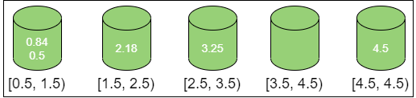

第三步，对每个桶内部的元素分别进行排序（显然，只有第一个桶需要排序）。

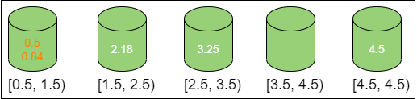

第四步，遍历所有的桶，输出所有元素。

`0.5, 0.84, 2.18, 3.25, 4.5`

到此为止，排序结束。

::: details 桶排序的代码

```python
def bucket_sort(array=[]):
    # 1. 得到数列的最大值和最小值，并算出差值 d
    max_value = array[0]
    min_value = array[0]
    
    for i in range(1, len(array)):
        if array[i] > max_value:
            max_value = array[i]
        
        if array[i] < min_value:
            min_value = array[i]
    
    d = max_value - min_value

    # 2. 初始化桶
    bucket_num = len(array)
    bucket_list = []

    for i in range(0, bucket_num):
        bucket_list.append([])
    
    # 3. 遍历原始数组，将每个元素放入桶中
    for i in range(1, len(array)):
        num = int((array[i] - min_value) * (bucket_num - 1) / d)
        bucket = bucket_list[num]
        bucket.append(array[i])
    
    # 4. 对每个桶内部进行排序
    for i in range(0, len(bucket_list)):
        # list 采用了归并排序或归并的优化版本
        bucket_list[i].sort()
    
    # 5. 输出全部元素
    sorted_array = []

    for sub_list in bucket_list:
        for element in sub_list:
            sorted_array.append(element)
    
    return sorted_array


my_array = list([4.12, 6.421, 0.0023, 3.0, 2.123, 8.122, 4.12, 10.09])
print(bucket_sort(my_array))
```

:::

在上述代码中，所有的桶都保存在 `bucket_list` 集合中，每个桶都是一个列表。

同时，上述代码使用了 `sort` 方法对桶内元素进行排序。`sort` 方法底层采用的是 `Timsort` 排序算法，可以简单地理解为是一种时间复杂度为 O(nlog~2~n) 的排序。

::: info
假设原始数列有 `n` 个元素，分成 `n` 个桶。桶排序的时间复杂度如下：

- **第一步**：求数列最大值、最小值，运算量为 `n`
- **第二步**：创建空桶，运算量为 `n`
- **第三步**：把原始数列的元素分配到各个桶中，运算量为 `n`
- **第四步**：在每个桶内部做排序，在元素分布相对均匀的情况下，所有桶的运算量之和为 `n`
- **第五步**：输出排序数列，运算量为 `n`

因此，桶排序的总体时间复杂度为 **O(n)**

至于空间复杂度就很容易得到了，同样是 **O(n)**

桶排序的性能 **并非绝对稳定**。如果元素的分布极不均衡，在极端情况下，第一个桶中有 `n - 1` 个元素，最后一个桶中有 `1` 个元素。此时的时间复杂度将退化为 **O(nlog~2~n)**，而且还白白创建了许多空桶。
:::

## 排序算法对比

|  排序算法  |  平均时间复杂度  |  最坏时间复杂度  |  空间复杂度  |  是否稳定排序  |
|  :----:  |  :----:  |  :----:  |  :----:  |  :----:  |
|  冒泡排序  |  **O(n^2^)**  |  **O(n^2^)**  |  **O(1)**  |  **稳定**  |
|  鸡尾酒排序  |  **O(n^2^)**  |  **O(n^2^)**  |  **O(1)**  |  **稳定**  |
|  快速排序  |  **O(nlog~2~n)**  |  **O(n^2^)**  |  **O(log~2~n)**  |  **不稳定**  |
|  堆排序  |  **O(nlog~2~n)**  |  **O(nlog~2~n)**  |  **O(1)**  |  **不稳定**  |
|  计数排序  |  **O(n + m)**  |  **O(n + m)**  |  **O(m)**  |  **稳定**  |
|  桶排序  |  **O(n)**  |  **O(nlog~2~n)**  |  **O(n)**  |  **稳定**  |
