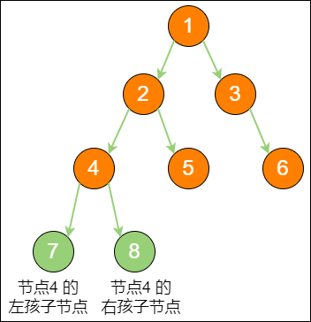
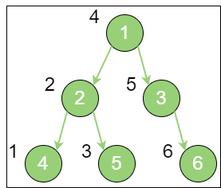
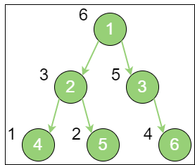
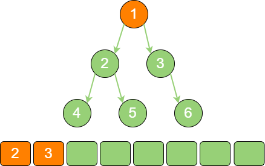
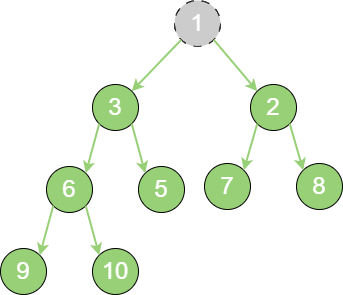

## 树和二叉树

有许多逻辑关系并不是简单的 **线性关系**，在实际场景中，常常存在一对多，甚至多对多的情况。其中 **树** 和 **图** 就是典型的 **非线性数据结构。**

### 树

**树（tree）** 是 `n(n ≥ 0)` 个节点的有限集。当 `n = 0` 时，称为 **空树**。

在任意一个非空树中，有如下特点：

- 有且仅有一个特定的称为 **根节点**
- 当 `n > 1` 时，其余节点可分为 `m(m > 0)` 个互不相交的有限集，每一个集合本身又是一个树，并称为 **根的子树**

**标准的树结构如下所示：**


在上图中，节点1 是 **根节点**（`root`）；节点5、6、7、8、9 是树的末端，没有 “孩子节点”，被称为 **叶子节点（leaf）**。图中的虚线部分，是根节点1 的 **其中一个子树。**

同时，树的结构从根节点到叶子节点，分为不同的层级。节点4 的上一级节点（节点2）是节点4 的 **父节点（parent）**；从节点4 衍生出来的节点（节点7、8、9）是节点4 的 **孩子节点（child）**；和节点4 同级，由同一个父节点衍生出来的节点（节点5、6）是节点4 的 **兄弟节点（sibling）。**

树的最大层级数，称为 **树的高度** 或 **深度。**

### 二叉树

**二叉树（binary tree）** 是树的一种特殊形式。**二叉** 顾名思义，这种树的每个节点最多有 `2` 个 **孩子节点**。注意，这里是最多有 `2` 个，也可能只有 `1` 个，或者没有 **孩子节点。**

**二叉树的结构如下图所示：**



二叉树节点的两个孩子节点，一个被称为 **左孩子（left child）**，一个被称为 **右孩子（right child）**。这两个孩子节点的顺序是固定的，就像人的左手就是左手，右手就是右手，不能够颠倒或混淆。

此外，二叉树还有两种特殊形式：

- **满二叉树**

    一个二叉树的所有非叶子节点都存在左孩子和右孩子，并且所有叶子节点都在同一层级上，那么这个树就是 **满二叉树**。满二叉树的每一个分支都是满的。

    

- **完全二叉树**

    对一个有 `n` 个节点的二叉树，按层级顺序编号，则所有节点的编号为从 `1` 到 `n`。如果这个树所有节点和同样深度的满二叉树的编号为从 `1` 到 `n` 的节点位置相同，则这个二叉树为 **完全二叉树。**

    

    在上图中，二叉树编号从 `1` 到 `12` 的 `12` 个节点，和前面满二叉树编号从 1 到 12 的节点位置完全对应。因此这个树是 **完全二叉树。**

    完全二叉树的条件没有满二叉树那么苛刻：满二叉树要求所有分支都是满的；而完全二叉树只需保证最后一个节点之前的节点都齐全即可。

二叉树可以用 **链式存储结构** 也可以用 **数组存储结构。**

- **链式存储结构**

    

    链式存储是二叉树最直观的存储方式。一个节点最多可以指向左右两个孩子节点，所以二叉树的每一个节点包含三部分。

    - **存储数据的 data 变量**
    - **指向左孩子的 left 指针**
    - **指向右孩子的 right 指针**

- **数组存储结构**

    

    使用数组存储时，会按照层级顺序把二叉树的节点放到数组中对应的位置上。如果某一个节点的左孩子或右孩子空缺，则数组的相应位置也空出来。这样可以更方便地在数组中定位二叉树的孩子节点和父节点。

    假设一个父节点的下标是 `parent`，那么它的左孩子节点的下标就是 `2 × parent + 1`；右孩子节点的下标就是 `2 × parent + 2`。反过来，假设一个左孩子节点的下标是 `leftChild`，那么它的父节点下标就是`(leftChild - 1) / 2`。
    
    假如节点4 在数组中的下标是 `3`，节点4 是节点2 的左孩子，节点2 的下标可以直接通过计算得出：节点2 的下标等于 `(3 - 1) / 2 = 1`。
    
    显然，对于一个稀疏的二叉树来说，用数组表示法是非常浪费空间的。

### 二叉树的应用

二叉树包含许多特殊的形式，每一种形式都有自己的作用，但是其最主要的应用还在于进行 **查找操作** 和 **维持相对顺序** 这两个方面。

- **查找操作**

    二叉树的树形结构使它很适合扮演索引的角色。

    这里介绍一种特殊的二叉树：**二叉查找树（binary search tree）**。仅看名字就可以知道，这种二叉树的主要作用就是进行查找操作。

    二叉查找树在二叉树的基础上增加了以下几个条件：

    - 如果左子树不为空，则左子树上所有节点的值均小于根节点的值
    - 如果右子树不为空，则右子树上所有节点的值均大于根节点的值
    - 左子树、右子树也都是二叉查找树

    **一个标准的二叉查找树：**

    

    二叉查找树的这些条件为了查找方便。例如：查找值为 `4` 的节点。
    
    第 1 步，访问根节点6，发现 `4 < 6`；第 2 步，访问节点6 的左孩子节点3，发现 `4 > 3`；第 3 步，访问节点3 的右孩子节点4，发现 `4 = 4`，这正是要查找的节点。

    对于一个节点分布相对均衡的二叉查找树来说，如果节点总数是 `n`，那么搜索节点的时间复杂度就是 **O(log~2~n)**，和树的深度是一样的。

    这种依靠比较大小来逐步查找的方式，和二分查找算法非常相似。

- **维持相对顺序**

    二叉查找树要求左子树节点的值小于父节点的值，右子树节点的值大于父节点的值，正是这样保证了二叉树的有序性。因此二叉查找树还有另一个名字 **二叉排序树（binary sort tree）。**

    新插入的节点，同样要遵循二叉排序树的原则。例如：插入新元素 `5`，由于 `5 < 6`、`5 > 3`、`5 > 4`，所以 `5` 最终会插到节点4 的右孩子位置。

    这一切看起来很顺利，然而却隐藏着一个致命的问题。例如：在二叉查找树根节点10 中依次插入节点9、8、7、6，就会出现以下现象：

    

    不只是外观看起来变得怪异了，查询节点的时间复杂度也退化成了 **O(n)。**

    解决这个问题需要用二叉树的 **自平衡**。二叉树自平衡的方式有多种，例如：红黑树、AVL树、树堆等。

## 二叉树的遍历

在计算机程序中，遍历本身是一个线性操作。所以遍历同样具有线性结构的数组或链表，是一件轻而易举的事情。

反观二叉树，是典型的非线性数据结构，遍历时需要把非线性关联的节点转化成一个线性的序列。以不同的方式来遍历，遍历出的序列顺序也不同。

从节点之间位置关系的角度来看，二叉树的遍历分为四种：

- **前序遍历**
- **中序遍历**
- **后序遍历**
- **层序遍历**

从更宏观的角度来看，二叉树的遍历归结为两大类：

- **深度优先遍历**：前序遍历、中序遍历、后序遍历
- **广度优先遍历**：层序遍历

::: note
深度优先和广度优先这两个概念不止局限于二叉树，它们更是一种抽象的算法思想，决定了访问某些复杂数据结构的顺序。在访问树、图，或其他一些复杂数据结构时，这两个概念常常被使用到
:::

### 深度优先遍历

所谓深度优先，顾名思义，就是偏向于纵深，“一头扎到底” 的访问方式。可能这种说法有些抽象，通过二叉树的 **前序遍历**、**中序遍历**、**后序遍历** 来理解深度优先。

1. 前序遍历。

    二叉树的前序遍历，输出顺序是根节点、左子树、右子树。

    

    上图就是一个二叉树的前序遍历，每个节点左侧的序号代表该节点的输出顺序，详细步骤如下：

    首先输出的是根节点1；由于根节点1 存在左孩子，输出左孩子节点2；由于节点2 也存在左孩子，输出左孩子节点4；节点4 既没有左孩子，也没有右孩子，那么回到节点2，输出节点2 的右孩子节点5；节点5 既没有左孩子，也没有右孩子，那么回到节点1，输出节点1 的右孩子节点3；节点3 没有左孩子，但是有右孩子，因此输出节点3 的右孩子节点6。到此为止，所有的节点遍历输出完毕。

2. 中序遍历。

    二叉树的中序遍历，输出顺序是左子树、根节点、右子树。

    

    上图就是一个二叉树的中序遍历，每个节点左侧的序号代表该节点的输出顺序，详细步骤如下：

    首先访问根节点的左孩子，如果这个左孩子还拥有左孩子，则继续深入访问下去，一直找到不再有左孩子的节点，并输出该节点。显然，第一个没有左孩子的节点是节点4；依照中序遍历的次序，接下来输出节点4 的父节点2；再输出节点2 的右孩子节点5；以节点2 为根的左子树已经输出完毕，这时再输出整个二叉树的根节点1；由于节点3 没有左孩子，所以直接输出根节点1 的右孩子节点3；最后输出节点3 的右孩子节点6。到此为止，所有的节点遍历输出完毕。

3. 后序遍历。

    二叉树的后序遍历，输出顺序是左子树、右子树、根节点。

    

    上图就是一个二叉树的后序遍历，每个节点左侧的序号代表该节点的输出顺序，详细步骤如下：

    首先访问根节点的左孩子，如果这个左孩子还拥有左孩子，则继续深入访问下去，一直找到不再有左孩子的节点，并输出该节点。显然，第一个没有左孩子的节点是节点4；依照后序遍历的次序，接下来访问节点4 的父节点2 的右孩子，输出节点5；以节点2 为根的左右子树已经输出完毕，再输出节点2；这时根节点1 的左子树输出完毕，输出根节点1 的右子树，节点3 没有左孩子，所以直接输出节点6；以节点3 为根的左右子树已经输出完毕，再输出节点3；根节点1 的左右节点已经输出完毕，最后输出根节点1。到此为止，所有的节点遍历输出完毕。

二叉树的这三种遍历方式，用递归的思路可以非常简单地实现出来。

::: details 代码

```python
class TreeNode:
    def __init__(self, data):
        self.data = data
        self.left = None
        self.right = None


def create_binary_tree(input_list=[]):
    """
    构建二叉树
    :param input_list：输出数列
    """
    if (input_list is None) or (len(input_list) == 0):
        return None
    
    data = input_list.pop(0)

    if data is None:
        return None
    
    node = TreeNode(data)
    node.left = create_binary_tree(input_list)
    node.right = create_binary_tree(input_list)

    return node


def pre_order_traversal(node):
    """
    前序遍历
    :param node：二叉树节点
    """
    if node is None:
        return
    
    print(node.data)
    pre_order_traversal(node.left)
    pre_order_traversal(node.right)
    
    return node


def in_order_traversal(node):
    """
    中序遍历
    :param node：二叉树节点
    """
    if node is None:
        return
    
    in_order_traversal(node.left)
    print(node.data)
    in_order_traversal(node.right)
    
    return node


def post_order_traversal(node):
    """
    后序遍历
    :param node：二叉树节点
    """
    if node is None:
        return
    
    post_order_traversal(node.left)
    post_order_traversal(node.right)
    print(node.data)

    return node


my_input_list = list([3, 2, 9, None, None, 10, None, None, 8, None, 4])
root = create_binary_tree(my_input_list)
print('前序遍历：')
pre_order_traversal(root)
print('中序遍历：')
in_order_traversal(root)
print('后序遍历：')
post_order_traversal(root)
```

:::

这三种遍历方式的区别，仅仅是输出的执行位置不同：前序遍历的输出在前，中序遍历的输出在中间，后序遍历的输出在最后。

::: waring 二叉树的构建
二叉树的构建方法有很多，这里把一个线性的链表转化成非线性的二叉树，链表节点的顺序恰恰是二叉树前序遍历的顺序。链表中的空值，代表二叉树节点的左孩子或右孩子为空的情况。
:::

在代码中，通过 `{3, 2, 9, None, None, 10, None, None, 8, None, 4}` 这样一个线性序列，构建成的二叉树如下：


二叉树的深度优先遍历绝大多数可以用递归解决的问题，其实都可以用另一种数据结构来解决，这种数据结构就是 **栈**。因为递归和栈都有回溯的特性。例如：

1. 首先遍历二叉树的根节点1，放入栈中。

    

2. 遍历根节点1 的左孩子节点2，放入栈中。

    

3. 遍历节点2 的左孩子节点4，放入栈中。

    

4. 节点4 既没有左孩子，也没有右孩子，需要回溯到上一个节点2。

    这时栈已经存储了刚才遍历的路径，让旧的栈顶元素4 出栈，就可以重新访问节点2，得到节点2 的右孩子节点5。
    
    此时节点2 已经没有利用价值（已经访问过左孩子和右孩子），节点2 出栈，节点5 入栈。

    

5. 节点5 既没有左孩子，也没有右孩子，需要再次回溯，一直回溯到节点1。所以让节点5 出栈。

    根节点1 的右孩子是节点3，节点1 出栈，节点3 入栈。

    

6. 节点3 的右孩子是节点6，节点3 出栈，节点6 入栈。

    

7. 节点6 既没有左孩子，也没有右孩子，所以节点6 出栈。此时栈为空，遍历结束。

    

::: details 二叉树非递归前序遍历的代码

```python
def pre_order_traversal_with_stack(node):
    stack = []

    while (node is not None) or (len(stack) > 0):
        while node is not None:
            print(node.data)
            stack.append(node)
            node = node.left
        
        if len(stack) > 0:
            node = stack.pop()
            node = node.right
```

:::

至于二叉树的中序、后序遍历的非递归实现，思路和前序遍历差不多，都是利用栈来进行回溯。

### 广度优先遍历

如果说深度优先遍历是在一个方向上 “一头扎到底”，那么广度优先遍历则恰恰相反：先在各个方向上各走出 1 步，再在各个方向上走出第 2 步、第 3 步……一直到各个方向全部走完。听起来有些抽象，通过二叉树的 **层序遍历** 来理解广度优先。

层序遍历，顾名思义，就是二叉树按照从根节点到叶子节点的层次关系，一层一层横向遍历各个节点。


上图就是一个二叉树的层序遍历，每个节点左侧的序号代表该节点的输出顺序。

二叉树同一层次的节点之间是没有直接关联的，实现这种层序遍历需要借助 **队列** 数据结构来辅助工作。详细遍历步骤如下：

1. 根节点1 进入队列。

    

2. 节点1 出队，输出节点1，并得到节点1 的左孩子节点2、右孩子节点3。让节点2 和节点3 入队。

    

3. 节点2 出队，输出节点2，并得到节点2 的左孩子节点4、右孩子节点5。让节点4 和节点5 入队。

    

4. 节点3 出队，输出节点3，并得到节点3 的右孩子节点6。让节点6 入队。

    

5. 节点4 出队，输出节点4，由于节点4 没有孩子节点，所以没有新节点入队。

    

6. 节点5 出队，输出节点5，由于节点5 同样没有孩子节点，所以没有新节点入队。

    

7. 节点6 出队，输出节点6，由于节点6 同样没有孩子节点，所以没有新节点入队。

    

到此为止，所有的节点遍历输出完毕。

::: details 二叉树非递归层序遍历的代码

```python
from queue import Queue

def level_order_traversal(node):
    queue = Queue()
    queue.put(node)

    while node queue.empty():
        node = queue.get()
        print(node.data)

        if node.left is not None:
            queue.put(node.left)
        
        if node.right is not None:
            queue.put(node.right)
```

:::

## 二叉堆

二叉堆本质上是一种完全二叉树，它分为两种类型：

- **最大堆**

    最大堆的任何一个父节点的值，都大于或等于它左孩子或右孩子节点的值。如下图所示：

    


- **最小堆**

    最小堆的任何一个父节点的值，都小于或等于它左孩子或右孩子节点的值。如下图所示：

    

二叉堆的根节点叫作 **堆顶**。最大堆和最小堆的特点决定了：最大堆的堆顶是整个堆中的 **最大元素**；最小堆的堆顶是整个堆中的 **最小元素。**

### 二叉堆的自我调整

对于二叉堆，有如下几种操作：

- **插入节点**
- **删除节点**
- **构建二叉堆**

这几种操作都基于堆的 **自我调整**。所谓堆的自我调整，就是把一个不符合堆性质的完全二叉树，调整成一个堆。通过以 **最小堆** 为例，来理解二叉堆的 **自我调整。**

1. 插入节点。

    当在二叉堆中插入节点时，插入位置是完全二叉树的最后一个位置。例如：插入一个新节点，值是 `0`。

    

    这时，新节点的父节点5 比 `0` 大，显然不符合最小堆的性质。于是让新节点 “上浮”，和父节点交换位置。

    

    继续用节点0 和父节点3 做比较，因为 `0 < 3`，则让新节点继续 “上浮”。

    

    继续比较，最终新节点0 “上浮” 到了堆顶位置。

    

2. 删除节点。

    从二叉堆删除节点的过程和插入节点的过程正好相反，所删除的是处于堆顶的节点。例如：删除最小堆的堆顶节点1。

    

    这时，为了继续维持完全二叉树的结构，把堆的最后一个节点10 临时补到原本堆顶的位置。

    

    接下来，让暂处堆顶位置的节点10 和它的左孩子、右孩子进行比较，如果左孩子、右孩子节点中最小的一个（显然是节点2）比节点10 小，那么让节点10 “下沉”。

    

    继续让节点10 和它的左孩子、右孩子做比较，左孩子、右孩子中最小的是节点7，由于 `10 > 7`，让节点10 继续 “下沉”。

    

    这样一来，二叉堆重新得到了调整。

3. 构建二叉堆。

    构建二叉堆，也就是把一个无序的完全二叉树调整为二叉堆，本质就是让所有非叶子节点依次 “下沉”。例如：一个无序完全二叉树的，如下图所示：

    

    首先，从最后一个非叶子节点开始，也就是从节点10 开始。如果节点10 大于它的左孩子、右孩子节点中最小的一个，则节点10 “下沉”。

    

    接下来轮到节点3，如果节点3 大于它的左孩子、右孩子节点中最小的一个，则节点3 “下沉”。

    

    然后轮到节点1，如果节点1 大于它的左孩子、右孩子节点中最小的一个，则节点1 “下沉”。事实上，节点1 小于它的左孩子、右孩子，所以不用改变。接下来轮到节点7，如果节点7 大于它的左孩子、右孩子节点中最小的一个，则节点7 “下沉”。

    

    继续比较节点7，继续 “下沉”。

    

    经过上述几轮比较和 “下沉” 操作，最终每一节点都小于它的左孩子、右孩子节点，一个无序的完全二叉树就被构建成了一个最小堆。

::: info
堆的插入操作是单一节点的 “上浮”，堆的删除操作是单一节点的 “下沉”，这两个操作的平均交换次数都是堆高度的一半，所以时间复杂度是 **O(log~2~n)**

堆的构建，需要所有非叶子节点依次 “下沉”，所以时间复杂度是 **O(n)**
:::

### 二叉堆的代码实现

在展示代码之前，还需要明确一点：二叉堆虽然是一个完全二叉树，但它的存储方式并不是链式存储，而是顺序存储。换句话说，二叉堆的所有节点都存储在数组中。

在数组中没有 **左指针** 和 **右指针** 的情况下，定位一个父节点的左孩子和右孩子可以依靠 **数组下标** 来计算。

假设父节点的下标是 `parent`，那么它的左孩子的下标就是 `2 × parent + 1`；右孩子的下标就是 `2 × parent + 2`。

例如：在上面的例子中，节点6 包含 `9` 和 `10` 两个孩子节点，节点6 在数组中的下标是 `3`，节点9 在数组中的下标是 `7`，节点10 在数组中的下标是 `8`。

那么，`7 = 3 × 2 + 1`、`8 = 3 × 2 + 2`，刚好符合规律。有了这个前提，下面的代码就更好理解了。

::: details 代码

```python
def up_adjust(array=[]):
    """
    二叉堆的尾节点上浮操作
    :param array：原数组
    """
    child_index = len(array) - 1
    parent_index = (child_index - 1) // 2

    # temp 保存插入的叶子节点值，用于最后的赋值
    temp = array[child_index]

    while (child_index > 0) and (temp < array[parent_index]):
        # 无序真正交换，单向赋值即可
        array[child_index] = array[parent_index]
        child_index = parent_index
        parent_index = (parent_index - 1) // 2
    
    array[child_index] = temp


def down_adjust(parent_index, length, array=[]):
    """
    二叉堆的节点下沉操作
    :param parent_index：待下沉的节点下标
    :param length：堆的长度范围
    :param array：原数组
    """
    # temp 保存父节点值，用于最后的赋值
    temp = array[parent_index]
    child_index = 2 * parent_index + 1

    while child_index < length:
        # 如果父节点的值小于任何一个孩子的值，直接跳出
        if temp <= array[child_index]:
            break

        # 无须真正交换，单向赋值即可
        array[parent_index] = array[child_index]
        parent_index = child_index
        child_index = 2 * child_index + 1
    
    array[parent_index] = temp


def build_heap(array=[]):
    """
    二叉堆的构建操作
    :param array：原数组
    """
    # 从最后一个非叶子节点开始，依次下沉调整
    for i in range((len(array) - 2) // 2, -1, -1):
        down_adjust(i, len(array), array)


my_array = list([1, 3, 2, 6, 5, 7, 8, 9, 10, 0])
up_adjust(my_array)
print(my_array)

my_array = list([7, 1, 3, 10, 5, 2, 8, 9, 6])
build_heap(my_array)
print(my_array)
```

:::

代码中有一个优化的点，就是在父节点和孩子节点做连续交换时，并不一定要真的交换，只需先把交换一方的值存入 temp 变量，做单向覆盖，循环结束后，再把 temp 的值存入交换后的最终位置即可。

## 优先队列

### 优先队列的特点

队列的特点是 **先进先出（FIFO）**。入队列，将新元素置于队尾；出队列，队头元素最先被移出。

优先队列不再遵循先入先出的原则，而是分为两种情况：

- **最大优先队列**：无论入队顺序如何，都是当前最大的元素优先出队
- **最小优先队列**：无论入队顺序如何，都是当前最小的元素优先出队

例如：有一个最大优先队列，其中的最大元素是 `8`，那么虽然 `8` 并不是队头元素，但出队时仍然让元素 `8` 首先出队。

::: tip
优先队列如果利用线性数据结构实现，时间复杂度 **较高**，可以使用 **二叉堆**
:::

### 优先队列的实现

二叉堆的特性：

- **最大堆的堆顶是整个堆中的最大元素**
- **最小堆的堆顶是整个堆中的最小元素**

因此，可以用最大堆来实现最大优先队列，这样的话，每一次入队操作就是堆的插入操作，每一次出队操作就是删除堆顶节点。

**入队操作** 具体步骤如下：

1. 插入新节点5。

    

2. 新节点5 “上浮” 到合适位置。

    

**出队操作** 具体步骤如下：

1. 让原堆顶节点10 出队。

    

2. 把最后一个节点1 替换到堆顶位置。

    

3. 节点1 “下沉”，节点9 成为新堆顶。

    

::: info
二叉堆节点 “上浮” 和 “下沉” 的时间复杂度都是 **O(log~2~n)**，所以优先队列入队和出队的时间复杂度也是 **O(log~2~n)**
:::

::: details 代码

```python
class PriorityQueue:
    def __init__(self):
        self.array = []
        self.size = 0
    
    def enqueue(self, element):
        self.array.append(element)
        self.size += 1
        self.up_adjust()
    
    def dequeue(self):
        if self.size < 0:
            raise Exception('队列为空！')
        
        head = self.array[0]
        self.array[0] = self.array[self.size - 1]
        self.size -= 1
        self.down_adjust()
        
        return head
    
    def up_adjust(self):
        child_index = self.size - 1
        parent_index = (child_index - 1) // 2

        # temp 保存插入的叶子节点值，用于最后的赋值
        temp = self.array[child_index]

        while (child_index > 0) and (temp > self.array[parent_index]):
            # 无须真正交换，单向赋值即可
            self.array[child_index] = self.array[parent_index]
            child_index = parent_index
            parent_index = (parent_index - 1) // 2
        
        self.array[child_index] = temp
    
    def down_adjust(self):
        parent_index = 0

        # temp 保存父节点值，用于最后的赋值
        temp = self.array[parent_index]
        child_index = 1

        while child_index < self.size:
            # 如果有右孩子，且右孩子的值大于左孩子的值，则定位到右孩子
            if (child_index + 1 < self.size) and (self.array[child_index 
                + 1] > self.array[child_index]):
                child_index += 1
            
            # 如果父节点的值大于任何一个孩子的值，直接跳出
            if temp >= self.array[child_index]:
                break

            # 无须真正交换，单向赋值即可
            self.array[parent_index] = self.array[child_index]
            parent_index = child_index
            child_index = 2 * child_index + 1

        self.array[parent_index] = temp


queue = PriorityQueue()
queue.enqueue(3)
queue.enqueue(5)
queue.enqueue(10)
queue.enqueue(2)
queue.enqueue(7)
print(queue.dequeue())
print(queue.dequeue())
```

:::

上述代码采用数组来存储二叉堆的元素，因此当元素数量超过数组长度时，需要进行扩容来扩大数组长度。
