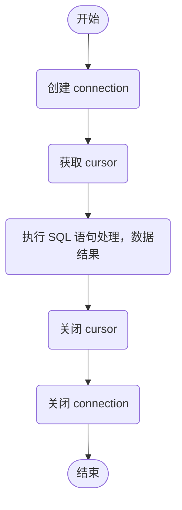

## 数据库编程接口

Python 中定义的数据库 **API 接口** 有模块接口、连接对象、游标对象、类型对象和构造器、DB API 的可选扩展以及可选的错误处理机制等。

### 连接对象

数据库连接对象（Connection Object）主要提供获取数据库游标对象和提交、回滚事务的方法，以及关闭数据库连接。

通过使用 `connect()` 函数获取连接对象，**常用参数如下：**

|  参数  |  说明  |
|  :----:  |  :----  |
|  **dsn**  |  数据源名称，给出该参数表示数据库依赖  |
|  **user**  |  用户名  |
|  **password**  |  用户密码  |
|  **host**  |  主机名  |
|  **database**  |  数据库名称  |

使用 `pymysql` 模块连接数据库。例如：

```python
conn = pymysql.connect(
    host='localhost', 
    user='user', 
    password='password', 
    db='test', 
    charset='utf-8', 
    cursorclass=pymysql.cursors.DictCursor
)
```

通过使用 `connect()` 函数获取连接对象，**常用方法如下：**

|  方法  |  说明  |
|  :----:  |  :----  |
|  **close()**  |  关闭数据库连接  |
|  **commit()**  |  提交事务  |
|  **rollback()**  |  回滚事务  |
|  **cursor()**  |  获取游标对象，操作数据库。如：执行 DML 操作，调用存储过程等  |

::: tip
`commit()` 提交事务，事务主要用于处理数据量大、复杂度高的数据。如果操作的是一系列的动作。如：张三给李四转账，有如下两个操作，这时使用事务可以维护数据库的完整性，保证两个操作要么全部执行，要么全部不执行：

- 张三账户金额减少
- 李四账户金额增加  
:::

### 游标对象

游标对象（Cursor Object）代表数据库中的游标，用于指示抓取数据操作的上下文，主要提供执行 SQL 语句、调用存储过程、获取查询结果等方法。

通过使用 `cursor()` 方法可以获取到游标对象，**游标对象属性如下：**

|  属性  |  说明  |
|  :----:  |  :----  |
|  **description**  |  数据库列类型和值的描述信息  |
|  **rowcount**  |  返回结果的行数统计信息。如：`SELECT`、`UPDATE`、`CALLPROC` 等  |

**常用游标对象方法如下：**

|  方法  |  说明  |
|  :----:  |  :----  |
|  **callproc(procname[, parameters])**  |  调用存储过程，需要数据库支持  |
|  **close()**  |  关闭当前游标  |
|  **execute(operation[, parameters])**  |  执行数据库操作，SQL 语句或者数据库命令  |
|  **executemany(operation, seq_of_params)**  |  用于批量操作。如：批量更新  |
|  **fetchone()**  |  获取查询结果集中的下一条记录  |
|  **fetchmany(size)**  |  获取指定数量的记录  |
|  **fetchall()**  |  获取结果集的所有记录  |
|  **nextset()**  |  跳至下一个可用的结果集  |
|  **arraysize**  |  指定使用 `fetchmany()` 获取的行数，默认为 1  |
|  **setinputsize(sizes)**  |  设置在调用 `execute*()` 方法时分配的内存区域大小  |
|  **setoutputsize(sizes)**  |  设置列缓冲区大小，对大数据列（如：`LONGS` 和 `BLOBS`）尤其有用  |

## 使用 SQLite

### 创建数据库文件

Python 中已经内置了 `SQLite3` 模块，所以可以直接使用 `import` 语句导入 `SQLite3` 模块。

**Python 操作数据库的通用的流程图：**



创建一个 `mrsoft.db` 的数据库文件，然后执行 SQL 语句创建一个 user 表，user 表包含 id 和 name 两个字段。例如：

```python
import sqlite3

# 连接到数据库文件，如果文件不存在会自动在当前目录创建
conn = sqlite3.connect('mrsoft.db')

# 创建一个 Cursor
cursor = conn.cursor()

# 执行 SQL 语句，创建 user 表
cursor.execute('create table user (id int(10) primary key, name varcher(20))')

# 关闭 Cursor 游标
cursor.close()

# 关闭 Connection
conn.close()
```

### 操作 SQLite

**语法格式**：`insert into 表名(字段名1, 字段名2,..., 字段名n) value (字段值1, 字段值2,..., 字段值n)`

例如：新增用户数据信息。

```python
import sqlite3

conn = sqlite3.connect('mrsoft.db')
cursor = conn.cursor()

# 执行 SQL 语句，插入 user 表信息
cursor.execute('insert into user (id, name) values ("1", "zhangsan")')
cursor.execute('insert into user (id, name) values ("2", "lisi")')
cursor.execute('insert into user (id, name) values ("3", "wangwu")')

cursor.close()

# 提交事务
conn.commit()

conn.close()
```

### 查看用户数据信息

**语法格式**：`select 字段名1, 字段名2,..., 字段名n from 表名 where 查询条件`

::: note
如果要查询全部的字段可以使用一个 `*` 号代替所有字段名
:::

**查询数据时通常使用如下 3 种方式：**

- **fetchone()**：获取查询结果集中的下一条记录
- **fetchmany(size)**：获取指定数量的记录
- **fetchall()**：获取结果集的所有记录

获取查询结果集中的下一条记录。例如：

```python
import sqlite3

conn = sqlite3.connect('mrsoft.db')
cursor = conn.cursor()

# 执行 SQL 语句，查询 user 表
cursor.execute('select * from user')

# 获取查询结果集中的下一条记录
result1 = cursor.fetchone()

print(result1)  # 输出结果：(1, 'zhangsan')

cursor.close()
conn.close()
```

获取指定数量的记录。例如：

```python
import sqlite3

conn = sqlite3.connect('mrsoft.db')
cursor = conn.cursor()

# 执行 SQL 语句，查询 user 表
cursor.execute('select * from user')

# 获取指定数量的记录
result1 = cursor.fetchmany(2)

print(result1)  # 输出结果：[(1, 'zhangsan'), (2, 'lisi')]

cursor.close()
conn.close()
```

获取结果集的所有记录。例如：

```python
import sqlite3

conn = sqlite3.connect('mrsoft.db')
cursor = conn.cursor()

# 执行 SQL 语句，查询 user 表
cursor.execute('select * from user')

# 获取结果集的所有记录
result1 = cursor.fetchall()

print(result1)  # 输出结果：[(1, 'zhangsan'), (2, 'lisi'), (3, 'wangwu')]

cursor.close()
conn.close()
```

获取结果集中 id 大于 1 的数据。例如：

```python
import sqlite3

conn = sqlite3.connect('mrsoft.db')
cursor = conn.cursor()

# 执行 SQL 语句，查询 user 表
cursor.execute('select * from user where id > ?', (1,))

# 获取结果集的所有记录
result1 = cursor.fetchall()

print(result1)  # 输出结果：[(2, 'lisi'), (3, 'wangwu')]

cursor.close()
conn.close()
```

::: warning
使用 `?` 号占位符代替具体的数值，然后使用一个元组来替换问号。如果元组中只有一个值，不要忽略元组中最后的 `,` 号
:::

### 修改用户数据信息

**语法格式**：`update 表名 set 要修改的字段名 = 要修改后的字段值 where 修改条件`

例如：修改数据信息。

```python
import sqlite3

conn = sqlite3.connect('mrsoft.db')
cursor = conn.cursor()

# 执行 SQL 语句，修改数据信息
cursor.execute('update user set name = ? where id = ?', ("zhaoliu", 1))
cursor.execute('select * from user')
result1 = cursor.fetchall()

print(result1)  # 输出结果：[(1, 'zhaoliu'), (2, 'lisi'), (3, 'wangwu')]

cursor.close()
conn.close()
```

### 删除用户数据信息

**语法格式**：`delete from 表名 where 查询条件`

例如：删除用户数据信息。

```python
import sqlite3

conn = sqlite3.connect('mrsoft.db')
cursor = conn.cursor()

# 执行 SQL 语句，删除数据信息
cursor.execute('delete from user where id = ?', (1,))
cursor.execute('select * from user')
result1 = cursor.fetchall()

print(result1)  # 输出结果：[(2, 'lisi'), (3, 'wangwu')]

cursor.close()
conn.close()
```

## 使用 MySQL

- 下载 MySQL 到本地
- 安装 MySQL
- 设置环境变量，使在任何路径都可以使用 SQL 命令
- 启动 MySQL

    - 在 cmd 窗口，输入命令：`net start mysql57`，启动 MySQL
    - 使用账户密码进入 MySQL，输入命令：`mysql -u root -p`，提示输入密码

- 使用 Navicat for MySQL 管理软件，新建 MySQL 连接

Python 安装 PyMySQL 模块：`pip install PyMySQL`

### 连接数据库

MySQL 数据库与 SQLite 数据库操作类似。例如：

```python
import pymysql

# 连接数据库。参数：主机名或 IP、用户名、密码、数据库名称
db = pymysql.connect("localhost", "root", "root", "studyPython")

# 创建 Cursor 游标对象
cursor = db.cursor()

# 执行 SQL 语句，查询版本
cursor.execute("SELECT VERSION()")

# 获取单条数据
data = cursor.fetchone()
print("Datebase version：%s" % data)  # 输出结果：Datebase version：5.7.21-log

# 关闭数据库连接
db.close()
```

### 创建数据表

创建 books 表，books 表包含 id（主键）、name（图书名）、category（图书分类）、price（图书价格）和 publish_time（出版时间）。例如：

```python
import pymysql

db = pymysql.connect("localhost", "root", "root", "mrsoft")
cursor = db.cursor()

cursor.execute("DROP TABLE IF EXISTS books")

sql = """
CREATE TABLE books (
    id int(8) NOT NULL AUTO_INCREMENT, 
    name varchar(50) NOT NULL, 
    category varchar(50) NOT NULL, 
    price decimal(10, 2) DEFAULT NULL, 
    pubilsh_tiem date DEFAULT NULL, 
    PRIMARY KEY (id)
) ENGINE=MyISAM AUTO_INCREMENT=1 DEFAULT CHARSET=utf-8;
"""

cursor.execute(sql)

db.close()
```

### 操作 MySQL 数据表

添加数据，可以使用 `excute()` 方法添加，也可以使用 `execuemany()` 方法批量添加多条数据。

**语法格式**：`executemany(operation, seq_of_params)`

- **operation**：操作的 SQL 语句
- **seq_of_params**：参数序列

例如：

```python
import pymysql

db = pymysql.connect("localhost", "root", "root", "mrsoft", charset="utf-8")
cursor = db.cursor()

cursor.execute("DROP TABLE IF EXISTS books")

# 数据列表
data = [
    ("test01", "des", "10.2", "2022-11-17"),
    ("test02", "des", "12.2", "2022-11-17"),
    ("test03", "game", "13.2", "2022-11-17")
]

try:
    # 执行 SQL 语句，添加多条数据
    cursor.executemany("insert into books(name, category, price, publish_time) values (%s, %s, %s, %s)", data)
    
    # 提交数据
    db.commit()
except:
    # 如果发生错误，进行回滚
    db.rollback()

db.close()
```