## 数组

**数组（array）** 是由有限个相同类型的变量所组成的有序集合，数组中的每一个变量被称为 **元素**。数组是最为简单、最为常用的数据结构。

以整型数组为例，数组的存储形式如下图所示：

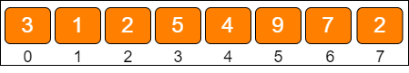

数组中的每一个元素都有自己的下标，只不过这个下标从 `0` 开始，一直到数组长度 `-1`。

数组的另一个特点，是在内存中按 **顺序存储**，因此可以很好地实现逻辑上的 **顺序表。**

内存是由一个个连续的内存单元组成的，每一个内存单元都有自己的地址。在这些内存单元中，有些被其他数据占用了，有些是空闲的。

数组中的每一个元素，都存储在小小的内存单元中，并且元素之间紧密排列，既不能打乱元素的存储顺序，也不能跳过某个存储单元进行存储。

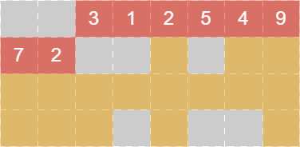

在上图中，橙色的格子代表空闲的存储单元，灰色的格子代表已占用的存储单元，而红色的连续格子代表数组在内存中的位置。

不同类型的数组，每个元素所占的字节个数也不同，本图只是一个简单的示意图。

### 数组的基本操作

1. 读取元素

    由于数组在内存中顺序存储，所以只要给出一个数组下标，就可以读取到对应的数组元素。

    创建一个数组：

    ```python
    my_list = [3, 1, 2, 5, 4, 9, 7, 2]
    ```

    要读取数组下标为 `3` 的元素，就写作 `my_list[3]`；读取数组下标为 `5` 的元素，就写作 `my_list[5]`。需要注意的是，输入的下标必须在数组的长度范围之内，否则会出现数组越界。像这种根据下标读取元素的方式叫作 **随机读取**。例如：

    ```python
    print(my_list[3])
    print(my_list[5])
    ```

2. 更新元素

    要把数组中某一个元素的值替换为一个新值，也是非常简单的操作。直接利用数组下标，就可以把新值赋给该元素。例如：

    ```python
    my_list[3] = 10
    print(my_list[3])
    ```

::: info
数组读取元素和更新元素的时间复杂度都是 **O(1)**
:::

3. 插入元素

    插入数组元素的操作存在三种情况：

    - **尾部插入**

        直接把插入的元素放在数组尾部的空闲位置即可，等同于更新元素的操作。例如：

        ```python
        my_list.append(6)
        ```

    - **中间插入**

        由于数组的每一个元素都有其固定下标，所以不得不首先把插入位置及后面的元素向后移动，腾出地方，再把要插入的元素放到对应的数组位置上。例如：

        ```python
        my_list.insert(5, 11)
        ```

        为了更好地理解数组的工作方式，实现一段插入操作的代码：

        ::: details 代码

        ```python
        class MyArray:
            def __init__(self, capacity):
                self.array = [None] * capacity
                self.size = 0

            def insert(self, index, element):
                # 判断访问下标是否超出范围
                if (index < 0) or (index > self.size):
                    raise Exception("超出数组实际元素范围！")

                # 从右向左循环，逐个元素向右挪一位
                for i in range(self.size - 1, -1, -1):
                    self.array[i + 1] = self.array[i]

                # 腾出的位置放入新元素
                self.array[index] = element
                self.size += 1

            def output(self):
                for i in range(self.size):
                    print(self.array[i])


        array = MyArray(4)
        array.insert(0, 10)
        array.insert(0, 11)
        array.insert(0, 15)
        array.output()
        ```

        :::

    - **超范围插入**

        假如现在有一个长度为 `6` 的数组，已经装满了元素，这时还想插入一个新元素。

        此时可以创建一个新数组，长度是旧数组的 `2` 倍，再把旧数组中的元素统统复制过去，这样就实现了数组的扩容。

        如此一来，插入元素方法也需要改写了，改写后的代码如下：

        ::: details 代码

        ```python
        class MyArray:
            def __init__(self, capacity):
                self.array = [None] * capacity
                self.size = 0

            def insert_v2(self, index, element):
                # 判断访问下标是否超出范围
                if (index < 0) or (index > self.size):
                    raise Exception("超出数组实际元素范围！")

                # 如果实际元素达到数组容量上线，数组扩容
                if self.size >= len(self.array):
                    self.resize()

                # 从右向左循环，逐个元素向右挪一位
                for i in range(self.size - 1, -1, -1):
                    self.array[i + 1] = self.array[i]

                # 腾出的位置放入新元素
                self.array[index] = element
                self.size += 1

            def resize(self):
                array_new = [None] * len(self.array) * 2
                # 从旧数组复制到新数组
                for i in range(self.size):
                    array_new[i] = self.array[i]
                self.array = array_new

            def output(self):
                for i in range(self.size):
                    print(self.array[i])


        array = MyArray(4)
        array.insert_v2(0, 10)
        array.insert_v2(0, 11)
        array.insert_v2(0, 12)
        array.insert_v2(0, 14)
        array.insert_v2(0, 15)
        array.insert_v2(1, 16)
        array.output()
        ```

        :::

4. 删除元素

    数组的删除操作和插入操作的过程相反，如果删除的元素位于数组中间，其后的元素都需要向前挪动 `1` 位。

    为了更好地理解数组的工作方式，实现一段删除操作的代码：

    ::: details 代码

    ```python
    class MyArray:
        def __init__(self, capacity):
            self.array = [None] * capacity
            self.size = 0

        def insert_v2(self, index, element):
            # 判断访问下标是否超出范围
            if (index < 0) or (index > self.size):
                raise Exception("超出数组实际元素范围！")

            # 如果实际元素达到数组容量上线，数组扩容
            if self.size >= len(self.array):
                self.resize()

            # 从右向左循环，逐个元素向右挪一位
            for i in range(self.size - 1, -1, -1):
                self.array[i + 1] = self.array[i]

            # 腾出的位置放入新元素
            self.array[index] = element
            self.size += 1

        def remove(self, index):
            # 判断访问下标是否超出范围
            if (index < 0) or (index > self.size):
                raise Exception("超出数组实际元素范围！")

            # 从左到右，逐个元素向左挪一位
            for i in range(index, self.size):
                self.array[i] = self.array[i + 1]

            self.size -= 1

        def resize(self):
            array_new = [None] * len(self.array) * 2
            # 从旧数组复制到新数组
            for i in range(self.size):
                array_new[i] = self.array[i]
            self.array = array_new

        def output(self):
            for i in range(self.size):
                print(self.array[i])

            print(self.array)


    array = MyArray(4)
    array.insert_v2(0, 10)
    array.insert_v2(0, 11)
    array.insert_v2(0, 12)
    array.remove(1)
    array.output()
    ```

    :::

::: info
数组扩容的时间复杂度是 **O(n)**，插入并移动元素的时间复杂度也是 **O(n)**，综合起来插入操作的时间复杂度是 **O(n)**。至于删除操作，只涉及元素的移动，时间复杂度也是 **O(n)**
:::

### 数组的优势和劣势

数组拥有非常高效的随机访问能力，只要给出下标，就可以用常量时间找到对应元素。有一种高效查找元素的算法叫作二分查找，就是利用了数组的这个优势。

至于数组的劣势，体现在插入和删除元素方面。由于数组元素连续紧密地存储在内存中，插入、删除元素都会导致大量元素被迫移动，影响效率。

数组适合读操作多、写操作少的场景。

## 链表

**链表（linked list）** 是一种在物理上非连续、非顺序的数据结构，由若干节点（node）所组成，每个节点包含指向下一节点的 next 指针。

### 单向链表

**单向链表的结构：**

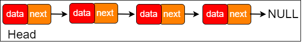

单向链表的每一个节点又包含两部分，一部分是 **存放数据的变量 data**，另一部分是 **指向下一个节点的 next 指针。**

```python
class Node:
    def __init__(self, data):
        self.data = data
        self.next = None
```

链表的第一个节点被称为 **头节点**，最后一个节点被称为 **尾节点**，尾节点的 **next 指针** 指向空。

与数组按照下标来随机寻找元素不同，对于链表的其中一个节点A，只能根据节点A 的 **next 指针** 来找到该节点的下一个节点B，再根据节点B 的 **next 指针** 找到下一个节点C……

### 双向链表

双向链表比单向链表稍微复杂一些，它的每一个节点除了拥有 **data** 和 **next 指针**，还拥有指向前置节点的 **prev 指针。**

**双向链表的结构：**

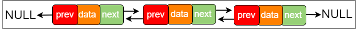

如果说数组在内存中的存储方式是 **顺序存储**，那么链表在内存中的存储方式则是 **随机存储。**

数组在内存中占用了 **连续完整的** 存储空间。而链表则采用了 **见缝插针** 的方式，链表的每一个节点分布在内存中的不同位置，依靠 **next 指针** 进行关联。这样可以灵活有效地利用零散的碎片空间。

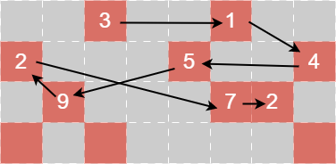

图中的箭头代表链表节点的 **next 指针。**

### 链表的基本操作

1. 查找节点

    在查找元素时，链表不像数组那样可以通过下标快速进行定位，只能从头节点开始向后一个一个节点逐一查找。

::: info
链表中的数据只能按顺序进行访问，最坏的时间复杂度是 **O(n)**
:::

2. 更新节点

    如果不考虑查找节点的过程，链表的更新过程会像数组那样简单，直接把旧数据替换成新数据即可。

3. 插入节点

    与数组类似，在链表中插入节点时，同样分为三种情况：

    - **尾部插入**

        把最后一个节点的 **next 指针** 指向新插入的节点即可。

    - **头部插入**

        可以分成两个步骤：

        - 把新节点的 **next 指针** 指向原先的头节点
        - 把新节点变为链表的头节点

    - **中间插入**

        可以分成两个步骤：

        - 新节点的 **next 指针** 指向插入位置的节点
        - 插入位置前置节点的 **next 指针**，指向新节点

    ::: tip
    只要内存空间允许，能够插入链表的元素是无穷无尽的，不需要像数组那样考虑扩容的问题
    :::

4. 删除元素

    链表的删除操作同样分为三种情况：

    - **尾部删除**

        把倒数第 `2` 个节点的 **next 指针** 指向空即可。

    - **头部删除**

        把链表的头节点设为原先头节点的 **next 指针** 所指向的节点即可。

    - **中间删除**

        把要删除节点的前置节点的 **next 指针**，指向要删除元素的下一个节点即可。

    ::: tip
    许多高级语言，如：Java、Python，拥有自动化的垃圾回收机制，所以不用刻意去释放被删除的节点，只要没有外部引用指向它们，被删除的节点会被自动回收
    :::

::: info
如果不考虑插入、删除操作之前查找元素的过程，只考虑纯粹的插入和删除操作，时间复杂度都是 **O(1)**
:::

为了更好地理解链表的工作方式，实现一段代码：

::: details 代码

以下是对单链表相关操作的代码实现。为了尾部插入的方便，代码中额外增加了指向链表尾节点的 **last 指针。** 

```python
class Node:
    def __init__(self, data):
        self.data = data
        self.next = None


class LinkedList:
    def __init__(self):
        self.size = 0
        self.head = None
        self.last = None
    
    def get(self, index):
        if (index < 0) or (index >= self.size):
            raise Exception('超出链表节点范围！')
        
        p = self.head

        for i in range(index):
            p = p.next
        
        return p
    
    def insert(self, data, index):
        if (index < 0) or (index > self.size):
            raise Exception('超出链表节点范围！')
        
        node = Node(data)

        if self.size == 0:
            # 空链表
            self.head = node
            self.last = node
        elif index == 0:
            # 插入头部
            node.next = self.head
            self.head = node
        elif self.size == index:
            # 插入尾部
            self.last.next = node
            self.last = node
        else:
            # 插入中间
            prev_node = self.get(index - 1)
            node.next = prev_node.next
            prev_node.next = node
        
        self.size += 1
    
    def remove(self, index):
        if (index < 0) or (index >= self.size):
            raise Exception('超出链表节点范围！')
        
        # 暂存被删除的节点，用于返回
        if index == 0:
            # 删除头节点
            removed_node = self.head
            self.head = self.head.next
        elif index == self.size - 1:
            # 删除尾节点
            prev_node = self.get(index - 1)
            removed_node = prev_node.next
            prev_node.next = None
            self.last = prev_node
        else:
            # 删除中间节点
            prev_node = self.get(index - 1)
            next_node = prev_node.next.next
            removed_node = prev_node.next
            prev_node.next = next_node
        
        self.size -= 1
        return removed_node
    
    def output(self):
        p = self.head

        while p is not None:
            print(p.data)
            p = p.next


linkedList = LinkedList()
linkedList.insert(3, 0)
linkedList.insert(4, 0)
linkedList.insert(9, 2)
linkedList.insert(5, 3)
linkedList.insert(6, 1)
linkedList.remove(0)
linkedList.output()
```

:::

### 数组 VS 链表

|  数据结构  |  查找  |  更新  |  插入  |  删除  |
|  :----:  |  :----:  |  :----:  |  :----:  |  :----:  |
|  数组  |  O(1)  |  O(1)  |  O(n)  |  O(n)  |
|  链表  |  O(n)  |  O(1)  |  O(1)  |  O(1)  |

从表格可以看出，数组的优势在于能够快速定位元素，对于读操作多、写操作少的场景来说，用数组更合适一些。

相反地，链表的优势在于能够灵活地进行插入和删除操作，如果需要频繁插入、删除元素，用链表更合适一些。

## 栈和队列

### 物理结构和逻辑结构

**物理结构** 都是内存中实实在在的存储结构。而 **逻辑结构** 是抽象的概念，它依赖于物理结构而存在。

数组和链表可以被看作数据存储的 **物理结构。**

- **逻辑结构**

    - **线性结构**：顺序表、栈、队列
    - **非线性结构**：树、图

- **物理结构**

    - **顺序存储结构**：数组
    - **链式存储结构**：链表

### 栈

**栈（stack）** 是一种线性数据结构，栈中的元素只能 **先入后出**（First In Last Out，简称 `FILO`）。最早进入的元素存放的位置叫作 **栈底（bottom）**，最后进入的元素存放的位置叫作 **栈顶（top）。**

::: details 生活中的例子
假如有一个又细又长的圆筒，圆筒一端封闭，另一端开口。往圆筒里放入乒乓球，先放入的靠近圆筒底部，后放入的靠近圆筒入口

那么，要想取出这些乒乓球，则只能按照和放入顺序相反的顺序来取，先取出后放入的，再取出先放入的，而不可能把最里面最先放入的乒乓球优先取出
:::

栈这种数据结构既可以用数组来实现，也可以用链表来实现。

**栈的数组实现如下：**

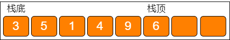

**栈的链表实现如下：**

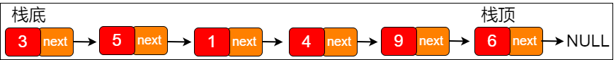

**栈的基本操作：**

1. 入栈

    **入栈（push）** 操作就是把新元素放入栈中，只允许从栈顶一侧放入元素，新元素的位置将会成为新的栈顶。

2. 出栈

    **出栈（pop）** 操作就是把元素从栈中弹出，只有栈顶元素才允许出栈，出栈元素的前一个元素将会成为新的栈顶。

::: info
在 Python 语言中，列表很好地实现了栈的功能，`append` 方法相当于入栈，`pop` 方法相当于出栈

入栈和出栈只会影响最后一个元素，不涉及其他元素的整体移动，所以无论是以数组还是以链表实现，入栈、出栈的时间复杂度都是 `O(1)`
:::

### 队列

**队列（queue）** 是一种线性数据结构。不同于栈的 **先入后出**，队列中的元素只能 **先入先出**（First In First Out，简称 `FIFO`）。队列的出口端叫作 **队头（front）**，队列的入口端叫作 **队尾（rear）。**

::: details 生活中的例子
假如公路上有一条单行隧道，所有通过隧道的车辆只允许从隧道入口驶入，从隧道出口驶出，不允许逆行

因此，要想让车辆驶出隧道，只能按照它们驶入隧道的顺序，先驶入的车辆先驶出，后驶入的车辆后驶出，任何车辆都无法跳过它前面的车辆提前驶出
:::

与栈类似，队列这种数据结构既可以用数组来实现，也可以用链表来实现。

**队列的数组实现如下：**

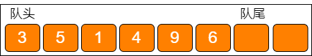

::: tip
用数组实现时，为了入队操作的方便，把队尾位置规定为最后入队元素的下一个位置
:::

**队列的链表实现如下：**

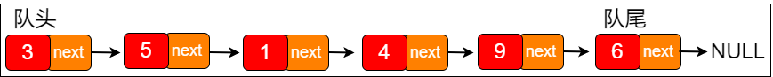

**队列的基本操作：**

1. 入队

    把新元素放入队列中，只允许在队尾的位置放入元素，新元素的下一个位置将会成为新的队尾。

2. 出队

    把元素移出队列，只允许在队头一侧移出元素，出队元素的后一个元素将会成为新的队头。

::: tip
像这样不断出队，队头左边的空间失去作用，队列的容量越来越小。用数组实现的队列可以采用 **循环队列** 的方式来维持队列容量的恒定
:::

在数组不做扩容的前提下，可以利用已出队元素留下的空间，让队尾指针重新指回数组的首位。

这样一来，整个队列的元素就 “循环” 起来了。在物理存储上，队尾的位置也可以在队头之前。当再有元素入队时，将其放入数组的首位，队尾指针继续后移即可。一直到 **（队尾下标 + 1）% 数组长度 = 队头下标时**，代表此队列真的已经满了。需要注意的是，队尾指针指向的位置永远空出 `1` 位，所以队列最大容量比数组长度小 `1`。

为了更好地理解队列的工作方式，实现一段代码：

::: details 代码

```python
class MyQueue:
    def __init__(self, capacity):
        self.list = [None] * capacity
        self.front = 0
        self.rear = 0
    
    def enqueue(self, element):
        if (self.rear + 1) % len(self.list) == self.front:
            raise Exception('队列已满！')
        
        self.list[self.rear] = element
        self.rear = (self.rear + 1) % len(self.list)
    
    def dequeue(self):
        if self.rear == self.front:
            raise Exception('队列已满！')
        
        dequeue_element = self.list[self.front]
        self.front = (self.front + 1) % len(self.list)
        return dequeue_element
    
    def output(self):
        i = self.front

        while i != self.rear:
            print(self.list[i])
            i = (i + 1) % len(self.list)


myQueue = MyQueue(6)
myQueue.enqueue(3)
myQueue.enqueue(5)
myQueue.enqueue(6)
myQueue.dequeue()
myQueue.dequeue()
myQueue.enqueue(2)
myQueue.enqueue(4)
myQueue.output()
```

:::

::: info
循环队列不但充分利用了数组的空间，还避免了数组元素整体移动。入队和出队的时间复杂度是 **O(1)**
:::

### 栈和队列的应用

1. 栈的应用
    
    栈的输出顺序和输入顺序相反，所以栈通常用于对 “历史” 的 **回溯**，也就是逆流而上追溯 “历史”。

    例如：实现递归的逻辑，就可以用栈来代替，因为栈可以回溯方法的调用链。

    栈还有一个著名的应用场景是面包屑导航，使用户在浏览页面时可以轻松地回溯到上一级或更上一级页面。

2. 队列的应用

    队列的输出顺序和输入顺序相同，所以队列通常用于对 “历史” 的 **回放**，也就是按照 “历史” 顺序，把 “历史” 重演一遍。

    例如：在多线程中，争夺公平锁的等待队列，就是按照访问顺序来决定线程在队列中的次序的。

    再如网络爬虫实现网站抓取时，也是把待抓取的网站 URL 存入队列中，再按照存入队列的顺序来依次抓取和解析的。

3. 双端队列

    把栈和队列的特点结合起来，既可以先入先出，也可以先入后出。这种数据结构叫作 **双端队列（deque）。**

    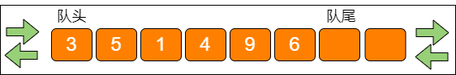

    双端队列这种数据结构，综合了栈和队列的优点，对双端队列来说，从队头一端可以入队或出队，从队尾一端也可以入队或出队。

4. 优先队列

    还有一种队列，它遵循的不是先入先出，而是谁的优先级最高，谁先出队。这种队列叫作 **优先队列。**

    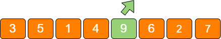

    优先队列已经不属于线性数据结构的范畴了，它是基于二叉堆来实现的。

## 神奇的哈希表

### 为什么需要哈希表

例如：开发一个学生管理系统，需要有通过输入学号快速查出对应学生的姓名的功能。这里不必每次都去查询数据库，而可以在内存中建立一个缓存表，这样做可以提高查询效率。

|  学号  |  姓名  |
|  :----:  |  :----:  |
|  001121  |  张三  |
|  002123  |  李四  |
|  002931  |  王五  |
|  003278  |  赵六  |

例如：想统计一本英文书里某些单词出现的频率，就需要遍历整本书的内容，把这些单词出现的次数记录在内存中。

|  单词  |  出现次数  |
|  :----:  |  :----:  |
|  this  |  108  |
|  and  |  56  |
|  are  |  79  |
|  by  |  46  |

因为这些需求，一个重要的数据结构诞生了，这个数据结构叫作 **哈希表。**

哈希表（hash table）也叫作 **散列表**，这种数据结构提供了 **键（Key）** 和 **值（Value）** 的映射关系。只要给出一个 `Key`，就可以高效查找到它所匹配的 `Value`，时间复杂度接近于 **O(1)。**

|  Key  |  Value  |
|  :----:  |  :----:  |
|  Key1  |  Value1  |
|  Key2  |  Value2  |
|  Key3  |  Value3  |
|  Key4  |  Value4  |

### 哈希函数

在上面几个数据结构中，**数组** 的查询效率最高，数组可以根据下标进行元素的随机访问。哈希表在本质上也是一个数组，但哈希表在查询的时候需要一个 **中转站**，通过某种方式，把 **Key** 和 **数组下标** 进行转换。这个中转站就叫做 **哈希函数。**

在不同的语言中，哈希函数的实现方式是不一样的，在 Python 语言中，哈希表对应的集合叫作 **字典（dict）。**

在 Python 及大多数面向对象的语言中，每一个对象都有属于自己的 hash 值，这个 hash 值是区分不同对象的重要标识。无论对象自身的类型是什么，它们的 hash 值都是一个整型变量。

既然都是整型变量，想要转化成数组的下标也就不难实现了，可以按照数组长度进行取模运算。

`index = hash(key) % size`

实际上，Python 中的哈希函数并没有直接采用取模运算，而是利用了位运算的方式来优化性能。不过在这里可以姑且把它简单理解成取模操作。通过哈希函数，可以把字符串或其他类型的 Key，转化成数组的下标 index。

例如：给出一个长度为 `8` 的数组，则当 `key = 001121` 时，`index = hash("001121") % size=1420036703 % 8 = 7`；而当 `key = "this"` 时，`index = hash("this") % size=3559070 % 8 = 6`。

### 哈希表的读写操作

1. 写操作

    **写（put）** 操作就是在哈希表中插入新的键值对（也被称为 `Entry`）。
    
    例如：调用 `dict["002931"] = "王五"`，意思是插入一组 `Key` 为 **002931**，`Value` 为 **王五** 的键值对。

    第 1 步，通过哈希函数，把 `Key` 转化成数组下标 `5`。第 2 步，如果数组下标 `5` 对应的位置没有元素，就把这个 `Entry` 填充到数组下标 `5` 的位置。

    但是，由于数组的长度是有限的，当插入的 `Entry` 越来越多时，不同的 `Key` 通过哈希函数获得的下标有可能是相同的。例如：`002936` 这个 `Key` 对应的数组下标是 `2`；`002947` 这个 `Key` 对应的数组下标也是`2`。这种情况，就叫作 **哈希冲突。**

    哈希冲突是无法避免的。解决哈希冲突的方法主要有两种：
    
    - **开放寻址法**：当一个 `Key` 通过哈希函数获得对应的数组下标已被占用时，可以 “另谋高就”，寻找下一个空当位置
    - **链表法**：哈希表数组的每一个元素不仅是一个 `Entry` 对象，还是一个 **链表的头节点**。每一个 `Entry` 对象通过 `next` 指针指向它的下一个 `Entry` 节点。当新来的 `Entry` 映射到与之冲突的数组位置时，只需要插入对应的链表中即可

2. 读操作

    **读（get）** 操作就是通过给定的 `Key`，在哈希表中查找对应的 `Value`。

    例如：调用 `dict["002936"]`，意思是查找 `Key` 为 `002936` 的 `Entry` 在哈希表中所对应的值。

    第 1 步，通过哈希函数，把 `Key` 转化成数组下标 `2`。第 2 步，找到数组下标 `2` 所对应的元素，如果这个元素的 `Key` 是 `002936`，那么就找到了；如果这个 `Key` 不是 `002936` 也没关系，由于数组的每个元素都与一个链表对应，可以顺着链表慢慢往下找，看看能否找到与 `Key` 相匹配的节点。
