## Bitmap 的巧用

### 关于用户标签的需求

实现用户信息的标签化。用户标签包括用户的社会属性、生活习惯、消费行为等信息。通过用户标签，可以对多样的用户群体进行统计。例如：统计用户的男女比例、统计喜欢旅游的用户数量等。

为了满足用户标签的统计需求，利用关系数据库设计了如下的表结构，每一个维度的标签对应着数据库表中的一列：

|  Name  |  Sex  |  Age  |  Occupation  |  Phone  |
|  :----:  |  :----:  |  :----:  |  :----:  |  :----:  |
|  张三  |  男  |  90后  |  程序员  |  苹果  |
|  李四  |  男  |  90后  |  程序员  |  三星  |
|  王五  |  女  |  00后  |  学生  |  小米  |

要想统计所有 “90后” 的程序员，用一条求交集的 SQL 语句即可。

```sql
Select count (distinct Name) as 用户数 from table where Age="90后" and Occupation="程序员";
```

要想统计所有使用苹果手机或 “00后” 的用户总和，用一条求并集的 SQL 语句即可。

```sql
Select count (distinct Name) as 用户数 from table where Phone="苹果" or Age="00后";
```

之后标签越来越多，筛选的标签条件过多的时候，拼出来的 `SQL` 语句像面条一样长……不仅如此，当对多个用户群体求 **并集** 时，需要用 `distinct` 来去掉重复数据，性能实在太差了……

### 解决方法

**Bitmap 算法**，中文里叫作 **位图算法**。是内存中连续的二进制位（bit）所组成的数据结构，该算法主要用于对大量整数做去重和查询操作。

假设给出一块长度为 `10bit` 的内存空间，也就是 `Bitmap`，想要依次插入整数 `4`、`2`、`1`、`3`，具体步骤如下：

第一步，给出一块长度为 `10` 的 `Bitmap`，其中的每一个 `bit` 位分别对应着从 `0` 到 `9` 的整型数。此时，`Bitmap` 的所有位都是 `0`。

```text
num:     0 0 0 0 0 0 0 0 0 0
Bitmap:  9 8 7 6 5 4 3 2 1 0
```

第二步，把整型数 `4` 存入 `Bitmap`，对应存储的位置就是下标为 `4` 的位置，将此 `bit`设置为 `1`。

```text
num:     0 0 0 0 0 1 0 0 0 0
Bitmap:  9 8 7 6 5 4 3 2 1 0
```

第三步，把整型数 `2` 存入 `Bitmap`，对应存储的位置就是下标为 `2` 的位置，将此 `bit`设置为 `1`。

```text
num:     0 0 0 0 0 1 0 1 0 0
Bitmap:  9 8 7 6 5 4 3 2 1 0
```

第四步，把整型数 `1` 存入 `Bitmap`，对应存储的位置就是下标为 `1` 的位置，将此 `bit`设置为 `1`。

```text
num:     0 0 0 0 0 1 0 1 1 0
Bitmap:  9 8 7 6 5 4 3 2 1 0
```

第五步，把整型数 `3` 存入 `Bitmap`，对应存储的位置就是下标为 `3` 的位置，将此 `bit`设置为 `1`。

```text
num:     0 0 0 0 0 1 1 1 1 0
Bitmap:  9 8 7 6 5 4 3 2 1 0
```

`Bitmap` 不仅方便查询，还可以去掉重复的整数。让每一个标签存储包含此标签的所有用户 ID。

|  Name  |  Sex  |  Age  |  Occupation  |  Phone  |
|  :----:  |  :----:  |  :----:  |  :----:  |  :----:  |
|  张三  |  男  |  90后  |  程序员  |  苹果  |
|  李四  |  男  |  90后  |  程序员  |  三星  |
|  王五  |  女  |  00后  |  学生  |  小米  |

第一步，建立用户名和用户ID 的映射。

|  ID  |  Name  |
|  :----:  |  :----:  |
|  1  |  张三  |
|  2  |  李四  |
|  3  |  王五  |

第二步，让每一个标签存储包含此标签的所有用户 ID，每一个标签都是一个独立的 `Bitmap`。

|  Sex  |  Bitmap  |
|  :----:  |  :----:  |
|  男  |  1, 2  |
|  女  |  3  |

|  Age  |  Bitmap  |
|  :----:  |  :----:  |
|  90后  |  1, 2  |
|  00后  |  3  |

|  Occupaton  |  Bitmap  |
|  :----:  |  :----:  |
|  程序员  |  1, 2  |
|  学生  |  3  |

|  Phone  |  Bitmap  |
|  :----:  |  :----:  |
|  苹果  |  1  |
|  三星  |  2  |
|  小米  |  3  |

::: note 哈希表和 Bitmap 对比
使用哈希表也同样能实现用户的去重和统计操作。

但如果使用哈希表的话，每一个用户ID 都要用整型数据存储，少则占用 `4` 字节（32bit），多则占用 `8` 字节（64bit）。而一个用户ID 在 `Bitmap` 中只占 `1bit`，内存是使用哈希表所占用内存的 `1/32`，甚至更少！
:::

`Bitmap` 在对用户群做 **交集** 和 **并集** 运算时也有极大的便利。例如：

1. 查找使用苹果手机的程序员用户

    程序员用户（`0000000110B`）：

    ```text
    num:     0 0 0 0 0 0 0 1 1 0
    Bitmap:  9 8 7 6 5 4 3 2 1 0
    ```

    使用苹果手机的用户（`0000000010B`）：

    ```text
    num:     0 0 0 0 0 0 0 0 1 0
    Bitmap:  9 8 7 6 5 4 3 2 1 0
    ```

    使用苹果手机的程序员用户（`0000000110B & 0000000010B = 0000000010B`）：

    ```text
    num:     0 0 0 0 0 0 0 0 1 0
    Bitmap:  9 8 7 6 5 4 3 2 1 0
    ```

2. 查找所有男性用户或 “00后” 用户

    男性用户（`0000000110B`）：

    ```text
    num:     0 0 0 0 0 0 0 1 1 0
    Bitmap:  9 8 7 6 5 4 3 2 1 0
    ```

    “00后” 用户（`0000001000B`）：

    ```text
    num:     0 0 0 0 0 0 1 0 0 0
    Bitmap:  9 8 7 6 5 4 3 2 1 0
    ```

    男性用户或 “00后” 用户（`0000000110B | 0000001000B = 0000001110B`）：

    ```text
    num:     0 0 0 0 0 0 1 1 1 0
    Bitmap:  9 8 7 6 5 4 3 2 1 0
    ```

这就是 `Bitmap` 算法的另一个优势—— **高性能的位运算。**

如何利用 `Bitmap` 实现反向匹配。例如：想查找非 “90后” 的用户。

如果简单地做 **取反运算** 操作，会出现如下问题：

“90后” 用户：

```text
num:     0 0 0 0 0 0 0 1 1 0
Bitmap:  9 8 7 6 5 4 3 2 1 0
```

直接进行 **非运算**，得到的非 “90后” 用户：

```text
num:     1 1 1 1 1 1 1 0 0 1
Bitmap:  9 8 7 6 5 4 3 2 1 0
```

显然，非 “90后” 用户实际上只有 `1` 个，而不是上面所得到的 `8` 个结果，所以不能直接进行非运算。这时可以借助一个 **全量的 Bitmap。**

给出 “90后” 用户的 `Bitmap`，再给出一个全量用户的 `Bitmap`。最终要求出的是存在于全量用户，但又不存在于 “90后” 用户的部分。

“90后” 用户（`0000000110B`）：

```text
num:     0 0 0 0 0 0 0 1 1 0
Bitmap:  9 8 7 6 5 4 3 2 1 0
```

全局用户（`0000001110B`）：

```text
num:     0 0 0 0 0 0 1 1 1 0
Bitmap:  9 8 7 6 5 4 3 2 1 0
```

使用 **异或运算** 进行操作，即相同位为 `0`，不同位为 `1` 得到非 “90后” 用户（`0000000110B XOR 0000001110B = 0000001000B`）：

```text
num:     0 0 0 0 0 0 1 0 0 0
Bitmap:  9 8 7 6 5 4 3 2 1 0
```

::: details Bitmap 代码

```python
class MyBitmap:
    def __init__(self, size):
        self.words = [0] * (self.get_word_index(size - 1) + 1)
        self.size = size
    
    def get_bit(self, bit_index):
        if (bit_index < 0) or (bit_index > self.size - 1):
            raise Exception('超过 Bitmap 有效范围！')
        
        word_index = self.get_word_index(bit_index)
        return (self.words[word_index] & (1 << bit_index)) != 0
    
    def set_bit(self, bit_index):
        if (bit_index < 0) or (bit_index > self.size - 1):
            raise Exception('超过 Bitmap 有效范围！')
        
        word_index = self.get_word_index(bit_index)
        self.words[word_index] |= (1 << bit_index)
    
    def get_word_index(self, bit_index):
        # 右移 6 位，相当于除以 64
        return bit_index >> 6


bitMap = MyBitmap(128)
bitMap.set_bit(126)
bitMap.set_bit(75)
print(bitMap.get_bit(126))
print(bitMap.get_bit(78))
```

:::

在上述代码中，使用一个命名为 `words` 的 `int` 类型数组来存储所有的二进制位。每一个 `int` 元素控制其中的 `64` 位。（在 Python3 中，`int` 既可以表示整型，也可以表示长整型。）

如果要把 `Bitmap` 的某一位设为 `1`，需要经过两步：

1. 定位到 `words` 中的对应的 `int` 元素。

2. 通过与运算修改 `int` 元素的值。

如果要查看 `Bitmap` 的某一位是否为 `1`，也需要经过两步：

1. 定位到 `words` 中的对应的 `int` 元素。

2. 判断 `int` 元素的对应的二进制位是否为 `1`。

## LRU 算法的应用

### 关于用户信息的需求

需要抽出一个用户系统，向各个业务系统提供用户的基本信息。各个业务对用户信息的查询频率很高，一定要注意性能问题。

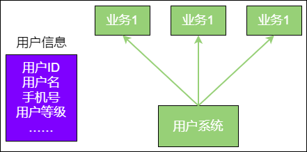

用户信息当然是存放在数据库里，但是由于对用户系统的性能要求比较高，显然不能在每一次请求时都去查询数据库。所以，在内存中创建了一个哈希表作为缓存，每当查找一个用户时会先在哈希表中进行查询，以此来提高访问的性能。

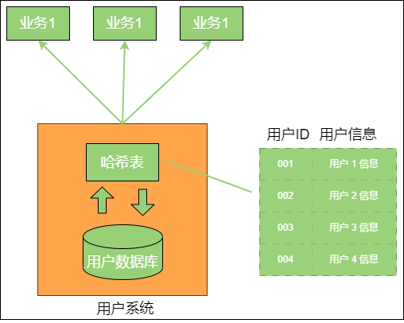

之后用户数量越来越多，当初设计的哈希表把内存给撑爆了，导致内存溢出。

### 解决方法

**LRU（Least Recently Used）** 算法，也就是最近最少使用的意思，是一种内存管理算法，该算法最早应用于 Linux 操作系统。这个算法基于一种假设：**长期不被使用的数据，在未来被用到的概率也不大。因此，当数据所占内存达到一定阈值时，要移除最近最少被使用的数据**。

在 LRU 算法中，使用了一种有趣的数据结构，这种数据结构叫作 **哈希链表。**

**哈希表** 是由若干个 `Key-Value` 组成的。在 “逻辑” 上，这些 `Key-Value` 是无所谓排列顺序的，谁先谁后都一样。但在 **哈希链表** 中，这些 `Key-Value` 不再是彼此无关的了，而是被一个链条串了起来。每一个 `Key-Value` 都具有它的 **前驱 Key-Value**、**后继 Key-Value**，就像双向链表中的节点一样。

这样，原本无序的哈希表就拥有了固定的排列顺序。依靠哈希链表的 **有序性**，可以把 `Key-Value` 按照最后的使用时间进行排序。**LRU 算法的基本思路** 例如：

1. 假设使用哈希链表来缓存用户信息，目前缓存了 `4` 个用户，这 `4` 个用户是按照被访问的时间顺序依次从链表右端插入的。

    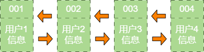

2. 如果这时业务方访问用户5，由于哈希链表中没有用户5 的数据，需要从数据库中读取出来，插入缓存中。此时，链表最右端是最新被访问的用户5，最左端是最近最少被访问的用户1。

    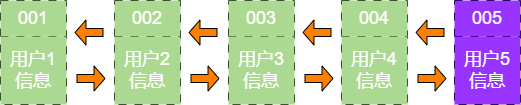

3. 接下来，如果业务方访问用户2，哈希链表中已经存在用户2 的数据，这时把用户2 从它的前驱节点和后继节点之间移除，重新插入链表的最右端。此时，链表的最右端变成了最新被访问的用户2，最左端仍然是最近最少被访问的用户1。

    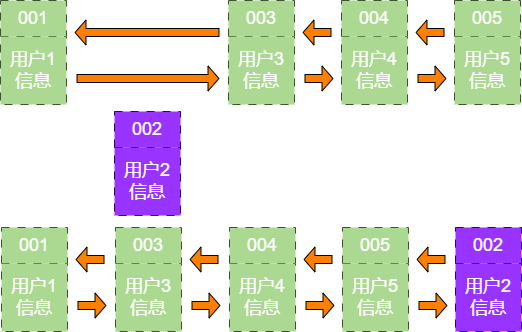

4. 接下来，如果业务方请求修改用户4 的信息。同样的道理，会把用户4 从原来的位置移动到链表的最右侧，并把用户信息的值更新。这时，链表的最右端是最新被访问的用户4，最左端仍然是最近最少被访问的用户1。

    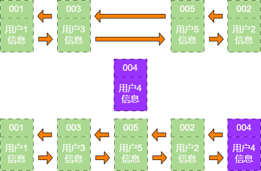

5. 后来业务方又要访问用户6，用户6 在缓存里没有，需要插入哈希链表中。假设这时缓存容量已经达到上限，必须先删除最近最少被访问的数据，那么位于哈希链表最左端的用户1 就会被删除，然后再把用户6 插入最右端的位置。

    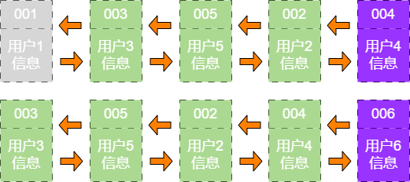

以上，就是 LRU 算法的基本思路。

::: details LRU 算法代码

```python
class LRUCache:
    def __init__(self, limit):
        self.limit = limit
        self.hash = {}
        self.head = None
        self.end = None
    
    def get(self, key):
        node = self.hash.get(key)
        
        if node is None:
            return None
        
        self.refresh_node(node)
        return node.value
    
    def put(self, key, value):
        node = self.hash.get(key)
        
        if node is None:
            # 如果 key 不存在，插入 key-value
            if len(self.hash) >= self.limit:
                old_key = self.remove_node(self.head)
                self.hash.pop(old_key)
            
            node = Node(key, value)
            self.add_node(node)
            self.hash[key] = node
        else:
            # 如果 key 存在，刷新 key-value
            node.value = value
            self.refresh_node(node)
    
    def remove(self, key):
        node = self.hash.get(key)
        self.remove_node(node)
        self.hash.remove(key)
    
    def refresh_node(self, node):
        # 如果访问的是尾节点，无序移动节点
        if node == self.end:
            return
        
        # 移除节点
        self.remove_node(node)
        # 重新插入节点
        self.add_node(node)
    
    def remove_node(self, node):
        if (node == self.head) and (node == self.end):
            # 移除唯一的节点
            self.head = None
            self.end = None
        elif node == self.end:
            # 移除节点
            self.end = self.end.pre
            self.end.next = None
        elif node == self.head:
            # 移除头节点
            self.head = self.head.next
            self.head.pre = None
        else:
            # 移除中间节点
            node.pre.next = node.pre
            node.next.pre = node.pre
        
        return node.key
    
    def add_node(self, node):
        if self.end is not None:
            self.end.next = node
            node.pre = self.end
            node.next = None
        
        self.end = node
        
        if self.head is None:
            self.head = node


class Node:
    def __init__(self, key, value):
        self.key = key
        self.value = value
        self.pre = None
        self.next = None


lruCache = LRUCache(5)
lruCache.put('001', '用户1 信息')
lruCache.put('002', '用户2 信息')
lruCache.put('003', '用户3 信息')
lruCache.put('004', '用户4 信息')
lruCache.put('005', '用户5 信息')
print(lruCache.get('002'))
lruCache.put('004', '用户4 信息更新')
lruCache.put('006', '用户6 信息')
print(lruCache.get('001'))
print(lruCache.get('006'))
```

:::

## A 星寻路算法

### 关于迷宫寻路的需求

在一个迷宫游戏中，有一些小怪物要攻击主角，现在希望给这些小怪物加上聪明的 `AI`（Artificial Intelligence，人工智能），让它们可以自动绕过迷宫中的障碍物，寻找到主角的所在。

### 解决方法

**A 星寻路算法（A*search algorithm）**，是一种用于寻找有效路径的算法。工作过程如下：

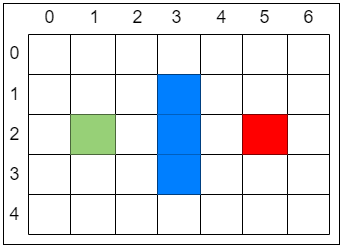

迷宫游戏的场景通常都是由小方格组成的。假设有一个 `7 × 5` 大小的迷宫，上图中绿色的格子是 **起点**，红色的格子是 **终点**，中间的三个蓝色格子是 **一堵墙。**

AI 角色从起点开始，每一步只能向上、下、左、右移动 `1` 格，且不能穿越墙壁。最终让 AI 角色用最少的步数到达终点。

在解决这个问题之前，先引入 `2` 个集合和 `1` 个公式。

- **两个集合如下：**

    - **open_list**：可到达的格子
    - **close_list**：已到达的格子

- **一个公式如下：**

    - **F = G + H**

每一个格子都具有 `F`、`G`、`H` 这三个属性，就像下图这样。

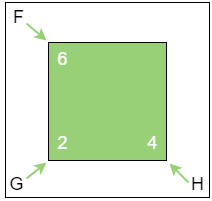

- **G**：从起点走到当前格子的成本也就是已经花费了多少步
- **H**：在不考虑障碍的情况下，从当前格子走到目标格子的距离，也就是离目标还有多远
- **F**：`G` 和 `H` 的综合评估，也就是从起点到达当前格子，再从当前格子到达目标格子的总步数，

例如：迷宫游戏让 AI 角色从起点开始，且不能穿越墙壁。最终让 AI 角色用最少的步数到达终点。

**A 星寻路算法第一轮：**

第一步，把起点放入 `open_list`，也就是刚才所说的 **可到达格子** 的集合。

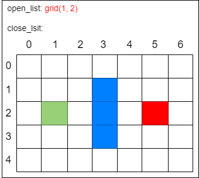

第二步，找出 `open_list` 中 `F` 值最小的方格作为当前方格。虽然没有直接计算起点方格的 `F` 值，但此时 `open_list` 中只有唯一的方格 `grid(1, 2)`，把当前格子移出 `open_list` 放入 `close_list`。代表这个格子 **已到达并检查过了。**

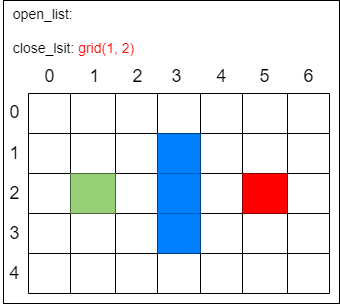

第三步，找出当前方格（刚刚检查过的格子）上、下、左、右所有可到达的格子，看它们是否在 `open_list` 或 `close_list` 当中。如果不在，则将它们加入 `open_list`，计算出相应的 `G`、`H`、`F` 值，并把当前格子作为它们的 **父节点。**

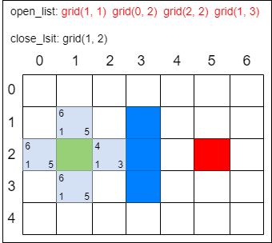

在上图中，每个格子的左下方数字是 `G`，右下方是 `H`，左上方是 `F`。一个格子的 “父节点” 代表它的来路，在输出最终路线时会用到。刚才经历的几个步骤是一次 **局部寻路** 的步骤。需要一次又一次重复刚才的第二步和第三步，直到找到终点为止。

**A 星寻路算法第二轮：**

第一步，找出 `open_list` 中 `F` 值最小的方格，即方格 `grid(2, 2)`，将它作为当前方格，并把当前方格移出 `open_list`，放入 `close_list`。代表这个格子已到达并检查过了。

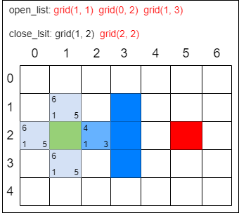

第二步，找出当前方格上、下、左、右所有可到达的格子，看它们是否在 `open_list` 或 `close_list` 当中。如果不在，则将它们加入 `open_list`，计算出相应的 `G`、`H`、`F` 值，并把当前格子作为它们的 “父节点”。

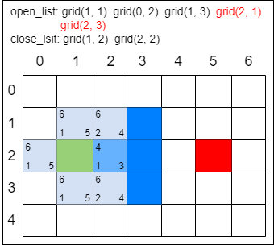

这一次 `open_list` 只增加了 `2` 个新格子。因为 `grid(3, 2)` 是墙壁，不用考虑，而 `grid(1, 2)` 在 `close_list` 中，说明已经检查过了，也不用考虑。

**A 星寻路算法第三轮：**

第一步，找出 `open_list` 中 `F` 值最小的方格。由于此时有多个方格的 `F` 值相等，任意选择一个即可，如将 `grid(2, 3)` 作为当前方格，并把当前方格移出 `open_list`，放入 `close_list`。代表这个格子已到达并检查过了。

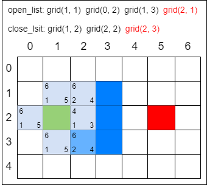

第二步，找出当前方格上、下、左、右所有可到达的格子，看它们是否在 `open_list` 或 `close_list` 当中。如果不在，则将它们加入 `open_list`，计算出相应的 `G`、`H`、`F` 值，并把当前格子作为它们的 “父节点”。

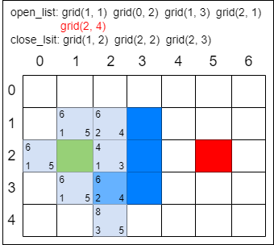

剩下的操作就是以前面的方式继续迭代，直到 `open_list` 中出现终点方格为止。以下操作仅用图片描述，方格中的数字表示 `F` 值：

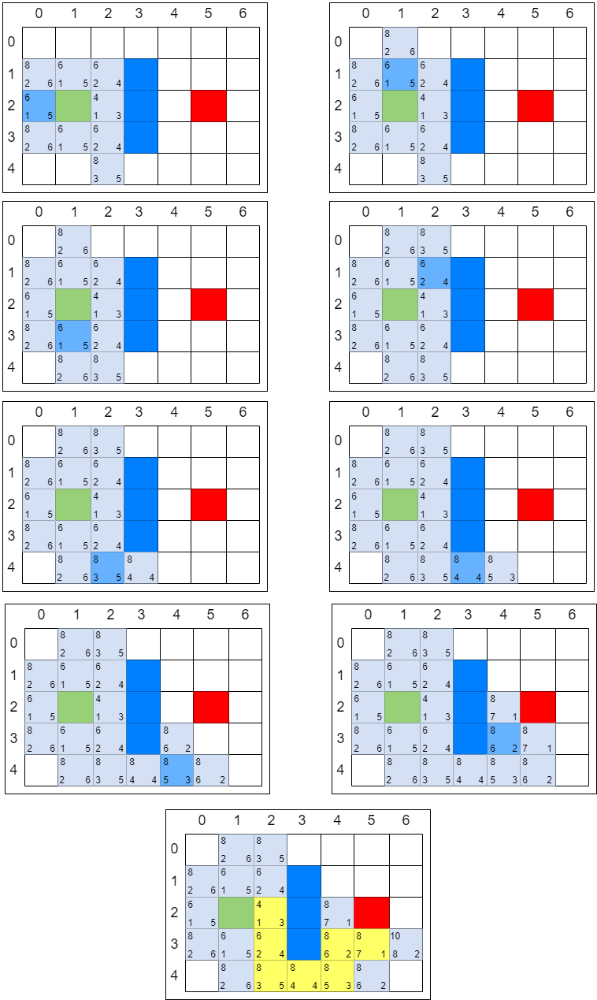

像这样一步一步来，当终点出现在 `open_list` 中时，寻路之旅就结束了。只要顺着终点方格找到它的 “父节点”，再找到 “父节点” 的 “父节点”……如此依次回溯，就能找到一条最佳路径了。

这就是 **A 星寻路算法** 的基本思想。像这样以估值高低来决定搜索优先次序的方法，被称为 **启发式搜索。**

::: details A 星寻路算法代码

```python
def a_star_search(start, end):
    # 待访问的格子
    open_list = []
    # 已访问的格子
    close_list = []
    # 把起点加入 open_list
    open_list.append(start)

    # 主循环，每一轮检查一个当前方格节点
    while len(open_list) > 0:
        # 在 open_list 中查找 F 值最小的节点作为当前方格节点
        current_grid = find_min_gird(open_list)
        # 将当前方格节点从 open_list 中移除
        open_list.remove(current_grid)
        # 将当前方格节点进入 close_list
        close_list.append(current_grid)
        # 找到所有邻近节点
        neighbors = find_neighbors(current_grid, open_list, close_list)

        for grid in neighbors:
            if grid not in open_list:
                # 邻近节点不在 open_list 中，标记父节点 G、H、F，并放入 open_list
                grid.init_grid(current_grid, end)
                open_list.append(grid)
        
        # 如果终点在 open_list 中，直接返回终点格子
        for grid in open_list:
            if (grid.x == end.x) and (grid.y == end.y):
                return grid
    
    # open_list 用尽，仍然找不到终点，说明终点不可到达，返回空
    return None


def find_min_gird(open_list = []):
    temp_grid = open_list[0]

    for grid in open_list:
        if grid.f < temp_grid.f:
            temp_grid = grid
    
    return temp_grid


def find_neighbors(grid, open_list = [], close_list = []):
    grid_list = []

    if is_valid_grid(grid.x, grid.y - 1, open_list, close_list):
        grid_list.append(Grid(grid.x, grid.y - 1))
    
    if is_valid_grid(grid.x, grid.y + 1, open_list, close_list):
        grid_list.append(Grid(grid.x, grid.y + 1))
    
    if is_valid_grid(grid.x - 1, grid.y, open_list, close_list):
        grid_list.append(Grid(grid.x - 1, grid.y))
    
    if is_valid_grid(grid.x + 1, grid.y, open_list, close_list):
        grid_list.append(Grid(grid.x + 1, grid.y))
    
    return grid_list


def is_valid_grid(x, y, open_list = [], close_list = []):
    # 是否超过边界
    if (x < 0) or (x >= len(MAZE)) or (y < 0) or (y >= len(MAZE[0])):
        return False
    
    # 是否有障碍物
    if MAZE[x][y] == 1:
        return False
    
    # 是否已经在 open_list 中
    if contain_grid(open_list, x, y):
        return False
    
    # 是否已经在 close_list 中
    if contain_grid(close_list, x, y):
        return False
    
    return True


def contain_grid(grids, x, y):
    for grid in grids:
        if (grid.x == x) and (grid.y == y):
            return True
    
    return False


class Grid:
    def __init__(self, x, y):
        self.x = x
        self.y = y
        self.f = 0
        self.g = 0
        self.h = 0
        self.parent = None
    
    def init_grid(self, parent, end):
        self.parent = parent

        if parent is not None:
            self.g = parent.g + 1
        else:
            self.g = 1
        
        self.h = abs(self.x - end.x) + abs(self.y - end.y)
        self.f = self.g + self.h


# 迷宫地图
MAZE = [
    [0, 0, 0, 0, 0, 0, 0],
    [0, 0, 0, 1, 0, 0, 0],
    [0, 0, 0, 1, 0, 0, 0],
    [0, 0, 0, 1, 0, 0, 0],
    [0, 0, 0, 0, 0, 0, 0],
]

# 设置起点和终点
start_grid = Grid(2, 1)
end_grid = Grid(2, 5)

# 搜索迷宫终点
result_grid = a_star_search(start_grid, end_grid)

# 回溯迷宫路径
path = []

while result_grid is not None:
    path.append(Grid(result_grid.x, result_grid.y))
    result_grid = result_grid.parent

# 输出迷宫和路径，路径用星号表示
for i in range(0, len(MAZE)):
    for j in range(0, len(MAZE[0])):
        if contain_grid(path, i, j):
            print('*, ', end='')
        else:
            print(str(MAZE[i][j]) + ', ', end='')
    
    print()
```

:::

## 实现红包算法

### 关于钱的需求

这个功能类似于微信群发红包的功能。例如，：一个人在群里发了 `1` 个 `100` 元的红包，群里有 `10` 个人一起来抢红包，每人抢到的金额随机分配。

**红包功能需要满足以下规则：**

- 所有人抢到的金额之和要等于红包金额，不能多也不能少
- 每个人至少抢到 `1` 分钱
- 要保证红包拆分的金额尽可能分布均衡，不要出现两极分化太严重的情况

### 解决方法

**方法1：**

为了避免出现高并发引起的一些问题，每个人领取红包的金额不能在领的时候才计算，必须先计算好每个红包拆出的金额，并把它们放在一个队列里，领取红包的用户要在队列中找到属于自己的那一份。

**每次拆分的金额 = 随机区间 [1分, 剩余金额 - 1分]**

例如：如果分发的红包是 `100` 元，有 `5` 个人抢，那么队列第一个位置的金额在 `0.01` 到 `99.99` 元之间取随机数。

- 假设第一个位置随机得到 `20` 元，队列第二个位置的金额要在 `0.01` 到 `79.99` 元之间取随机数
- 假设第二个位置随机得到 `30` 元，队列第三个位置的金额要在 `0.01` 到 `49.99` 元之间取随机数
- 假设第三个位置随机得到 `15` 元，队列第四个位置的金额要在 `0.01` 到 `34.99` 元之间取随机数
- 假设第四个位置随机得到 `22` 元，那么第五个位置自然是 `35 - 22 = 13` 元

以这样的方式来拆分红包的话，前面拆分的金额会很大，后面的金额会越来越小！

**方法2：**

**二倍均值法**。假设剩余红包金额为 `m` 元，剩余人数为 `n`，那么有如下公式：

**每次抢到的金额 = 随机区间 [0.01, m / n × 2 - 0.01] 元**

这个公式，保证了每次随机金额的平均值是相等的，不会因为抢红包的先后顺序而造成不公平。

例如：假设有 `5` 个人，红包总额为 `100` 元。

`100 ÷ 5 × 2 = 40`，所以第 `1` 个人抢到的金额的随机范围是 `[0.01，39.99]` 元，在正常情况下，平均可以抢到 `20` 元。

假设第 `1` 个人随机抢到了 `20` 元，那么剩余金额是 `80` 元。

`80 ÷ 4 × 2 = 40`，所以第 `2` 个人抢到的金额的随机范围同样是 `[0.01，39.99]` 元，在正常的情况下，还是平均可以抢到 `20` 元。

假设第 `2` 个人随机抢到了 `20` 元，那么剩余金额是 `60` 元。

`60 ÷ 3 × 2 = 40`，所以第 `3` 个人抢到的金额的随机范围同样是 `[0.01，39.99]` 元，平均可以抢到 `20` 元。

以此类推，每一次抢到金额的随机范围的均值都是相等的。

::: tip
第 `1` 次随机的金额有一半概率超过 `20` 元，使得后面的随机金额上限不足 `39.99` 元；但相应地，第 `1` 次随机的金额同样也有一半的概率小于 `20` 元，使得后面的随机金额上限超过 `39.99` 元。因此从整体来看，第 `2` 次随机的金额平均范围仍然是 `[0.01，39.99]` 元。

这个方法虽然公平，但也存在局限性，即除最后一次外，其他每次抢到的金额都要小于剩余人均金额的 `2` 倍，并不是完全自由地随机抢红包。
:::

::: details 二倍均值法代码

```python
import random

def divide_red_package(total_amount, total_people_num):
    amount_list = []
    rest_amount = total_amount
    rest_people_num = total_people_num

    for i in range(0, total_people_num - 1):
        # 随机范围：[1, 剩余人均金额的两倍)，左闭右开
        amount = random.randint(1, int(rest_amount / rest_people_num * 2) - 1)
        rest_amount -= amount
        rest_people_num -= 1
        amount_list.append(amount)
    
    amount_list.append(rest_amount)
    return amount_list


my_amount_list = divide_red_package(1000, 10)

for my_amount in my_amount_list:
    print("抢到金额：%.2f" % (my_amount / 100))
```

:::

**方法3：**

**线段切割法**。可以把红包总金额想象成一条很长的线段，而每个人抢到的金额，是这条主线段所拆分出的若干子线段。

每一条子线段的长度，由 “切割点” 来决定。当 `n` 个人一起抢红包时，就需要确定 `n - 1` 个切割点。

因此，当 `n` 个人一起抢总金额为 `m` 元的红包时，需要做 `n - 1` 次随机运算，以此确定 `n - 1` 个切割点。随机的范围区间是 `[0.01, m - 0.01]`。

当所有切割点确定以后，子线段的长度也随之确定。此时红包的拆分金额，就等同于每个子线段的长度。

这就是线段切割法的思路，在这里需要注意以下两点：

1. 注意随机切割点出现重复

2. 尽可能降低时间复杂度和空间复杂度
