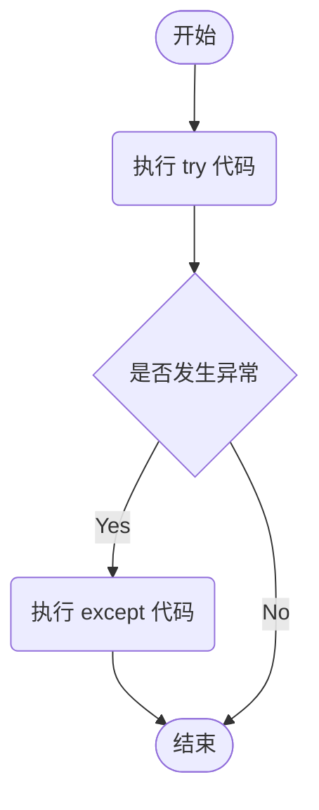
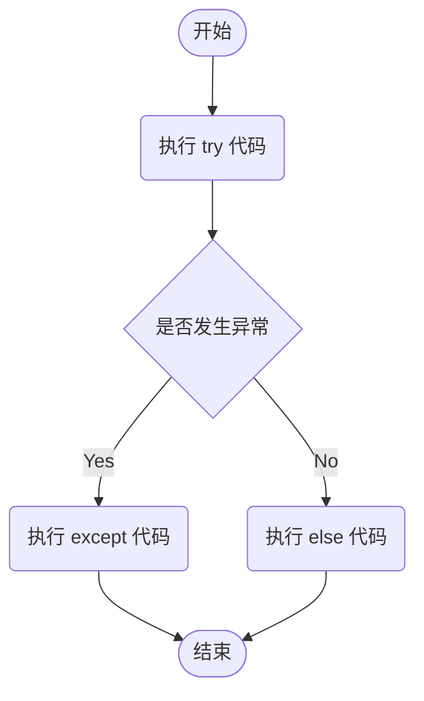
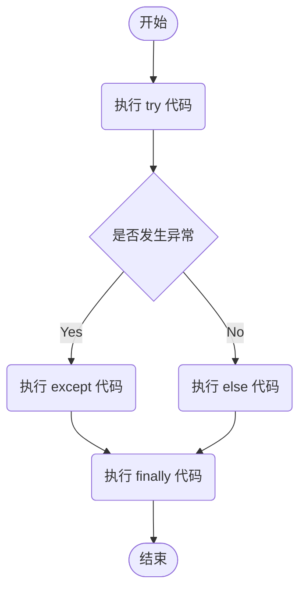

## 异常处理

在程序运行过程中，经常会遇到各种各样的错误，这些错误统称为 **异常**。这些异常有的是由于开发者将关键字敲错导致的，这类错误多数产生的是 `SyntaxError:invalid syntax`（无效的语法），这些直接导致程序不能运行。

程序运行出错时会有 `Traceback` 信息，`Traceback` 指的是 **异常堆栈信息**，描述了程序运行的过程及引发异常的信息。

### Python 中常见的异常

|  异常  |  描述  |
|  :----:  |  :----  |
|  **NameError**  |  尝试访问一个没有声明的变量引发的错误  |
|  **IndexError**  |  索引超出序列范围引发的错误  |
|  **IndentationError**  |  缩进错误  |
|  **ValueError**  |  传入的值错误  |
|  **KeyError**  |  请求一个不存在的字典关键字引发的错误  |
|  **IOError**  |  输入输出错误（如要读取的文件不存在）  |
|  **ImportError**  |  当 import 语句无法找到模块或 from 无法在模块中找到相应的名称时引发的错误  |
|  **AttributeError**  |  尝试访问未知的对象属性引发的错误  |
|  **TypeError**  |  类型不合适引发的错误  |
|  **MemoryError**  |  内存不足  |
|  **ZeroDivisionError**  |  除数为 0 引发的错误  |

### 异常处理语句

#### try···except 语句

在使用时，把可能产生异常的代码放在 `try` 语句块中，把处理结果放在 `except` 语句块中，如果 `try` 语句块中的代码出现错误时，就会执行 `except` 语句块中的代码；如果 `try` 语句块中的代码没有错误，就不执行 `except` 语句块中的代码。

**语法格式：**

```python
try:
    执行的代码 1
except [ExceptionName [as alias]]:
    执行的代码 2
```

- **执行的代码 1**：指定可能出现错误的代码块
- **[ExceptionName [as alias]]**：可选参数，指定要捕获的异常。`ExceptionName` 表示要捕获异常的名称；`al alias` 表示为捕获异常的名称指定一个别名，通过该别名，可以记录异常的具体内容
- **执行的代码 2**：指定出现异常时，执行的代码

**try···except 语句流程：**



::: tip
`except` 后面不指定异常名称，则表示捕获全部异常。通过 `try···except` 语句捕获到异常后，程序会继续执行
:::

例如：

```python
def division():
    """
    功能：分苹果
    :return:
    """
    print(('-' * 20), "分苹果了", ('-' * 20))
    apple = int(input("请输入苹果的个数："))
    children = int(input("请输入来了几个下朋友："))
    result = apple // children
    remain = apple % children

    if remain > 0:
        print(f"{apple} 个苹果，平均分给 {children} 个小朋友，每个人分 {result} 个，剩下 {remain} 个苹果")
    else:
        print(f"{apple} 个苹果，平均分给 {children} 个小朋友，每个人分 {result} 个苹果")


if __name__ == '__main__':
    try:
        division()
    except ZeroDivisionError:
        print("出错了！苹果不能被 0 个小朋友分")


# 多个 except 语句
if __name__ == '__main__':
    try:
        division()
    except ZeroDivisionError:
        print("出错了！苹果不能被 0 个小朋友分")
    except ValueError as e:
        print("输入错误：", e)


# 同时处理多个类似异常，可以将 except 语句进行合并处理
if __name__ == '__main__':
    try:
        division()
    except (ZeroDivisionError, ValueError) as e:
        print("出错了！原因是：", e)
```

#### try···except···else 语句

当 `try` 语句块中没有发现异常时要执行的语句，当 `try` 语句块中发现异常，将不执行。

**语法格式：**

```python
try:
    执行的代码 1
except [ExceptionName [as alias]]:
    执行的代码 2
else:
    执行的代码 3
```

**try···except 语句流程：**



::: tip
依赖于 `try` 代码块成功执行的代码都应放到 `else` 代码块中
:::

例如：

```python
def division():
    """
    功能：分苹果
    :return:
    """
    print(('-' * 20), "分苹果了", ('-' * 20))
    apple = int(input("请输入苹果的个数："))
    children = int(input("请输入来了几个下朋友："))
    result = apple // children
    remain = apple - result * children

    if remain > 0:
        print(f"{apple} 个苹果，平均分给 {children} 个小朋友，每个人分 {result} 个，剩下 {remain} 个苹果")
    else:
        print(f"{apple} 个苹果，平均分给 {children} 个小朋友，每个人分 {result} 个苹果")


if __name__ == '__main__':
    try:
        division()
    except ZeroDivisionError:
        print("出错了！苹果不能被 0 个小朋友分")
    except ValueError as e:
        print("输入错误：", e)
    else:
        print("苹果顺利分完！")
```

#### try···except···finally 语句

有时在 `try···except` 语句中会占用一些资源。例如：打开的文件、网络连接、打开的数据库等。如果要释放这些资源，就要用 `finally` 进行清理代码。

完整的异常处理语句应该包含 `finally` 代码块，通常情况下无论程序中有无异常产生，`finally` 代码块都会执行。

**语法格式：**

```python
try:
    执行的代码 1
except [ExceptionName [as alias]]:
    执行的代码 2
else:
    执行的代码 3
finally:
    执行的代码 4
```

**try···except···finally 语句流程：**



例如：

```python
def division():
    """
    功能：分苹果
    :return:
    """
    print(('-' * 20), "分苹果了", ('-' * 20))
    apple = int(input("请输入苹果的个数："))
    children = int(input("请输入来了几个下朋友："))
    result = apple // children
    remain = apple - result * children

    if remain > 0:
        print(f"{apple} 个苹果，平均分给 {children} 个小朋友，每个人分 {result} 个，剩下 {remain} 个苹果")
    else:
        print(f"{apple} 个苹果，平均分给 {children} 个小朋友，每个人分 {result} 个苹果")


if __name__ == '__main__':
    try:
        division()
    except ZeroDivisionError:
        print("出错了！苹果不能被 0 个小朋友分")
    except ValueError as e:
        print("输入错误：", e)
    else:
        print("苹果顺利分完！")
    finally:
        print("进行分苹果操作")
```

#### 使用 raise 语句抛出异常

如果某个函数或方法可能会产生异常，但不想在当前函数或方法中处理这个异常，则可以使用 `raise` 语句在函数或方法中抛出异常。

**语法格式**：`raise [ExceptionName [(reason)]]`

- **ExceptionName**：可选参数，指定抛出异常名称以及异常信息的相关描述，如果省略将错误原样抛出
- **(reason)**：可选参数，指定抛出异常时附带相关描述信息，如果省略将不附带相关描述信息

例如：

```python
def division():
    """
    功能：分苹果
    :return:
    """
    print(('-' * 20), "分苹果了", ('-' * 20))
    apple = int(input("请输入苹果的个数："))
    children = int(input("请输入来了几个下朋友："))

    if apple < children:
        raise ValueError("苹果太少了，不够分！")

    result = apple // children
    remain = apple - result * children

    if remain > 0:
        print(f"{apple} 个苹果，平均分给 {children} 个小朋友，每个人分 {result} 个，剩下 {remain} 个苹果")
    else:
        print(f"{apple} 个苹果，平均分给 {children} 个小朋友，每个人分 {result} 个苹果")


if __name__ == '__main__':
    try:
        division()
    except ZeroDivisionError:
        print("出错了！苹果不能被 0 个小朋友分")
    except ValueError as e:
        print("输入错误：", e)
    else:
        print("苹果顺利分完！")
    finally:
        print("进行分苹果操作")
```

## 程序调试

在程序开发过程中，有语法和逻辑方面的错误。当语法错误时，程序会直接停止；当逻辑错误时，程序会一直执行但结果是错误的。这时需要掌握一定的程序调试方法。

### 使用自带的 IDLE 进行程序调试

在继承开发工具中打开 `Debug` 功能，然后添加需要的 **断点**，按下 <kbd>F5</kbd> 继续执行程序。

::: tip 断点的作用
设置断点后，程序执行到断点时就会暂时中断执行，可以查看某些变量的值，程序可以随时继续执行
:::

### 使用 assert 语句调试程序

Python 提供了 `assert` 语句调试程序，`assert` 意思是 **断言**，一般用于对程序某个时刻必须满足的条件进行验证。

**语法格式**：`assert expression [, reason]`

- **expression**：条件表达式，如果该表达式的值为真时，什么都不做；如果为假时，则抛出 `AssertionError` 异常
- **reason**：可选参数，用于对判断条件进行描述

例如：

```python
def division():
    """
    功能：分苹果
    :return:
    """
    print(('-' * 20), "分苹果了", ('-' * 20))
    apple = int(input("请输入苹果的个数："))
    children = int(input("请输入来了几个下朋友："))

    # 断言调试
    assert apple > children, "苹果不够分！"

    result = apple // children
    remain = apple - result * children

    if remain > 0:
        print(f"{apple} 个苹果，平均分给 {children} 个小朋友，每个人分 {result} 个，剩下 {remain} 个苹果")
    else:
        print(f"{apple} 个苹果，平均分给 {children} 个小朋友，每个人分 {result} 个苹果")


if __name__ == '__main__':
    try:
        division()
    except ZeroDivisionError:
        print("出错了！苹果不能被 0 个小朋友分")
    except ValueError as e:
        print("输入错误：", e)
    else:
        print("苹果顺利分完！")
    finally:
        print("进行分苹果操作")
```

通常情况下，`assert` 语句可以和异常处理语句结合使用。例如：

```python
if __name__ == '__main__':
    try:
        division()
    except ZeroDivisionError:
        print("出错了！苹果不能被 0 个小朋友分")
    except ValueError as e:
        print("输入错误：", e)
    # assert 和异常处理语句结合使用
    except AssertionError as e:
        print("输入错误：", e)
    else:
        print("苹果顺利分完！")
    finally:
        print("进行分苹果操作")
```

::: tip
`assert` 语句只在调试阶段有效。可以通过在执行 python 命令时加入 `-O`（大写）参数来关闭 assert 语句
:::

### 自定义异常类

自定义的异常类，需要继承 `Exception` 类或子类，之前的 `ZeroDivisionError` 和 `ValueError` 异常都属于 `Exception` 的子类。

**语法格式：**

```python
class TestExcept(Exception):
    def __init__(self, message):
        super().__init__(massage)
```

- **TestExcept**：定义异常类的名称
- **message**：定义异常的描述信息
- **super()**：调用父类构造方法，并把参数 `massage` 传给父类构造方法

例如：用户输入的密码不能低于 6 位数。自定义一个异常，用于检测用户输入的密码是否符合规定，不符合则引发异常，提示当前输入的密码长度和最小密码长度不能低于 6 位数。

```python
# 异常捕获的类
class MyError(Exception):
    # length 为用户输入的密码长度，min_len 为规定的最小长度
    def __init__(self, length, min_len):
        self.length = length
        self.min_len = min_len

    # 设置抛出异常的描述信息
    def __str__(self):
        return "您输入的长度是 %s，不能少于 %s" % (self.length, self.min_len)


def main():
    try:
        # 获取用户输入的密码
        con = input("请输入密码：")
        # 获取用户输入的密码长度
        l = len(con)

        if l < 6:
            # 长度低于设定的 6 位数则引发异常
            raise MyError(l, 6)
        
        # assert l >= 6, MyError(l, 6)
    
    # 有错误则提示
    except Exception as ss:
        print(ss)
    else:
        # 没有错误则执行
        print("您的密码输入完毕")


main()
```

