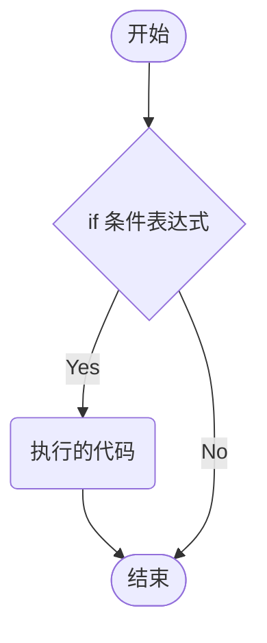
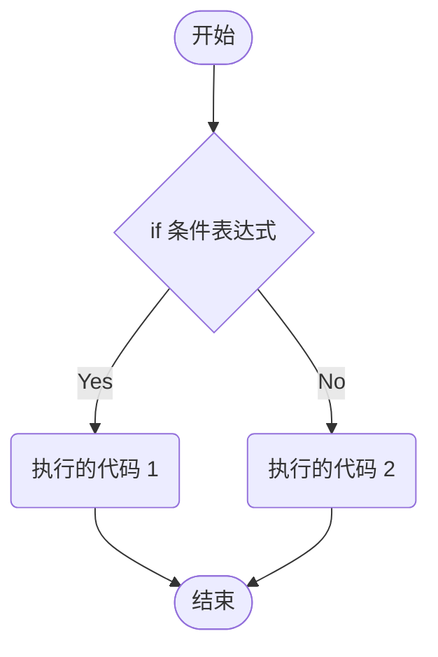
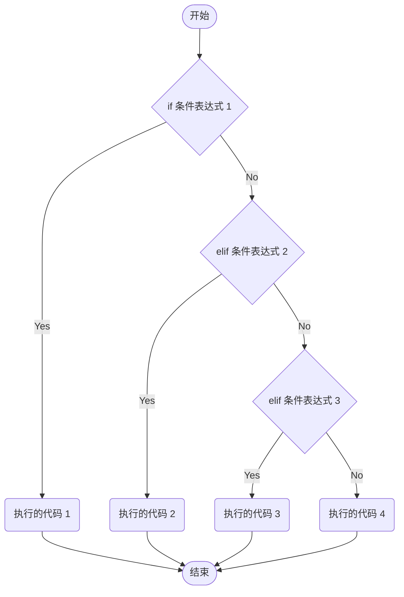
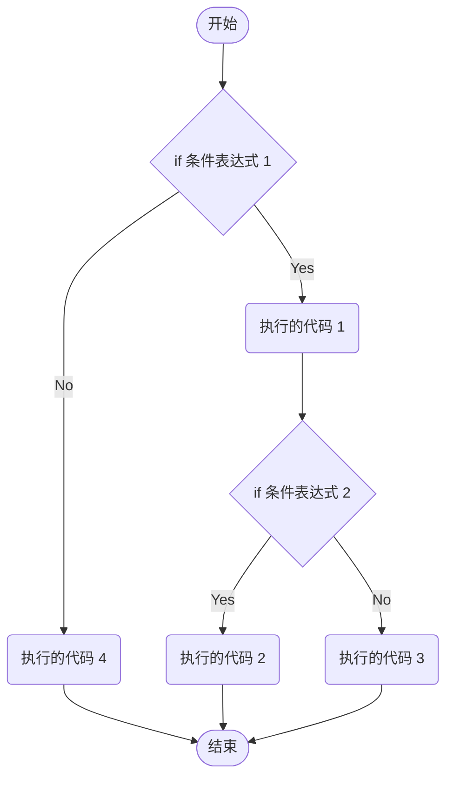
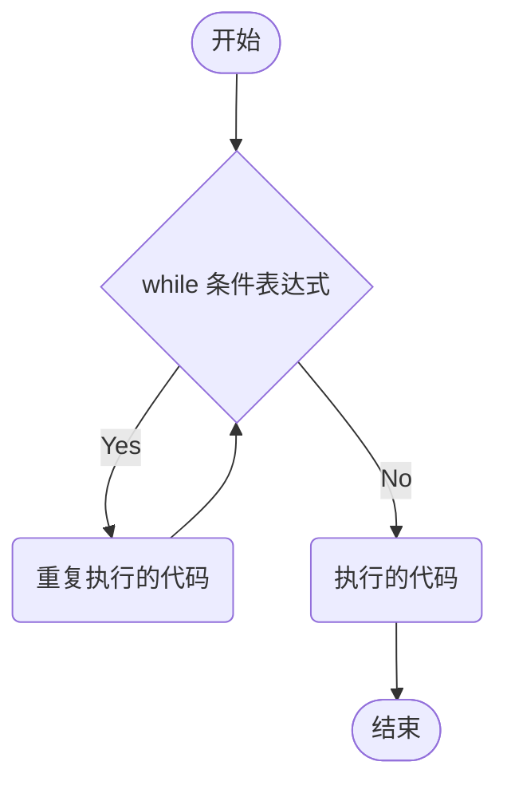
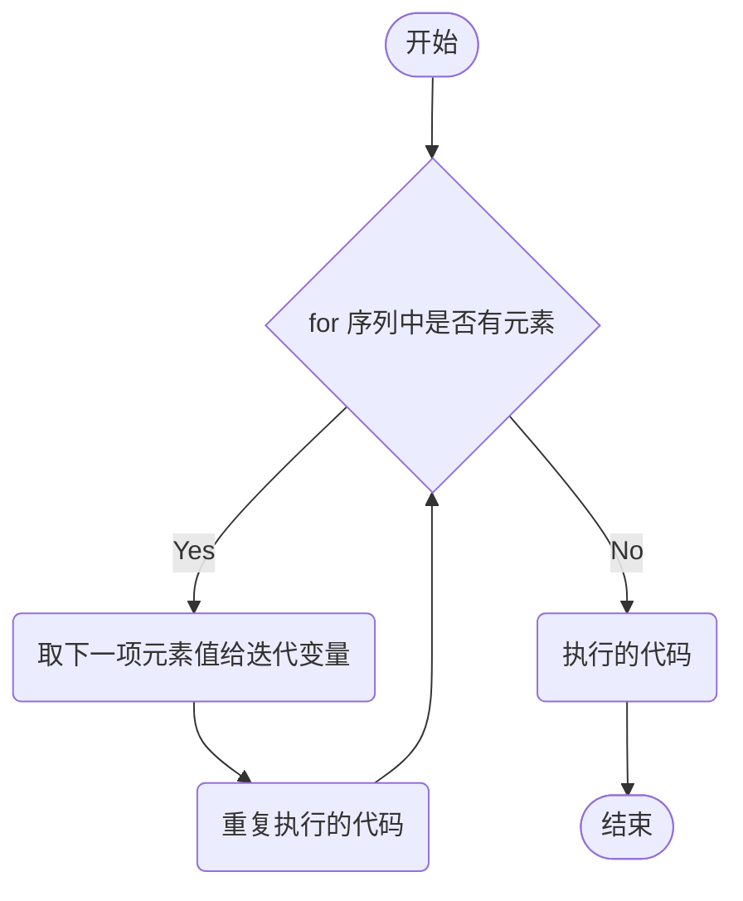

## 条件选择语句

条件选择语句主要有 3 中形式，分别为 **if 语句**、**if···else 语句** 和 **if···elif···else 多分支语句。**

### if 语句

**语法格式：**

```python
if 条件表达式:
    执行的代码
```

**if 语句的流程：**



例如：

```python
num = 5

if num == 5:
    print("num 的值为 5")
```

### if···else 语句

**语法格式：**

```python
if 条件表达式:
    执行的代码 1
else:
    执行的代码 2
```

**if···else 语句的流程：**



例如：

```python
num = 10

if num == 5:
    print("num 的值为 5")
else:
    print("num 的值不为 5")
```

::: tip
**if···else 语句** 可以使用条件表达式简化：

```python
num = 10

print("num 的值为 5") if num == 5 else print("num 的值不为 5")
```

如果 `num = 5`，就输出：“num 的值为 5”；否则就输出：“num 的值不为 5”
:::

### if···elif···else 语句

**语法格式：**

```python
if 条件表达式 1:
    执行的代码 1
elif 条件表达式 2:
    执行的代码 2
elif 条件表达式 3:
    执行的代码 3
...
else:
    执行的代码 4
```

**if···elif···else 语句的流程：**



例如：

```python
age1 = int(input('请输入您的年龄： '))

if (age1 < 18) and (age1 >= 0):
    print(f'您的年龄是 {age1}，不合法，童工')
elif 18 <= age1 <= 60:
    print(f'您的年龄是 {age1}，合法')
elif age1 > 60:
    print(f'您的年龄是 {age1}，退休年龄')
else:
    print('您的输入不符合语法，请输入 0 以上的数字')
```

::: tip 使用 if 选择语句时，尽量使用较为规范的格式

- 当使用布尔型的变量作为判断条件时，假设布尔型变量为 flag，较为规范的格式：

    ```python
    if flag:  # 表示为真
    if not flage:  # 表示为假
    ```

- 不规范的格式：

    ```python
    if flag == True:
    if flag == Flage:
    ```

使用 `if flag:` 这样的格式，可以避免将 `if flag == True:`，错写成 `if flag = True:`
:::

### if 语句嵌套

**语法格式：**

```python
if 条件表达式 1:
    执行的代码 1
    if 条件表达式 2:
        执行的代码 2
    else:
        执行的代码 3
else:
    执行的代码 4
```

**if 语句嵌套的流程：**



例如：

```python
money = 1
seat = 1

if money == 1:
    print('有钱，请上车')
    if seat == 1:
        print('有空座位，可以坐下')
    else:
        print('没有空座位，不可以坐下')
else:
    print('没钱，不能上车')
```

::: tip
**if 语句嵌套** 有多种嵌套方式，嵌套时需要控制好不同级别代码块的缩进量
:::

### 条件表达式

条件表达式又叫：三目运算符、三元运算符或三元表达式，和上面的 **if···else 语句使用条件表达式简化** 原理一样。

**语法格式**：`条件成立执行的代码1 if 条件表达式 else 条件不成立执行的代码2`

使用条件表达式时，先计算 **if 条件表达式**，如果结果为 `True`，返回 **if 条件表达式** 左边的值，否则返回 `else` 右边的值

例如：

```python
a = 1
b = 2

# 如果 a > b，c 就等于 a；否则 c 就等于 b
c = a if a > b else b

print(c)  # 输出结果：2
```

## 循环语句

- **while 循环**：一直重复，直到条件不满足时才结束循环，又叫条件循环。只要条件为真，就会一直循环
- **for 循环**：重复一定次数的循环，又叫计次循环

### while 循环语句

while 循环是通过一个条件来控制是否要反复执行代码。while 循环语句中，`else 语句` 可以省略不写。

::: tip
在使用 while 循环时，一定不要忘记添加将循环条件变为 `False` 的代码，否则将产生死循环
:::

**语法格式：**

```python
while 条件表达式:
    重复执行的代码
[else:
    执行的代码]
```

**while 循环语句的流程：**



例如：计算 1-100 累加和。

```python
x = 1
result = 0

while x <= 100:
    # result = result + x
    result += x
    # x = x + 1
    x += 1

print(result)  # 输出结果：5050

或

x = 1
result = 0

while x <= 100:
    # result = result + x
    result += x
    # x = x + 1
    x += 1
else:
    print(result)  # 输出结果：5050
```

::: tip
**else 语句** 只有在 while 循环语句正常退出后才会执行，异常中断或者遇到 `break` 和 `return` 时，不会执行 `else 语句`
:::

例如：

```python
x = 1
result = 0

while x <= 100:
    # result = result + x
    result += x
    # x = x + 1
    x += 1
    
    if x == 20:
        print("x 值为 20 时中断")  # 输出结果：x 值为 20 时中断
        break
# 异常退出不执行 else 语句
else:
    print(result)
```

### for 循环语句

**for 循环** 是一个依次重复执行的循环。通常用于枚举或遍历序列，以及迭代对象中的元素。for 循环语句中，**else 语句** 可以省略不写。

**语法格式：**

```python
for 迭代变量 in 序列:
    重复执行的代码
[else:
    执行的代码]
```

for 循环语句的流程：



例如：

```python
str1 = 'itheima'

for i in str1:
    print(i)

print("for over")

或

str1 = 'itheima'

for i in str1:
    print(i)
else:
    print("for over")
```

::: tip
**else 语句** 只有在 for 循环语句正常退出后才会执行，异常中断或者遇到 `break` 和 `return` 时，不会执行 **else 语句**
:::

例如：

```python
str1 = 'itheima'

for i in str1:
    print(i)

    if i == "e":
        print("i 等于 e 时中断")
        break
# 异常中断，else 语句不执行
else:
    print("for over")
```

### 循环语句嵌套

- **while 循环语句嵌套：**
    
    **语法格式：**
    
    ```python
    while 条件表达式 1:
        重复执行的代码 1
        while 条件表达式 2:
            重复执行的代码 2
        [else:
            执行的代码 1]
    [else:
        执行的代码 2]
    ```
    
    **while 循环语句嵌套的流程：**
    
    ```mermaid
    flowchart TB
        A([开始]) --> B1{while 条件表达式 1}
        B1 -- Yes --> C1(重复执行的代码 1) --> B2{while 条件表达式 2}
        B1 -- No  --> C2(执行的代码 2) --> D([结束])
        B2 -- Yes --> C3(重复执行的代码 2) --> B2
        B2 -- No --> C4(执行的代码 1) --> B1
    ```
    
    例如：打印正方形的星星，一行输出星星的个数是 5 个，打印 5 行。
    
    ```python
    j = 0
    
    while j < 5:
        i = 0
        
        while i < 5:
            print('*', end='')
            i += 1
        print()
        j += 1
    ```

- **for 循环语句嵌套：**
    
    **语法格式：**
    
    ```python
    for 迭代变量 in 序列:
        重复执行的代码 1
        for 迭代变量 in 序列:
            重复执行的代码 2
        [else:
            执行的代码 1]
    [else:
        执行的代码 2]
    ```
    
    **for 循环语句嵌套的流程：**
    
    ```mermaid
    flowchart TB
        A([开始]) --> B1{for 序列中是否有元素 1}
        B1 -- Yes --> C1(取下一项元素值给迭代变量 1) --> C2(重复执行的代码 1) --> B2{for 序列中是否有元素 2}
        B1 -- No  --> C3(执行的代码 2) --> D([结束])
        B2 -- Yes --> C4(取下一项元素值给迭代变量 2) --> C5(重复执行的代码 2) --> B2
        B2 -- No ---> C6(执行的代码 1) --> B1
    ```
    
    例如：

    ```python
    str1 = 'itheima'
    str2 = 'Hello'
    
    for i in str1:
        print(i)
        
        for j in str2:
            print(j)
    ```

## 相互嵌套

- **while 循环** 也可以嵌套 **for 循环** 和 **if 语句**
- **for 循环** 也可以嵌套 **while 循环** 和 **if 语句**

### while 循环嵌套 for 循环

**语法格式：**

```python
while 条件表达式 1:
    重复执行的代码 1
    for 迭代变量 in 序列:
        重复执行的代码 2
    [else:
        执行的代码 1]
[else:
    执行的代码 2]
```

### while 循环嵌套 if 语句

**语法格式：**

```python
while 条件表达式 1:
    重复执行的代码 1
    if 条件表达式 2:
        执行的代码 1
[else:
    执行的代码 2]
```

### for 循环嵌套 while 循环

**语法格式：**

```python
for 迭代变量 in 序列:
    重复执行的代码 1
    while 条件表达式:
        重复执行的代码 2
    [else:
        执行的代码 1]
[else:
    执行的代码 2]
```

### for 循环嵌套 if 语句

**语法格式：**

```python
for 迭代变量 in 序列:
    重复执行的代码 1
    if 条件表达式 1:
        执行的代码 1
[else:
    执行的代码 2]
```

