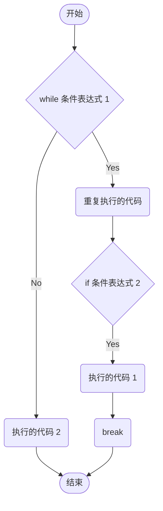
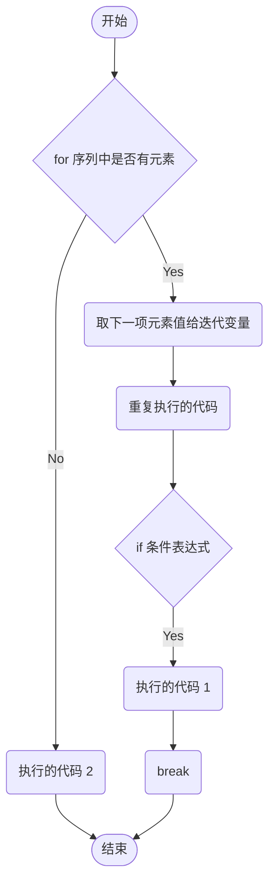
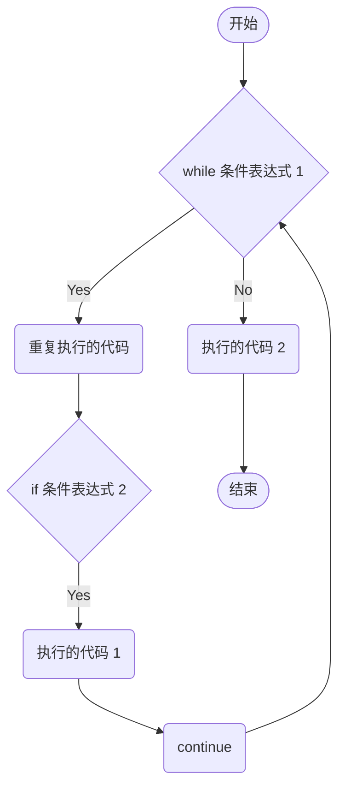
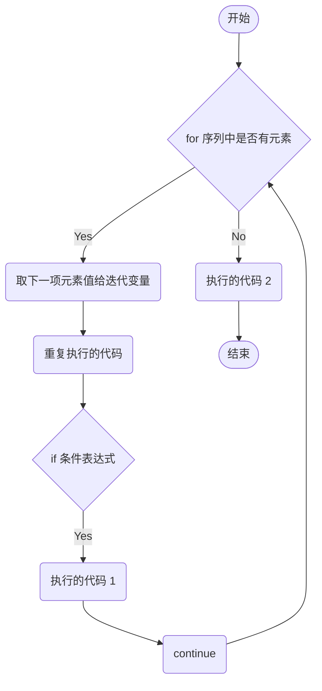

跳转语句能够改变程序的执行顺序，包括 `break`、`continue` 和 `return`。

`break` 和 `continue` 用于循环体中，而 `return` 用于函数中。

## break 语句

break 语句用于 **强制退出循环**，不再执行循环体中尚未执行的语句。

::: tip
**break 语句** 一般会结合 **if 语句** 进行搭配使用，表示在某种条件下，跳出循环。如果使用嵌套循环，break 语句将跳出最内层的循环
:::

### 在 while 循环语句中使用 break 语句

**语法格式：**

```python
while 条件表达式 1:
    重复执行的代码
    if 条件表达式 2:
        执行的代码 1
        break
[else:
    执行的代码 2]
```

**在 while 循环语句中使用 break 语句流程：**



例如：

```python
i = 0

while i < 101:
    i += 1
    if (i % 3) == 2 and (i % 5) == 3 and (i % 7) == 2:
        print("这个数是", i)
        break
    print(i)
```

### 在 for 循环语句中使用 break 语句

**语法格式：**

```python
for 迭代变量 in 序列:
    重复执行的代码
    if 条件表达式:
        执行的代码 1
        break
[else:
    执行的代码 2]
```

**在 for 循环语句中使用 break 语句流程：**



例如：

```python
for number in range(101):
    if (number % 3 == 2) and (number % 5 == 3) and (number % 7 == 2):
        print("这个数是", number)
        break
    print(number)
```

## continue 语句

continue 语句用于 **结束本次循环**，跳过循环体中尚未执行的语句，接着进行终止条件的判断，以决定是否继续循环。

::: tip
**continue 语句** 一般会结合 **if 语句** 进行搭配使用，表示在某种条件下，跳出当前循环中尚未执行的语句，然后进行下一轮循环。如果使用嵌套循环，continue 语句将只跳出最内层循环中尚未执行的语句
:::

### 在 while 循环语句中使用 continue 语句

**语法格式：**

```python
while 条件表达式 1:
    重复执行的代码
    if 条件表达式 2:
        执行的代码 1
        continue
[else:
    执行的代码 2]
```

**在 while 循环语句中使用 continue 语句流程：**



例如：

```python
i = 0

while i < 10:
    if i == 5:
        print("跳过 ", i)
        i += 1
        continue
    print(i)
    i += 1
```

### 在 for 循环语句中使用 continue 语句

**语法格式：**

```python
for 迭代变量 in 序列:
    重复执行的代码
    if 条件表达式:
        执行的代码 1
        continue
[else:
    执行的代码 2]
```

**在 for 循环语句中使用 continue 语句流程：**



例如：

```python
str1 = 'itheima'

for i in str1:
    if i == 'e':
        print("跳过 ", i)
        continue
    print(i)
```

## pass 语句

Python 中还有一个 pass 语句，表示 **空语句**。不做任何事情，一般起占位作用。

在不是偶数时，使用 pass 语句占个位置，方便以后对不是偶数是数进行处理，例如：

```python
for i in range(1, 11):
    if (i % 2) == 0:
        print(i, end=' ')
    else:
        pass
```

