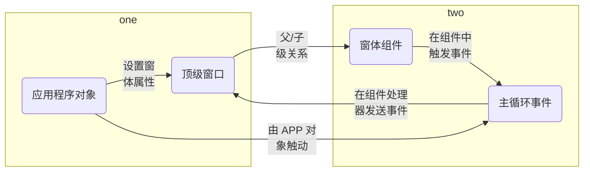

## GUI

GUI 是 Graphical User Interface（图像用户界面）的缩写。在 GUI 中并不只是键入文本和返回文本，用户可以看到窗口、按钮、文本框等图形，而且可以用鼠标单击，还可以通过键盘输入。

GUI 是与程序交互的一种方式。GUI 的程序有三个基本要素：**输入**、**处理** 和 **输出**

### 常用的 GUI 框架

|  工具包  |  描述  |
|  :----:  |  :----  |
|  **wxPython**  |  wxPython 是 Python 语言的一套优秀的 GUI 图形库，支持跨平台。提供了丰富的控件，可用于开发复杂的图形用户界面  |
|  **Kivy**  |  Kivy 是一个开源工具包能够让使用相同源代码创建的程序能跨平台运行。主要关注创新型用户界面开发。如：多点触摸应用程序  |
|  **Flexx**  |  Flexx 是一个纯 Python 工具包，用来创建图形化界面应用程序，可使用 Web 技术进行界面的渲染  |
|  **PyQt**  |  PyQt 是 Qt 库的 Python 版本，支持跨平台。若使用 PyQt 工具包，需要额外安装软件包  |
|  **Tkinter**  |  Tkinter（也叫 Tk 接口）是 Python 官方提供的图形用户界面开发库，用于封装 TK GUI 工具包，跨平台。但 Tkinter 工具包包含的控件少，帮助文档不健全  |
|  **Pywin32**  |  Windows Pywin32 允许您像 VC 一样的形式来使用 Python 开发 win32 应用  |
|  **PyGTK**  |  PyGTK 让您用 Python 轻松创建具有图形用户界面的程序  |
|  **pyui4win**  |  Pyui4win 是一个开源的采用自绘技术的界面库  |

### 安装 wxPython

`wxPython` 的官方网址是：<https://wxPython.org>。

使用 pip 命令安装 wxPython 库：`pip install wxPython`。

## 创建应用程序

在使用 wxPython 之前，先了解两个基础对象：

- **应用程序对象**：应用管理主事件循环，主事件循环是一种事件或消息分发处理机制，大部分图形用户界面在界面中的显示及响应用户事件的处理都是通过主事件循环实现的
- **顶级窗口**：通常用于管理最重要的数据，控制并呈现给用户

这两个基础对象和应用程序的其它部分之间的关系：



这个应用程序对象拥有顶级窗口和主循环事件。顶级窗口管理其窗口中的组件和其它的分配给它的数据对象属性。窗口和它的组件触发的事件基于用户的动作，并接受事件通知以便改变显示。

### 创建一个 wx.App 的子类

创建一个没有任何功能的子类。例如：

```python
import wx


class App(wx.App):
    # 初始化方法
    def OnInit(self):
        # 创建窗口对象
        frame = wx.Frame(parent=None, title="Hello wyPython")
        # 显示窗口。窗口默认隐藏，需要调用 Show() 方法显示
        frame.Show()
        # 返回值
        return True


if __name__ == '__main__':
    # App 类的实例用于创建应用程序对象
    app = App()
    # 调用 App 类的 MainLoop() 主循环方法，让应用程序进入主事件循环中
    app.MainLoop()
```

直接创建 `wx.App`。例如：

```python
import wx

# 创建应用程序对象
app = wx.App()
# 创建窗口对象
frame = wx.Frame(parent=None, title="第一个 wxPython 程序！", size=(400, 300), pos=(100, 100))
# 显示窗口
frame.Show()
# 调用 wx.app 类的 MainLoop() 主循环方法，让应用程序进入主事件循环中
app.MainLoop()
```

### 使用 wx.Frame 框架

在 GUI 中框架通常称为 **窗口**。框架是一个容器，用户可以将它在屏幕上任意移动，并对它进行缩放，通常包含标题栏、菜单等。

在 wxPython 中，wx.Frame 是所有框架的父类，当创建 wx.Frame 的子类时，子类应该调用其父类的构造器 `wx.Frame.__init__()`。

**wx.Frame 语法格式：**

`wx.Frame(parent, id=-1, title="", pos=ws.DefaultPosition, size=ws.DefaultSize, style=wx.DEFAULT_FRAME_STLE, name="frame")`

- **parent**：框架的父窗口，如果是顶级窗口，这个值是 `None`
- **id**：关于新窗口的 wxPython **ID 号**。通常设为 `-1`，让 wxPython 自动生成一个新的 `ID`
- **title**：窗口的标题
- **pos**：一个 wx.Point 对象，指定这个窗口的左上角在屏幕中的位置。在图形用户界面程序中，通常 `(0, 0)` 是显示器的左上角，默认值 `(-1, -1)` 将让系统决定窗口的位置
- **size**：一个 wx.size 对象，指定这个窗口的初始尺寸。默认值是 `(-1, -1)` 将让系统决定窗口的初始尺寸
- **style**：指定窗口的类型常量。可以使用或运算来组合它们
- **name**：框架内在的名字。可以使用 `name` 来寻找这个窗口

自定义窗口类。例如：

```python
import wx


class MyFrame(wx.Frame):
    # 初始化方法
    def __init__(self, parent, id):
        wx.Frame.__init__(self, parent, id, title="myframe", pos=(100, 100), size=(300, 300))


if __name__ == '__main__':
    # 创建应用程序对象
    app = wx.App()
    # 创建窗口对象
    frame = MyFrame(parent=None, id=-1)
    # 显示窗口
    frame.Show()
    app.MainLoop()
```

## 常用控件

创建完窗口以后，可以在窗口内添加一些控件。控件就是经常使用的按钮、文本、输入框、单选框等。

### wx.StaticText 文本类

通过使用 `wx.StaticText` 类来完成在屏幕上绘制纯文本，使用 wx.StaticText 能够改变文本的对齐方式、字体和颜色等。

**wx.StaticText 语法格式：**

`wx.StaticText(parent, id, label, pos=wx.DefaultPosition, size=wx.DefaultSize, style=0, name="staticText")`

- **parent**：父窗口部件
- **id**：标识符。使用 `-1` 可以自动创建一个唯一的标识
- **label**：显示在静态控件中的文本内容
- **pos**：一个 wx.Point 或一个 Python 元组，它是窗口部件的位置
- **size**：一个 wx.size 或一个 Python 元组，它的窗口部件的尺寸
- **style**：样式标记
- **name**：对象的名字

使用 `panel = wx.Panel(self)` 来创建画板，并将 `panel` 作为父类，然后将组件放入窗体中，使用 `wx.Font` 类设置字体。

**wx.Font 语法格式：**

`wx.Font(pointSize, family, style, weight, underline=False, faceName="", encoding=wx.FONTENCODING_DEFAULT)`

- **pointSize**：字体的整体尺寸，单位为磅
- **family**：用于快速指定一个字体而不需要知道该字体实际的名字
- **style**：指明字体是否倾斜
- **weight**：指明字体的醒目程度
- **underline**：仅在 Windows 下有效，如果值为 `True` 则加下划线；如果值为 `False` 则无下划线
- **faceName**：指定字体名
- **encoding**：允许在几个编码中选择一个，大多数情况可以使用默认编码

例如：输出一篇古文。

```python
import wx


class MyFrame(wx.Frame):
    def __init__(self, parent, id):
        wx.Frame.__init__(self, parent, id, title="创建 StaticText 类", pos=(100, 100), size=(600, 400))
        # 创建画板
        panel = wx.Panel(parent=self)

        # 创建标题，并设置字体
        title = wx.StaticText(parent=panel, label="江雪", pos=(60, 20))
        font = wx.Font(16, wx.DEFAULT, wx.FONTSTYLE_NORMAL, wx.NORMAL)
        title.SetFont(font)
        # 创建文本
        wx.StaticText(panel, label="唐 柳宗元", pos=(70, 50))
        wx.StaticText(panel, label="千山鸟飞绝", pos=(50, 70))
        wx.StaticText(panel, label="万径人踪灭", pos=(50, 90))
        wx.StaticText(panel, label="孤舟蓑笠翁", pos=(50, 110))
        wx.StaticText(panel, label="独钓寒江雪", pos=(50, 130))


if __name__ == '__main__':
    # 初始化应用
    app = wx.App()
    # 创建窗口对象
    frame = MyFrame(parent=None, id=-1)
    # 显示窗口
    frame.Show()
    app.MainLoop()
```

### wx.TextCtrl 输入文本类

`wx.StaticText` 类只能够用于显示纯碎的静态文本，使用 `wx.TextCtrl` 类可以与用户进行交互，允许输入单行或多行文本。也可以作为密码输入控件，掩饰所按下的按键。

**wx.TextCtrl 语法格式：**

`wx.TextCtrl(parent, id, value = "", pos=wx.DefaultPosition, size=wx.DefaultSize, style=0, validator=wx.DefaultValidator name=wx.TextCtrNameStr)`

- **parent**：父窗口部件
- **id**：标识符。使用 `-1` 可以自动创建一个唯一的标识
- **value**：显示在该控件中的初始文本
- **pos**：一个 `wx.Point` 或一个 Python 元组，它是窗口部件的位置
- **size**：一个 `wx.size` 或一个 Python 元组，它的窗口部件的尺寸
- **style**：单行 `wx.TextCtrl` 的样式。**取值如下：**

    - **wx.TE_CENTER**：控件中的文本居中
    - **wx.TE_LEFT**：控件中的文本左对齐
    - **wx.TE_RIGHT**：控件中的文本右对齐
    - **wx.TE_NOHIDESEL**：文本始终高亮显示，只适用与 Windows
    - **wx.TE_PASSWORD**：不显示所键入的文本，以星号 `*` 代替显示
    - **wx.TE_PROCESS_ENTER**：如果使用该参数，那么当用户在控件内按下 <kbd>Enter</kbd> 键时，一个文本输入事件将被触发，否则按键事件由该文本控件或该对话框管理
    - **wx.TE_PROCESS_TAB**：如果指定该样式，那么通常的字符事件在按下 <kbd>Tab</kbd> 键时，创建（一般意味一个制表符将被插入文本），否则 `tab` 由对话框管理，通常是控件间的切换
    - **wx.TE_READONLY**：文本控件为只读，用户不能修改其中的文本

- **validator**：常用于过滤数据以确保只能键入要接受的数据
- **name**：框架内在的名字。可以使用 `name` 来寻找这个窗口

例如：实现一个包含用户名和密码的登录界面。

```python
import wx


class MyFrame(wx.Frame):
    def __init__(self, parent, id):
        wx.Frame.__init__(self, parent, id, title="创建 TextCtrl 类", size=(400, 300))

        panel = wx.Panel(self)
        self.title = wx.StaticText(panel, label="请输入用户名和密码", pos=(140, 20))
        self.label_user = wx.StaticText(panel, label="用户名：", pos=(50, 50))
        self.text_user = wx.TextCtrl(panel, pos=(100, 50), size=(235, 25), style=wx.TE_LEFT)
        self.label_passwd = wx.StaticText(panel, label="密  码：", pos=(50, 90))
        self.text_passwd = wx.TextCtrl(panel, pos=(100, 90), size=(235, 25), style=wx.TE_PASSWORD)


if __name__ == '__main__':
    app = wx.App()
    frame = MyFrame(parent=None, id=-1)
    frame.Show()
    app.MainLoop()
```

### wx.Button 按钮类

按钮是 GUI 界面中应用最为广泛的控件，常用于捕获用户生成的单击事件，最明显的用途是触发绑定到一个处理函数。

wxPython 中最常用的按钮类型是 `wx.Button` 类。

**wx.Button 语法格式：**

`wx.Button(parent, id, label, pos, size=wxDefaultSize, style=0, validator, name="button")`

- **parent**：父窗口部件
- **id**：标识符。使用 `-1` 可以自动创建一个唯一的标识
- **label**：显示在静态控件中的文本内容
- **pos**：一个 `wx.Point` 或一个 Python 元组，它是窗口部件的位置
- **size**：一个 `wx.size` 或一个 Python 元组，它的窗口部件的尺寸
- **style**：单行 wx.TextCtrl 的样式。**取值如下：**

    - **wx.TE_CENTER**：控件中的文本居中
    - **wx.TE_LEFT**：控件中的文本左对齐
    - **wx.TE_RIGHT**：控件中的文本右对齐
    - **wx.TE_NOHIDESEL**：文本始终高亮显示，只适用与 Windows
    - **wx.TE_MULTILINE**：控件中的文本可以换行，是多行文本
    - **wx.TE_PASSWORD**：不显示所键入的文本，以星号 `*` 代替显示
    - **wx.TE_PROCESS_ENTER**：如果使用该参数，那么当用户在控件内按下 <kbd>Enter</kbd> 键时，一个文本输入事件将被触发，否则按键事件由该文本控件或该对话框管理
    - **wx.TE_PROCESS_TAB**：如果指定该样式，那么通常的字符事件在按下 <kbd>Tab</kbd> 键时，创建（一般意味一个制表符将被插入文本），否则 `tab` 由对话框管理，通常是控件间的切换
    - **wx.TE_READONLY**：文本控件为只读，用户不能修改其中的文本

- **validator**：常用于过滤数据以确保只能键入要接受的数据
- **name**：框架内在的名字。可以使用 `name` 来寻找这个窗口

例如：为登录界面添加 “确认” 和 “取消” 按钮。

```python
import wx


class MyFrame(wx.Frame):
    def __init__(self, parent, id):
        wx.Frame.__init__(self, parent, id, title="My TextCtrl class", size=(400, 300))

        panel = wx.Panel(self)
        self.title = wx.StaticText(panel, label="请输入用户名和密码", pos=(140, 20))
        self.label_user = wx.StaticText(panel, label="用户名：", pos=(50, 50))
        self.text_user = wx.TextCtrl(panel, pos=(100, 50), size=(235, 25), style=wx.TE_LEFT)
        self.label_passwd = wx.StaticText(panel, label="密  码：", pos=(50, 90))
        self.text_passwd = wx.TextCtrl(panel, pos=(100, 90), size=(235, 25), style=wx.TE_PASSWORD)

        self.bt_confirm = wx.Button(panel, label="确认", pos=(105, 130))
        self.bt_cancel = wx.Button(panel, label="取消", pos=(195, 130))


if __name__ == '__main__':
    app = wx.App()
    frame = MyFrame(parent=None, id=-1)
    frame.Show()
    app.MainLoop()
```

## BoxSizer 布局

控件的几何位置是 **绝对位置**，也就是固定的，当调整窗口大小时，界面会不美观。在 wxPython 中有一种更智能的布局方式——`sizer`（尺寸器）。`sizer` 是用于自动布局一组窗口控件的算法。`sizer` 被附加到一个容器，通常是一个框架或面板。在父容器中创建的子窗口控件必须被分别添加到 `sizer`。当 `sizer` 被附加到容器时，它随后就可以管理它所包含的子布局。

**wxPython 提供的 sizer：**

|  sizer 名称  |  描述  |
|  :----:  |  :----  |
|  **BoxSizer**  |  在一条水平或垂直线上的窗口部件的布局。当尺寸改变时，控制窗口部件的行为上很灵活。通常用于嵌套的样式，可用于几乎任何类型的布局  |
|  **GridSizer**  |  一个十分基础的网络布局。当您要设置的窗口部件都是同样的尺寸且整齐地放入一个规则的网格中可以使用  |
|  **FlexGridSizer**  |  对 GridSizer 稍微做了些改变，当窗口部件有不同的尺寸时，可以有更好的结果  |
|  **GridBagSizer**  |  GridSizer 系列中最灵活的成员。使网格中的窗口部件可以随意放置  |
|  **StaticBoxSizer**  |  一个标准的 BoxSizer，带有标题和环线  |

### 什么是 BoxSizer

BoxSizer 是一个垂直列或水平行，窗口部件在其中从左至右或从上到下布置在一条线上。sizer 相互之间嵌套可以使您能够在每行或每列很容易放置不同数量的项目。由于每个 sizer 都是一个独立的实体，因此您的布局就有了更多的灵活性，对于大多数的应用程序，一个嵌套水平 sizer 的垂直 sizer 将使您能够创建您所需要的布局。

### 使用 BoxSizer 布局

尺寸器会管理组件的尺寸，只要将部件添加到尺寸器上，再加上一些布局参数，就可以让尺寸器自己去管理父组件的尺寸。例如：

```python
import wx


class MyFrame(wx.Frame):
    def __init__(self, parent, id):
        wx.Frame.__init__(self, parent, id, title="用户登录", size=(400, 300))

        panel = wx.Panel(self)
        self.title = wx.StaticText(panel, label="请输入用户名和密码", pos=(140, 20))

        vsizer = wx.BoxSizer(wx.VERTICAL)
        vsizer.Add(self.title, proportion=0, flag=wx.BOTTOM | wx.TOP | wx.ALIGN_CENTER, border=15)
        # 设定尺寸器
        panel.SetSizer(vsizer)


if __name__ == '__main__':
    app = wx.App()
    frame = MyFrame(parent=None, id=-1)
    frame.Show()
    app.MainLoop()
```

`Add()` 方法添加子窗口（或控件）到父窗口。

**Add() 语法格式：**

`Box.Add(control, proportion, flag, border)`

- **control**：要添加的控件
- **proportion**：所添加控件在定义的定位方式所代表方向上占据的空间比例。如果有三个按钮，它们的比例值分别为 `0`、`1`、`2`，它们都已经添加到一个宽度为 `30` 的水平排列 `wx.BoxSizer`，起始宽度都是 `10`。当 `sizer` 的宽度从 `30` 变成 `60` 时，按钮 `1` 的宽度保持不变，仍然是 `10`；按钮 `2` 的宽度约为 `10 + (60 - 30) * 1 / (1 + 2) = 20`，按钮 `2` 约为 `20`
- **flag**：用于控制对齐方式、边框和调整尺寸，flag 参数与 border 参数结合使用可以指定边框边距宽度。**包括以下选项：**

    - **wx.LEFT**：左边距
    - **wx.RIGHT**：右边距
    - **wx.BOTTOM**：底边距
    - **wx.TOP**：上边距
    - **wx.ALL**：上下左右 4 个边距

    通过竖线 `|` 操作符，来联合使用这些标志，比如：`wx.LEFT | wx.BOTTOM`。此外，flag 参数还可以与 proportion 参数结合，指定控件本身的对齐（排列）方式。**包括以下选项：**
    
    - **wx.ALIGN_LEFT**：左边对齐
    - **wx.ALIGN_RIGHT**：右边对齐
    - **wx.ALIGN_TOP**：顶部对齐
    - **wx.ALIGN_BOTTOM**：底边对齐
    - **wx.ALIGN_CENTER_VERTICAL**：垂直居中对齐
    - **wx.ALIGN_CENTER_HORIZONTAL**：水平居中对齐
    - **wx.ALIGN_CENTER**：居中对齐

    调整尺寸。**选项如下：**

    - **wx.EXPAND**：所添加控件将占有 sizer 定位方向上所有可用的空间
    - **wx.SHAPED**：调整子窗口（或控件）填充有效空间，但保存高度比
    - **wx.FIXED_MINSIZE**：调整子窗口（或控件）为最小尺寸
    - **wx.RESERVE_SPACE_EVEN_IF_HIDDEN**：设置此标志后，子窗口（或控件）如果被隐藏，则所占空间保留

- **border**：用于设置边框的宽度，控制所添加控件的边距，就是在部件之间添加一些像素的空白

首先设置了增加面板控件（`wx.Panel`），并创建了一个 `wx.BoxSizer`，它带有一个决定其是水平还是垂直的参数（`wx.HORIZONTAL` 或 `wx.VERTICAL`）默认为水平，然后使用 `Add()` 方法将控件加入 `sizer`，最后使用面板的 `SetSizer()` 方法设定它的尺寸器。例如：

```python
import wx


class MyFrame(wx.Frame):
    def __init__(self, parent, id):
        wx.Frame.__init__(self, parent, id, title="用户登录", size=(400, 300))

        # 创建面板
        panel = wx.Panel(self)

        # 创建文本，左对齐
        self.title = wx.StaticText(panel, label="请输入用户名和密码", pos=(140, 20))
        self.label_user = wx.StaticText(panel, label="用户名：", pos=(50, 50))
        self.text_user = wx.TextCtrl(panel, pos=(100, 50), size=(235, 25), style=wx.TE_LEFT)
        self.label_passwd = wx.StaticText(panel, label="密  码：", pos=(50, 90))
        self.text_passwd = wx.TextCtrl(panel, pos=(100, 90), size=(235, 25), style=wx.TE_PASSWORD)

        # 创建 “确定” 和 “取消” 按钮
        self.bt_confirm = wx.Button(panel, label="确认", pos=(105, 130))
        self.bt_cancel = wx.Button(panel, label="取消", pos=(195, 130))

        # 添加容器，容器中控件横向排列
        hsizer_user = wx.BoxSizer(wx.HORIZONTAL)
        hsizer_user.Add(self.label_user, proportion=0, flag=wx.ALL, border=5)
        hsizer_user.Add(self.text_user, proportion=1, flag=wx.ALL, border=5)
        hsizer_passwd = wx.BoxSizer(wx.HORIZONTAL)
        hsizer_passwd.Add(self.label_passwd, proportion=0, flag=wx.ALL, border=5)
        hsizer_passwd.Add(self.text_passwd, proportion=1, flag=wx.ALL, border=5)
        hsizer_button = wx.BoxSizer(wx.HORIZONTAL)
        hsizer_button.Add(self.bt_confirm, proportion=0, flag=wx.ALIGN_CENTER, border=5)
        hsizer_button.Add(self.bt_cancel, proportion=0, flag=wx.ALIGN_CENTER, border=5)

        # 添加容器，容器中控件纵向排列
        vsizer_all = wx.BoxSizer(wx.VERTICAL)
        vsizer_all.Add(self.title, proportion=0, flag=wx.BOTTOM | wx.TOP | wx.ALIGN_CENTER, border=15)
        vsizer_all.Add(hsizer_user, proportion=0, flag=wx.EXPAND | wx.LEFT | wx.RIGHT, border=45)
        vsizer_all.Add(hsizer_passwd, proportion=0, flag=wx.EXPAND | wx.LEFT | wx.RIGHT, border=45)
        vsizer_all.Add(hsizer_button, proportion=0, flag=wx.ALIGN_CENTER | wx.TOP, border=15)

        # 设定尺寸器
        panel.SetSizer(vsizer_all)


if __name__ == '__main__':
    app = wx.App()
    frame = MyFrame(parent=None, id=-1)
    frame.Show()
    app.MainLoop()
```

## 事件处理

当单击 “确定” 按钮时，验证输入的用户名和密码是否正确，并输出相应的提示信息；当点击 “取消” 按钮时，清空已经输入的用户名和密码。如果要实现这种功能，就需要使用 wxPython 的事件处理。

用户执行的动作就叫作事件（`event`）。如：单击按钮，就是一个单击事件。

### 绑定事件

通过使用 `Bind()` 方法可以将事件处理函数绑定到给定的事件上，当发送一个事件时，可以让程序注意这些事件并且做出反应。

**Bind() 语法格式：**

`bt_confirm.Bind(wx.EVT_BUTTON, OnclickSubmit)`

- **bt_confirm.Bind**：需要绑定的事件
- **wx.EVT_BUTTON**：事件类型为按钮类型。在 wxPython 中有很多 **wx.EVT_** 开头的事件类型。例如：

    - **wx.EVT_MOTION**：产生于用户移动鼠标
    - **wx.ENTER_WINDOW**：产生于当用户鼠标进入一个窗口控件
    - **wx.LEAVE_WINDOW**：产生于当用户鼠标离开一个窗口控件
    - **wx.EVT_MOUSEWHEEL**：被绑定到鼠标滚轮的活动

- **OnclickSubmit**：方法名。事件发送时执行该方法

当用户输入用户名和密码后，单击 “确定” 按钮，如果输入的用户名为 “zhangsan” 并且密码为 “123”，则弹出对话框提示 “登录成功”，否则提示 “用户名和密码不匹配”；当用户点击 “取消” 按钮时，清空用户输入的用户名和密码。例如：

```python
import wx


class MyFrame(wx.Frame):
    def __init__(self, parent, id):
        wx.Frame.__init__(self, parent, id, title="用户登录", size=(400, 300))

        # 创建面板
        panel = wx.Panel(self)

        # 创建文本，左对齐
        self.title = wx.StaticText(panel, label="请输入用户名和密码")
        self.label_user = wx.StaticText(panel, label="用户名：")
        self.text_user = wx.TextCtrl(panel, style=wx.TE_LEFT)
        self.label_passwd = wx.StaticText(panel, label="密  码：")
        self.text_passwd = wx.TextCtrl(panel, style=wx.TE_PASSWORD)

        # 创建 “确定” 和 “取消” 按钮，并绑定事件
        self.bt_confirm = wx.Button(panel, label="确认")
        self.bt_confirm.Bind(wx.EVT_BUTTON, self.OnclickSubmit)
        self.bt_cancel = wx.Button(panel, label="取消")
        self.bt_cancel.Bind(wx.EVT_BUTTON, self.OnclickCancel)

        # 添加容器，容器中控件横向排列
        hsizer_user = wx.BoxSizer(wx.HORIZONTAL)
        hsizer_user.Add(self.label_user, proportion=0, flag=wx.ALL, border=5)
        hsizer_user.Add(self.text_user, proportion=1, flag=wx.ALL, border=5)
        hsizer_passwd = wx.BoxSizer(wx.HORIZONTAL)
        hsizer_passwd.Add(self.label_passwd, proportion=0, flag=wx.ALL, border=5)
        hsizer_passwd.Add(self.text_passwd, proportion=1, flag=wx.ALL, border=5)
        hsizer_button = wx.BoxSizer(wx.HORIZONTAL)
        hsizer_button.Add(self.bt_confirm, proportion=0, flag=wx.ALIGN_CENTER, border=5)
        hsizer_button.Add(self.bt_cancel, proportion=0, flag=wx.ALIGN_CENTER, border=5)

        # 添加容器，容器中控件纵向排列
        vsizer_all = wx.BoxSizer(wx.VERTICAL)
        vsizer_all.Add(self.title, proportion=0, flag=wx.BOTTOM | wx.TOP | wx.ALIGN_CENTER, border=15)
        vsizer_all.Add(hsizer_user, proportion=0, flag=wx.EXPAND | wx.LEFT | wx.RIGHT, border=45)
        vsizer_all.Add(hsizer_passwd, proportion=0, flag=wx.EXPAND | wx.LEFT | wx.RIGHT, border=45)
        vsizer_all.Add(hsizer_button, proportion=0, flag=wx.ALIGN_CENTER | wx.TOP, border=15)

        # 设定尺寸器
        panel.SetSizer(vsizer_all)

    def OnclickSubmit(self, event):
        """
        单击 “确定按钮”，执行方法
        :param self:
        :param event:
        :return:
        """
        message = ""
        # 获取输入的用户名
        user = self.text_user.GetValue()
        # 获取输入的密码
        passwd = self.text_passwd.GetValue()

        # 判断用户名和密码是否为空
        if user == "" or passwd == "":
            message = "用户名或密码不能为空！"
        elif user == "zhangsan" and passwd == "123":
            message = "登录成功！"
        else:
            message = "用户名和密码不匹配！"
        
        # 弹出提示框
        wx.MessageBox(message)

    def OnclickCancel(self, event):
        """
        单击 ”取消“ 按钮，执行方法
        :param event:
        :return:
        """
        # 清空输入的用户名
        self.text_user.SetValue("")
        # 清空输入的密码
        self.text_passwd.SetValue("")


if __name__ == '__main__':
    app = wx.App()  # 初始化应用
    frame = MyFrame(parent=None, id=-1)  # 实例 MyFrame 类，并传递参数
    frame.Show()  # 显示窗口
    app.MainLoop()  # 调用主循环方法
```

### 复选框和单选框

多选控件是复选框（`wx.CheckBox`），复选框有时也能单独使用，能提供两种状态的开和关。

单选控件是单选框（`wx.RadioButton`），同一组的多个单选框应该具有互斥性，就是当一个按钮按下时，其它按钮一定释放。

例如：

```python
import wx


class MyFrame(wx.Frame):
    def __init__(self):
        super().__init__(None, title="复选框和单选框", size=(400, 300))

        panel = wx.Panel(self)
        motion = wx.StaticText(panel, label="选择您喜欢的运动：")
        # 创建复选框
        run = wx.CheckBox(panel, id=1, label="跑步")
        swimming = wx.CheckBox(panel, id=2, label="游泳")
        mountain_climbing = wx.CheckBox(panel, id=3, label="爬山")
        # 设置 swimming 为初始状态选中
        swimming.SetValue(True)
        # 绑定 id 为 1~3 的所有控件的事件处理到 on_motion_click() 方法
        self.Bind(wx.EVT_CHECKBOX, self.on_motion_click, id=1, id2=3)

        gender = wx.StaticText(panel, label="选择性别：")
        # 创建单选框按钮，设置 style=wx.RB_GROUP 的单选按钮，说明是一个组开始，直到遇到另外设置 style=wx.RB_GROUP 的 wx.RadioButto 单选按钮为止都是同一个组。所以 man 和 woman 是同一个组，即这两个单选按钮是互斥的
        man = wx.RadioButton(panel, id=4, label="男", style=wx.RB_GROUP)
        woman = wx.RadioButton(panel, id=5, label="女")
        # 绑定 id 为 4~5 的控件的事件处理到 on_gender_click() 方法
        self.Bind(wx.EVT_RADIOBUTTON, self.on_gender_click, id=4, id2=5)

        hbox_motion = wx.BoxSizer()
        hbox_motion.Add(motion, flag=wx.LEFT | wx.RIGHT, border=5)
        hbox_motion.Add(run)
        hbox_motion.Add(swimming)
        hbox_motion.Add(mountain_climbing)

        hbox_gender = wx.BoxSizer()
        hbox_gender.Add(gender, flag=wx.LEFT | wx.RIGHT, border=5)
        hbox_gender.Add(man)
        hbox_gender.Add(woman)

        vbox = wx.BoxSizer(wx.VERTICAL)
        vbox.Add(hbox_motion, flag=wx.ALL, border=10)
        vbox.Add(hbox_gender, flag=wx.ALL, border=10)

        panel.SetSizer(vbox)

    def on_motion_click(self, event):
        """
        选择喜欢的运动，执行方法
        :param event:
        :return:
        """
        motion = event.GetEventObject()
        # 从事件对象中取出事件源对象（复选框）。GetLabel 获得复选框标签；IsChecked 获得复选状态
        print("选择 {0}，状态 {1}".format(motion.GetLabel(), event.IsChecked()))

    def on_gender_click(self, event):
        """
        选择性别，执行方法
        :param event:
        :return:
        """
        gender = event.GetEventObject()
        # 从事件对象中取出事件源对象（单选框）。GetLabel 获得单选框标签
        print("第一组 {0} 被选中".format(gender.GetLabel()))


if __name__ == '__main__':
    app = wx.App()
    frame = MyFrame()
    frame.Show()
    app.MainLoop()
```

### 列表

对列表控件可以进行单选或多选，列表控件类是 `wx.ListBox`。

**wx.ListBox 语法格式：**

`wx.ListBox(parent, choices, style)`

- **parent**：父窗口部件
- **choices**：指定选项列表
- **style**：选择列表控件类型

    - **wx.LB_SINGLE**：单选
    - **wx.LB_MULTIPLE**：多选
    - **wx.LB_EXTENDED**：多选，但是需要在按住 <kbd>Ctrl</kbd> 或 <kbd>Shift</kbd> 键时选择项目
    - **wx.LB_SORT**：对列表选择项进行排序

例如：

```python
import wx


class MyFrame(wx.Frame):
    def __init__(self):
        super().__init__(None, title="选择列表", size=(400, 300))

        panel = wx.Panel(self)
        motion = wx.StaticText(panel, label="选择您喜欢的运动：")
        motion_list = ["跑步", "游泳", "爬山"]
        # 创建列表控件。choices 用于设置列表选项；style 用于设置列表风格样式 wx.LB_SINGLE 指单选列表控件
        motion_box = wx.ListBox(panel, choices=motion_list, style=wx.LB_SINGLE)
        # 绑定列表选择事件 wx.EVT_LISTBOX 到 self.on_motion_box() 方法
        self.Bind(wx.EVT_LISTBOX, self.on_motion_box, motion_box)

        fruits = wx.StaticText(panel, label="选择您喜欢的水果：")
        fruits_list = ["苹果", "香蕉", "橘子"]
        # 创建列表控件。wx.LB_EXTENDED 指多选列表控件
        fruits_box = wx.ListBox(panel, choices=fruits_list, style=wx.LB_EXTENDED)
        self.Bind(wx.EVT_LISTBOX, self.on_fruits_box, fruits_box)

        hbox_motion = wx.BoxSizer()
        hbox_motion.Add(motion, proportion=1, flag=wx.LEFT | wx.RIGHT, border=5)
        hbox_motion.Add(motion_box, proportion=1)

        hbox_fruits = wx.BoxSizer()
        hbox_fruits.Add(fruits, proportion=1, flag=wx.LEFT | wx.RIGHT, border=5)
        hbox_fruits.Add(fruits_box, proportion=1)

        vbox = wx.BoxSizer(wx.VERTICAL)
        vbox.Add(hbox_motion, flag=wx.ALL | wx.EXPAND, border=5)
        vbox.Add(hbox_fruits, flag=wx.ALL | wx.EXPAND, border=5)

        panel.SetSizer(vbox)

    def on_motion_box(self, event):
        """
        选择喜欢运动，执行的方法
        :param event:
        :return:
        """
        motion = event.GetEventObject()
        # 返回单个选项的列表索引序号
        print("选择 {0}".format(motion.GetSelection()))

    def on_fruits_box(self, event):
        """
        选择喜欢水果，执行的方法
        :param event:
        :return:
        """
        fruits = event.GetEventObject()
        # 返回多个选项的列表索引序号列表
        print("选择 {0}".format(fruits.GetSelections()))


if __name__ == '__main__':
    app = wx.App()
    frame = MyFrame()
    frame.Show()
    app.MainLoop()
```

### 静态图片控件

静态图片控件用于显示一张图片，图片可以是 wx.Python 所支持的任意图片格式，静态图片控件类是 `wx.StaticBitmap`。

可以使用 `self.panel.Layout()` 语句重新设置 panel 面板，在图片替换后，需要重写绘制窗口，否则布局会发生混乱。例如：

```python
import wx


class MyFrame(wx.Frame):
    def __init__(self):
        super().__init__(None, title="静态图片控件", size=(400, 300))
        # 创建面板，是该类的实例变量
        self.panel = wx.Panel(parent=self)

        # 创建 wx.Bitmap 图片对象的列表
        self.bmps = [
            wx.Bitmap('images/img13.jpg', wx.BITMAP_TYPE_ANY),
            wx.Bitmap('images/img14.jpg', wx.BITMAP_TYPE_ANY),
            wx.Bitmap('images/img15.jpg', wx.BITMAP_TYPE_ANY)
        ]

        picture1 = wx.Button(self.panel, id=1, label="Button1")
        picture2 = wx.Button(self.panel, id=2, label="Button2")
        self.Bind(wx.EVT_BUTTON, self.on_picture_click, id=1, id2=2)

        # 静态图片控件对象，self.bmps[0] 是静态图片控件要显示的图片对象
        self.image = wx.StaticBitmap(self.panel, bitmap=self.bmps[0])

        vbox = wx.BoxSizer(wx.VERTICAL)
        vbox.Add(picture1, proportion=1, flag=wx.EXPAND)
        vbox.Add(picture2, proportion=1, flag=wx.EXPAND)
        vbox.Add(self.image, proportion=3, flag=wx.EXPAND)

        self.panel.SetSizer(vbox)

    def on_picture_click(self, event):
        event_id = event.GetId()
        if event_id == 1:
            # 重新设置图片，实现图片切换
            self.image.SetBitmap(self.bmps[1])
        else:
            self.image.SetBitmap(self.bmps[2])
        
        # 重新设置 panel 面板布局
        self.panel.Layout()


if __name__ == '__main__':
    app = wx.App()
    frame = MyFrame()
    frame.Show()
    app.MainLoop()
```

