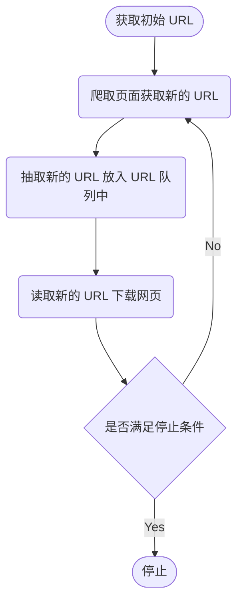
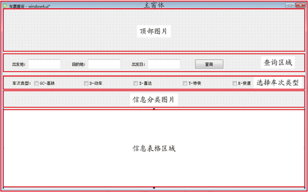

**网络爬虫** 可以按照指定的规则（网络爬虫的算法）自动浏览或抓取网络中的信息，通过 Python 可以很轻松地编写爬虫程序或者是脚本。

## 网络爬虫的基本工作流

**网络爬虫基本工作流程图：**



**网络爬虫基本工作流程：**

1. 获取初始的 URL，该 URL 地址是用户自己制定的初始爬取的网页
2. 爬取对应 URL 地址的网页时，获取新的 URL 地址
3. 将新的 URL 地址放入 URL 队列中
4. 从 URL 队列中读取新的 URL，然后依据新的 URL 爬取网页，同时从新的网页中获取新的 URL 地址，重复上述的爬取过程
5. 设置停止条件，如果没有设置停止条件，爬虫会一直爬取下去，直到无法获取新的 URL 地址为止。设置了停止条件后，爬虫将会满足停止条件时停止爬取

## 网络爬虫的常用技术

### Python 的网络请求

**URL 地址** 与 **下载网页** 这两项是网络爬虫必备而又关键的功能，这两个功能必然会提到 HTTP，在 Python 中实现 HTTP 网络请求常见的三种方式：`urllib`、`urllib3` 和 `requests`。

- **urllib 模块**

    `urllib` 是 python 自带模块，该模块中提供了一个 `urlopen()` 方法，通过该方法指定 URL 发送网络请求来获取数据。
    
    **urlib 子模块如下：**

    |  模块名称  |  功能  |
    |  :----:  |  :----  |
    |  **urllib.request**  |  该模块定义了打开 URL（主要是 HTTP）的方法和类。例如：身份验证、重定向、cookie 等  |
    |  **urllib.error**  |  该模块主要包含异常类，基本的异常类是 URLError  |
    |  **urllib.parse**  |  该模块定义的功能分为两大类：URL 解析和 URL 引用  |
    |  **urllib.robotparser**  |  该模块用于解析 robots.txt 文件  |

    通过 `urllib.request` 模块实现发送请求并读取网页内容的简单实例。例如：

    ```python
    import urllib.request

    # 打开指定需要爬取的网页
    response = urllib.request.urlopen('http://www.baidu.com')
    html = response.read()  # 读取网页代码

    print(html)  # 打印读取内容
    ```

    上述示例中，是通过 `get` 请求方式获取百度的网页内容。下面通过使用 `urllib.request` 模块的 `post` 请求实现获取网页信息的内容。例如：

    ```python
    import urllib.parse
    import urllib.request

    # 将数据使用 urlencod 编码处理后，再使用 encoding 设置为 utf-8 编码
    data = bytes(urllib.parse.urlencode({'word': 'hello'}), encoding='utf-8')
    # 打开指定需要爬取的网页
    response = urllib.request.urlopen('http://httpbin.org/post', data=data)
    html = response.read()  # 读取网页代码

    print(html)  # 打印读取内容
    ```

- **Urllib3 模块**

    `Urllib3` 是一个功能强大，条理清晰的 HTTP 客户端，适用于 Python。`Urllib3` 提供了很多 Python 标准库里所没有的 **重要特性：**

    - 线程安全
    - 连接池
    - 客户端 SSL/TLS 验证
    - 使用大部分编码上传文件
    - Helper 用于重试请求并处理 HTTP 重定向
    - 支持 gzip 和 deflate 编码
    - 支持 HTTP 和 SOCKS 代理
    - 百分百的测试覆盖率

    通过 Urllib3 模块实现发送 `get` 网络请求。例如：

    ```python
    import urllib3

    # 创建 PoolManager 对象，用于处理与线程池的连接已经线程安全的所以细节
    http = urllib3.PoolManager()
    response = http.request('GET', 'https://www.baidu.com/')  # 对需要爬取的网页发送请求

    print(response.data)  # 打印读取内容
    ```

    `post` 请求实现获取网页信息的内容：

    ```python
    response = http.request('POST', 'http://httpbin.org/post', fields={'word': 'hello'})
    ```

- **requests 模块**

    `requests` 是第三方模块，该模块在实现 HTTP 请求时要比 `urllib` 模块简化很多，操作更加人性化。

    安装 request 模块：`pip install requests`。

    **requests 模块的功能特性如下：**

    - `Keep-Alive` 和 连接池
    - 基本或摘要式的身份认证
    - Unicode 响应体
    - 国际化域名和 URL
    - 优雅的 `key/value` Cookie
    - HTTP(S) 代理支持
    - 带持久 Cookie 的会话
    - 自动解压
    - 文件分块上传
    - 浏览器式的 SSL 认证
    - 流下载
    - 分块请求
    - 自动内容解码
    - 连接超时
    - 支持 `.netrc`

    以 `GET` 请求方式为例，打印多种请求信息。例如：

    ```python
    import requests
    
    response = requests.get('http://www.baidu.com')
    
    print(response.status_code)  # 打印状态
    print(response.url)  # 打印请求 url
    print(response.headers)  # 打印头部信息
    print(response.cookies)  # 打印 cookie 信息
    print(response.text)  # 以文本形式打印网页源码
    print(response.content)  # 以字节流形式大于网页源码
    ```

    以 `POST` 请求方式，发送 HTTP 网络请求。例如：

    ```python
    import requests

    data = {'word': 'hello'}  # 表单参数
    response = requests.post('http://httpbin.org/post', data=data)  # 对需要爬取的网页发送请求

    print(response.content)  # 以字节流形式打印网页源码
    ```

    `requests` 模块不仅提供了以上两种常用的请求方式，还提供以下多种网络请求的方式：

    ```python
    requests.put('http://httpbin.org/put', data = {'key': 'value'})  # PUT 请求
    requests.delete('http://httpbin.org/delete')  # DELETE 请求
    requests.head('http://httpbin.org/get')  # HEAD 请求
    requests.options('http://httpbin.org/get')  # OPTIONS 请求
    ```

    如果发现请求的 URL 地址中参数是跟在 `?` 的后面。例如：`httpbin.org/get?key=val`。`requests` 模块提供了传递参数的方法，运行使用 `params` 关键字参数，以一个字符串字典来提供这些参数。

    ```python
    import requests

    payload = {'key1': 'value1', 'key2': 'value2'}  # 传递参数
    response = requests.get('http://httpbin.org/get', params=payload)  # 对需要爬取的网页发送请求

    print(response.context)  # 以字节流形式打印网页源码
    ```

### 请求 headers 处理

有时在请求一个网页内容时，发现无论通过 `GET` 或者是 `POST` 以及其它请求方式，都会出现 `403` 错误，这是由于该网页为了防止恶意采集信息而使用了反爬虫设置，从而拒绝了用户的访问。此时可以通过模拟浏览器的头部信息来进行访问，这样就可以解决反爬虫设置的问题，以 `requests` 模块为例介绍请求头部 `headers` 的处理。

1. 通过浏览器的网络监视器查看头部信息
2. 选中第一条信息（`200 GET`），右侧的信息头面板中将显示请求头部信息（`User-Agent`），然后复制该信息
3. 实现代码，首先创建一个需要爬取的 `url` 地址，然后创建 `headers` 头部信息，再发送请求等待响应，最后打印网页的代码信息

例如：

```python
import requests

url = 'https://www.baidu.com'  # 创建需要爬取的网页地址
# 创建头部信息
headers = {'User-Agent': 'Mozilla/5.0 (Windows NT 10.0; WOW64) AppleWebKit/537.36 (KHTML, like Gecko) Chrome/83.0.4103.97 Safari/537.36'}
response = requests.get(url, headers=headers)  # 发送网络请求
print(response.content)  # 以字节流形式打印网页源码
```

### 网络超时

在访问一个网页时，如果该网页长时间未响应，系统就会判断该网页超时，所以无法打开网页。

模拟一个网络超时的现象。例如：

```python
import requests

for a in range(0, 50):  # 循环发送请求 50 次
    try:  # 捕获异常
        response = requests.get('https://www.baidu.com', timeout=0.04)  # 设置超时为 0.04 秒
        print(response.status_code)  # 打印状态码
    except Exception as e:  # 捕获异常
        print("异常：", e)  # 打印异常信息
```

`request` 模块同样提供了三种常见的网络异常类。例如：

```python
import requests

from requests.exceptions import ReadTimeout, HTTPError, RequestException  # 导入 requests.exceptions 模块中的三种异常类

for a in range(0, 50):  # 循环发送请求 50 次
    try:  # 捕获异常
        response = requests.get('https://www.baidu.com', timeout=0.04)  # 设置超时为 0.04 秒
        print(response.status_code)  # 打印状态码
    except ReadTimeout:  # 捕获超时异常
        print('timeout')
    except HTTPError:  # 捕获 HTTP 异常
        print('httperror')
    except RequestException:  # 捕获请求异常
        print('reqerror')
```

### 代理服务

在爬取网址的过程中，经常出现不久前可以爬取的网页现在无法爬取了，这是因为您的 IP 被爬取网址的服务器所屏蔽了。此时可以设置代理服务解决这个问题，首先需要找到代理地址。例如：`122.114.31.177`，对应的端口号为 `808`，完整的格式为 `122.114.31.177:808`。例如：

```python
import requests

# 设置代理 IP 与对应的端口号
proxy = {'http': '122.144.31.177:808', 'https': '122.144.31.177:8080'}
# 对需要爬取的网页发送请求
response = requests.get('http://www.mingrisoft.com/', proxies=proxy)

# 以字节流形式打印网页源码
print(response.content)
```

### HTML 解析之 Beautiful Soup

`Beautiful Soup` 是一个用于从 HTML 和 XML 文件中提取数据的 Python 库。`Beautiful Soup` 提供一些简单的、函数用来处理导航、搜索、修改分析树等功能。`Beautiful Soup` 模块中的查找提取功能非常强大，而且非常便捷，通常可以节省程序员大量的工作时间。

`Beautiful Soup` 自动将输入文档转换为 `Unicode` 编码，输出文档转换为 `UTF-8` 编码。您不需要考虑编码方式，除非文档没有指定一个编码方式。

**Beautiful Soup 安装方式：**

- Debian 或 Ubuntu Linux 系统通过 `apt-get install python-bs4` 命令安装
- Windows 系统通过 `easy_install beautifulsoup4` 或 `pip install beautifulsoup4` 命令安装，在使用 Beautiful Soup 4 之前需要先安装 bs4 库：`pip install bs4`
- 通过下载源码的方式进行安装，地址为：<https://www.crummy.com/software/BeautifulSoup/bs4/download/>，然后在 CMD（控制台）中打开源码的指定路径输入命令 `python setup.py install` 即可

Beautiful Soup 支持 Python 标准库中包含的 HTML 解析器，但它也支持许多第三方 Python 解析器，其中包含 `lxml` 解析器。

**根据不同的操作系统使用以下命令安装 lxml：**

- **适用于 Linux 系统**：`apt-get install python-lxml`
- **适用于 Windows 系统**：`easy_install lxml` 或 `pip install lxml`

另一个解析器是 `html5lib`，它是一个用于解析 HTML 的 Python 库，按照 Web 浏览器的方式解析 HTML。

**根据不同的操作系统使用以下命令安装 html5lib：**

- **适用于 Linux 系统**：`apt-get install python-html5lib`
- **适用于 Windows 系统**：`easy_install html5lib` 或 `pip install html5lib`

**解析器的比较：**

|  解析器  |  用法  |  优点  |  缺点  |
|  :----:  |  :----  |  :----  |  :----  |
|  Python 标准库  |  BeautifulSoup(markup, "html.parsesr")  |  执行速度适中  |  在 Python 3.2.2 之前的版本中文档容错能力差  |
|  lxml 的 HTML 解析器  |  BeautifulSoup(markup, "lxml")  |  速度快、文档容错能力强  |  需要安装 C 语言库  |
|  lxml 的 XML 解析器  |  BeautifulSoup(markup, "lxml-xml") 或 BeautifulSoup(markup, "xml")  |  速度快、唯一支持 XML 的解析器  |  需要安装 C 语言库  |
|  html5lib  |  BeautifulSoup(markup, "html5lib")  |  最好的容错性、以浏览器的方式解析文档、生成 HTML5 格式的文档  |  速度慢、不依赖外部扩展  |

**Beautiful Soup 使用**

1. 导入 bs4 库，然后创建一个模拟 HTML 代码的字符串

    ```python
    from bs4 import BeautifulSoup

    html_doc = """
    <html><head><title>The Dormouse's story</title></head>
    <body>
    <p class="title"><b>The Dormouse's story</b></p>

    <p class="story">Once upon a time there were three little sisters; and their names were
    <a href="http://examle.com/elsie" class="sister" id="link1">Elsie</a>,
    <a href="http://examle.com/lacie" class="sister" id="link2">Lacie</a> and
    <a href="http://examle.com/tillie" class="sister" id="link3">Tillie</a>,
    and they lived at the bottom of a well.</p>

    <p class="story">...</p>
    """
    ```

2. 创建 Beautiful Soup 对象，并指定解析器为 lxml，最后通过打印的方式将解析的 HTML 代码显示在控制台中

    ```python
    # 创建一个 Beautiful Soup 对象，获取页面正文
    soup = BeautifulSoup(html_doc, features='lxml')
    print(soup)  # 打印解析的 HTML 代码
    ```

    如果将 `html_doc` 字符串代码保存在 `index.html` 文件中，可以通过打开 HTML 文件的方式进行代码的解析，并可以通过 `prettify()` 方法进行代码的格式化处理。

    ```python
    # 创建 Beautiful Soup 对象，打开需要解析的 HTML 文件
    soup = BeautifulSoup(open('index.html'), 'lxml')
    print(soup.prettify())  # 打印格式化后的代码
    ```

## 网络爬虫开发常用框架

爬虫框架就是一些爬虫项目的半成品，可以将一些爬虫常用的功能写好，然后留下一些接口，在不同的爬虫项目中，调用适合自己项目的接口，再编写少量的代码实现自己需要的功能。

1. Scrapy 爬虫框架

    `Scrapy` 框架是一套比较成熟的、开源的 Python 爬虫框架，简单轻巧，并且非常方便，可以高效地爬取 Web 页面并从页面中提取结构化的数据。

    `Scrapy` 官网地址为：<https://scrapy.org>

2. Crawley 爬虫框架

    `Crawley` 也是 Python 开发出的爬虫框架，该框架致力于改变人们从互联网中提取数据的方式。**具体特性如下：**
    
    - 基于 `Eventlet` 构建的高速网络爬虫框架
    - 可以将数据存储在关系数据库中。如：`Postgres`、`MySQL`、`Oracle`、`SQlite` 等数据库
    - 可以将爬取的数据导入为 `Json`、`XML` 格式
    - 支持非关系数据库。例如：`Mongodb` 和 `Couchdb`
    - 支持命令行工具
    - 可以使用您喜欢的工具进行数据的提取。例如：`XPath` 或 `Pyquery` 工具
    - 支持使用 Cookie 登录或访问那些只要登录才可以访问的网页
    - 简单易学

    `Crawley` 的官网地址为：<http://project.crawley-cloud.com>

3. PySpider 爬虫框架

    相对于 `Scrapy` 框架而言，`PySpider` 框架还是新秀。`PySpider` 框架采用 Python 语言编写，分布式架构，支持多种数据库后端，强大的 `WebUI` 支持脚本编辑器、任务监视器、项目管理器以及结果查看器。**具体特性如下：**

    - Python 脚本控制，可以用任何您喜欢的 `HTML` 解析包（内置 pyquery）
    - WEB 界面编写调试脚本、起停脚本、监控执行状态、查看活动历史、获取结果产出
    - 支持 `MySQL`、`MongoDB`、`Redis`、`SQLite`、`Elasticsearch`、`PostgreSQL`、`SQLAlchemy` 等数据库
    - 支持 `RabbitMQ`、`Beanstalk`、`Redis` 和 `Kombu` 作为消息队列
    - 支持抓取 `JavaScript` 的页面
    - 强大的调度控制，支持超时重爬及优先级设置
    - 组件可替换，支持单机或分布式部署，支持 `Docker` 部署

    `PySpider` 源码地址为：<https://github.com/binux/pyspider/releases>

    开发文档地址为：<http://docs.pysider.org/>

## 实战项目：快手爬票

如果想要知道每列车次的时间信息，都需要在各类的列车网址中进行查询。

### 搭建 QT 环境

QT 工具官网地址：<https://www.qt.io/>。

Qt 官网有一个专门的资源下载网站，所有的开发环境和相关工具都可以从这里下载，具体地址是：<https://download.qt.io/>。

**国内镜像网站：**

- **中国科学技术大学**：<http://mirrors.ustc.edu.cn/qtproject/>
- **清华大学**：<https://mirrors.tuna.tsinghua.edu.cn/qt/>
- **北京理工大学**：<http://mirrors.bit.edu.cn/qtproject/>
- **中国互联网络信息中心**：<https://mirrors.cnnic.cn/qt/>

QT 是 Python 开发窗体的工具之一，它不仅与 Python 有良好的兼容性，还有通过可视化拖曳的方式进行窗体的创建，提高开发人员的开发效率。由于 QT 在创建窗体项目时会自动生成后缀名为 `ui` 的文件，该文件需要转换为 `py` 文件后才可以被 python 所识别，所以需要为 QT 与 PyChar 开发工具进行配置。**具体步骤如下：**

1. 确保 `Python`、`QT` 与 `PyCharm` 开发工具安装完成后，打开 `PyCharm` 开发工具，打开设置界面，首先选择 `Project Interpreter` 选项，然后在右侧的列表中选择 `Show All...`，然后在弹出的窗口选择 `Add Local`
2. 在弹出的窗口选择 `System Interpreter`，然后在右侧的下拉列表中默认选择 python 对应的 **版本安装路径**，单击 `OK` 即可
3. 确认 python 的编译版本后，在 **返回的窗口中** 选中右侧的添加按钮，然后在弹出的窗口中 **添加 PyQt5 模块包**，点击 `Install Package` 按钮
4. PyQt5 模块包安装完成后返回设置窗口，在该窗口中依次单击 `Tools -> External Tools` 选项，然后在右侧单击 **添加按钮**
5. 在弹出的窗口中添加 **启动 Qt Designer 的快捷工具**，首先在 `Name` 所对应的编辑框中 **填写工具名称 Qt Designer**，然后在 `Program` 所对应的编辑框中 **填写 QT 开发工具的安装路径**（尾部需要填写软件名），最后在 `Working directory` 所对应的编辑框中 **填写 \$ProjectFileDir\$**，该值代表项目文件目录，单击 `OK` 按钮完成添加
6. 添加将 QT 生成的 `ui` 文件转换为 `py` 文件的快捷工具，在 `Name` 所对应的编辑框中 **填写工具名称 PyUIC**，然后在 `Program` 所对应的编辑框中 **填写 Python 的安装路径**（尾部需要填写软件名），再在 `Arguments` 所对应的编辑框中 **填写将 ui 文件转换为 py 文件的 Python 代码** `-m PyQt5.uic.pyuic $FileName$ -o $FileNameWithoutExtension$.py`，在 `Working directory` 所对应的编辑框中 **填写 \$FileDir\$**，该值为文件目录，单击 `OK` 即可

### 主窗体设计

`Python`、`QT` 与 `PyCharm` 配置完成后，接下来需要对快手爬票的主窗体进行设计，首先需要创建主窗体外层，然后依次添加顶部图片、查询区域、选择车次类型区域、分类图片区域、信息表格区域。**设计顺序如下所示：**



1. Qt 拖曳控件

    （1）在 PyCharm 中 **创建新的项目**，并在右侧 **指定项目名称与位置**

    （2）项目打开完成后，在顶部的菜单栏中依次单击 `Tools -> External Tools -> Qt Designer`

    （3）单击 `Qt Designer` 快捷工具后，Qt 的窗口编辑工具将自动打开，并且会自动弹出一个新建窗体的窗口，在该窗口中 **选择一个主窗体的模板**，这里选择 `Main Window` 然后 **单击创建按钮** 即可

    （4）主窗体创建完成后，自动进入到 `Qt Designer` 的设计界面，顶部区域是菜单栏与快捷菜单选项，左侧区域是各种控件与布局，中间的区域为编辑区域，该区域可以将控件拖曳至此处，也可以预览窗体的设计效果。右侧上方是对象查看器，此处列出所有控件以及彼此所属的关系层。右侧中间的位置是属性编辑器，此处可以设置控件的各种属性。右侧底部的位置分别为信号或槽编辑器、动作编辑器及资源浏览器

    （5）根据自己的设计思路依次将指定的控件拖曳至主窗体中，首先添加主窗体器内的控件，再向主窗体中添加查询区域容器与控件，再向主窗体中添加选择车次类型容器与控件

    **主窗体容器与控件如下：**

    |  对象名称  |  控件名称  |  描述  |
    |  :----:  |  :----:  |  :----  |
    |  **centralwidget**  |  **QWidget**  |  该控件与对象名称是创建主窗体后默认生成，为主窗体外层容器  |
    |  **label_title_img**  |  **QLabel**  |  该控件为与主窗体容器内，用于设置顶部图片、对象名称自定义  |
    |  **label_train_img**  |  **QLabel**  |  该控件为与主窗体容器内，用于设置分类图片、对象名称自定义  |
    |  **tableView**  |  **QTableView**  |  该控件为与主窗体容器内，用于显示信息表格、对象名称自定义  |

    **查询区域容器与控件：**

    |  对象名称  |  控件名称  |  描述  |
    |  :----:  |  :----:  |  :----  |
    |  **widget_query**  |  **QWdiget**  |  该控件位于查询区域的容器内，用于显示查询区域，对象名称自定义，该控件为查询区域的容器  |
    |  **label**  |  **QLabel**  |  该控件位于查询区域的容器内，用于显示 **出发地：** 文字、对象名称自定义  |
    |  **label_2**  |  **QLabel**  |  该控件位于查询区域的容器内，用于显示 **目的地：** 文字、对象名称自定义  |
    |  **label_3**  |  **QLabel**  |  该控件位于查询区域的容器内，用于显示 **出发日：** 文字、对象名称自定义  |
    |  **pushButton**  |  **QPushButton**  |  该控件位于查询区域的容器内，用于显示 **查询按钮**，对象名称自定义  |
    |  **textEdit**  |  **QTextEdit**  |  该控件位于查询区域的容器内，用于显示 **出发地：** 所对应的编辑框、对象名称自定义  |
    |  **textEdit_2**  |  **QTextEdit**  |  该控件位于查询区域的容器内，用于显示 **目的地：** 所对应的编辑框、对象名称自定义  |
    |  **textEdit_3**  |  **QTextEdit**  |  该控件位于查询区域的容器内，用于显示 **出发日：** 所对应的编辑框、对象名称自定义  |

    **选择车次类型容器与控件：**

    |  对象名称  |  控件名称  |  描述  |
    |  :----:  |  :----:  |  :----  |
    |  **widget_checkBox**  |  **QWidget**  |  该控件用于显示选择车次类型区域、对象名称自定义，该控件为选择车次类型区域的容器  |
    |  **checkBox_D**  |  **QCheckBox**  |  该控件位于选择车次类型的容器内，用于选择动车类型、对象名自定义  |
    |  **checkBox_G**  |  **QCheckBox**  |  该控件位于选择车次类型的容器内，用于选择高铁类型、对象名自定义  |
    |  **checkBox_K**  |  **QCheckBox**  |  该控件位于选择车次类型的容器内，用于选择快车类型、对象名自定义  |
    |  **checkBox_T**  |  **QCheckBox**  |  该控件位于选择车次类型的容器内，用于选择特快类型、对象名自定义  |
    |  **checkBox_Z**  |  **QCheckBox**  |  该控件位于选择车次类型的容器内，用于选择直达类型、对象名自定义  |
    |  **label_type**  |  **QLabel**  |  该控件位于选择车次类型的容器内，用于显示 **车次类型：** 文字、对象名自定义  |

    （6）窗体设置完成后，按下 <kbd>Ctrl</kbd> + <kbd>S</kbd> 快捷键保存窗体设计文件名称为 `window.ui`，然后需要将该文件保存在当前项目的目录当中，再选中该文件右键依次选择 `External Tools -> PyUIC` 选项，将窗体设置的 `ui` 文件转换为 `py` 文件

2. 代码调试

    打开 `window.py` 文件后，自动生成的代码中已经导入了 `PyQt5` 以及其内部的常用模块。`PyQt5` 的类别分为多个模块，**常见的模块与概述如下：**

    |  模块名称  |  描述  |
    |  :----:  |  :----  |
    |  **QtCore**  |  此模块应用处理时间、文件和目录、各种数据类型、流、URL、MIME 类型、线程或进程  |
    |  **QtGui**  |  此模块包含类窗口系统集成、事件处理、二维图像、基本成像、字体和文本，以及一套完整的 OpenGL 和 OpenGL ES 的绑定  |
    |  **QtWidgets**  |  此模块中包含的类，提供了一组用于创建经典桌面风格用户界面的 UI 元素  |
    |  **QtMulimedia**  |  此模块中包含的类，用于处理多媒体内容和 API 来访问的相机、收音机功能  |
    |  **QtNetwork**  |  此模块中包含网络编程的类，通过这些类使用网络编程更简单，更便携，便于 TCP/IP 和 UDP 客户端和服务器的编码  |
    |  **QtPositioning**  |  此模块中包含的类，利用各种可能的来源，确定位置，包括卫星、Wi-Fi  |
    |  **QtWebSockets**  |  此模块中包含实现 WebSocket 协议的类  |
    |  **QtXml**  |  此模块中包含用于处理 XML 文件中的类，该模块为 SAX 和 DOM API 提供了解决方法  |
    |  **QtSvg**  |  此模块中提供了用于显示 SVG 文件内容的类，SVG 是可缩放矢量图形，用于描述 XML 中的二维图形的一种格式  |
    |  **QtSql**  |  此模块提供了用于处理数据库的类  |
    |  **QtTest**  |  此模块包含的功能为 pyqt5 应用程序的单元测试  |

    通过代码来调试主窗体中各种控件的细节处理，以及相应的属性。**具体步骤如下：**

    （1）打开 `window.py` 文件，在右侧代码区域的 `setupUi()` 方法中修改主窗体的最大值与最小值，用于保持主窗体大小不变无法扩大或缩小。例如：

    ```python
    MainWindow.setObjectName('MainWindow')  # 设置窗体对象名称
    MainWindow.resize(960, 786)  # 设置窗体大小
    MainWindow.setMinimumSize(QtCore.QSize(960, 786))  # 主窗体最小值
    MainWindow.setMaximumSize(QtCore.QSize(960, 786))  # 主窗体最大值
    self.centralwidget = QtWidgets.QWidget(MainWindow)  # 主窗体的 widget 控件
    self.centralwidget.setObjectName('centralwidget')  # 设置对象名称
    ```

    （2）将图片资源 img 文件夹复制到该项目中，然后导入 `PyQt5.QtGui` 模块中的 QPalette、QPixmap、QColor 用于对控件设置背景图片，为对象名 `label_title_img` 的 Label 控件设置背景图片，该控件用于显示顶部图片。例如：

    ```python
    from PyQt5.QtGui import QPalette, QPixmap, QColor

    self.label_title_img = QtWidgets.QLabel(self.centralwidget)  # 通过 label 控件显示顶部图片
    self.label_title_img.setGeometry(QtCore.QRect(0, 0, 960, 141))
    self.label_title_img.setObjectName('label_title_img')
    title_img = QPixmap('img/bg1.png')  # 打开顶部位图
    self.label_title_img.setPixmap(title_img)  # 设置调色板
    ```

    （3）设置查询部分 widget 控件的背景图片，该控件起到容器的作用，在设置背景图片时并没有 Label 控件那么简单，首先需要为该控件开启自动填充背景功能，然后创建调色板对象，指定调色板背景图片，最后为控件设置对应的调色板即可。例如：

    ```python
    self.widget_query = QtWidgets.QWidget(self.centralwidget)  # 查询部分的 widget
    self.widget_query.setGeometry(QtCore.QRect(0, 141, 960, 80))
    self.widget_query.setObjectName('widget_query')
    self.widget_query.setAutoFillBackground(True)  # 开启自动填充背景

    palette = QPalette()  # 调色板类
    palette.setBrush(QPalette.Background, QtGui.QBrush(QtGui.QPixmap('img/bg2.png')))
    self.widget_query.setPalete(palette)  # 为控件设置对应的调色板即可
    ```

    ::: note
    根据以上两种设置背景图片的方法，分别为选择车次类型的 widget 控件与显示火车信息图片的 Label 控件设置背景图片
    :::

    （4）通过代码修改窗体或控件文字时，需要在 `retranslateUi()` 方法中进行设置。例如：

    ```python
    MainWindow.setWindowTitle(_translate('MainWindow', "车票查询"))
    self.checkBox_T.setText(_translate('MainWindow', "T-特快"))
    self.checkBox_K.setText(_translate('MainWindow', "K-快速"))
    self.checkBox_Z.setText(_translate('MainWindow', "Z-直达"))
    self.checkBox_D.setText(_translate('MainWindow', "D-动车"))
    self.checkBox_G.setText(_translate('MainWindow', "G-高铁"))
    self.label_type.setText(_translate('MainWindow', "车次类型："))
    self.label.setText(_translate('MainWindow', "出发地："))
    self.label_3.setText(_translate('MainWindow', "目的地："))
    self.label_4.setText(_translate('MainWindow', "出发日："))
    self.pushButton.setText(_translate('MainWindow', "查询"))
    ```

    （5）导入 sys 模块，然后在代码块的最外层创建 `show_MainWindow()` 方法，该方法用于显示窗体。例如：

    ```python
    def show_MainWindow():
        app = QtWidgets.QApplication(sys.argv)  # 实例化 QApplication 类，作为 GUI 主程序入口
        MainWindow = QtWidgets.QMainWindow()  # 创建 MainWindow 类
        ui = Ui_MainWindow()  # 实例化 UI 类
        ui.setupUi(MainWindow)  # 设置窗体 UI
        MainWindow.show()  # 显示窗体
        sys.exit(app.exec_())  # 当窗体创建完成，需要结束主循环过程
    ```

    （6）在代码块的最外层模拟 Python 的程序入口，然后调用显示窗体的 `show_MainWindow()` 方法。例如：

    ```python
    if __name__ == '__main__':
        show_MainWindow()
    ```

### 分析网页请求参数

通过 12306 客户服务中心所提供的查票请求地址获取火车票的相关信息。在发送请求时，地址中需要填写必要的参数否则后台将无法返回前台所需要的正确信息。

（1）打开 12306 官方网站（<http://www.12306.cn/mormhweb>），单击右侧导航栏中的余票查询，然后输入出发地与目的地，出发日期默认即可。打开网络监视器，然后单击网页中的查询按钮，在网络监视器中将显示查询按钮所对应的网络请求

（2）单击网络请求将显示请求细节的窗口，在该窗口中默认会显示消息头的相关数据，此处可以获取完整的请求地址

（3）在请求地址的上方选择参数选项，将显示该请求地址中的必要参数。如：出发地名、目的地名、出发日期、车票类型

### 下载站名文件

得到请求地址与请求参数后，可以发现请求参数中的出发地与目的地均为车站名的英文缩写。而这个英文缩写的字母是通过输入中文车站名转换而来的，所有需要在网页中仔细查找是否有将车站名自动转换为英文缩写的请求信息。

（1）关闭并重新打开网络监视器，然后对余票查询网页进行刷新，此时在网络监视器中选择类型为 js 的网络请求。在文件类型中仔细分析文件内容是否有与车站名相关的信息

（2）选中与车站名相关的网络请求，在请求细节中找到该请求的完整地址。然后在网页中打开该地址测试返回数据

（3）打开 Pycharm 开发工具，在 `cheek tickets` 目录中右键菜单依次选则 `New -> Python File`，创建一个名称为 `get_stations.py` 文件，然后安装 request 模块

（4）在 `get_stations.py` 文件中分别导入 requests 模块、re 模块及 os 模块，然后创建 `getStaion()` 方法，该方法用于发送获取地址信息的网络请求，并将返回的数据转换为需要的类型

```python
def getStation():
    # 发送请求获取所有车站名称，通过输入的站名转换为查询地址的参数
    url = 'https://kyfw.12306.cn/otn/resources/js/framework/station_name.js?station_version=1.9242'
    response = requests.get(url, verify=True)  # 请求并进行验证
    stations = re.findall(u'([\u4e00-\u9fa5]+)\|([A-Z]+)', response.text)  # 获取需要的车站名称
    stations = dict((stations))  # 转换为字典类型
    stations = str(stations)  # 转换为字符串类型否则无法写入文件
    write(stations)  # 调用写入方法
```

（5）分别创建 write() 方法、read() 方法及 isStations() 方法，分别用于写入文件、读取文件及判断车站文件是否存在

```python
def write(stations):
    file = open('stations.text', 'w', encoding='utf_8_sig')  # 以写入模式打开文件
    file.write(stations)  # 写入文件
    file.close()  # 关闭文件


def read():
    file = open('stations.text', 'r', encoding='utf_8_sig')  # 以读模式打开文件
    data = file.readine()  # 读取文件
    file.close()  # 关闭文件
    return data


def isStations():
    isStations = os.path.exists('stations.text')  # 判断车站文件是否存在
    return isStations
```

（6）打开 window.py 文件，首先导入 get_stations 文件下的所有方法，然后在模拟 python 的程序入口处修改代码。接下来判断是否存在所有车站信息的文件，如果没有该文件就下载车站信息的文件然后显示窗体，如果存在将直接显示窗体即可

```python
from get_stations import *

if __name__ == '__main__':
    if isStations() == False:  # 判断是否存在所有车站的文件，没有就下载，有就直接显示窗体
        getStation()  # 下载所有车站文件
        show_MainWindow()  # 调用显示窗体的方法
    else:
        show_MainWindow()
```

（7）在 window.py 文件下，单击右键菜单选择 `Run ‘window’` 菜单运行主窗体，主窗体界面显示后在 check tickets 目录下将自动下载 stations.text 文件

### 车票信息的请求与显示

1. 发送与分析车票信息的查询请求

    得到了获取车票信息的网络请求地址，然后又分析出请求地址的必要参数以及车站名称转换的文件，接下来就需要将主窗体中输入的出发地、目的地及出发日期三个重要的参数配置到查票的请求地址中，然后分析并接收所查询车票的对应信息。

    （1）在浏览器中查询请求地址，然后在浏览器中将以 json 的方式返回车票的查询信息

    （2）发现可用数据后，在项目中创建 `query_request.py` 文件，在该文件中首先导入 `get_stations` 文件下的所有方法，然后分别创建名为 data 与 type_data 的列表分别用于保存整理好的车次信息与分类后的车次信息

    ```python
    from get_stations import *

    data = []  # 用于保存整理好的车次信息
    type_data = []  # 保存分类后车次信息
    ```

    （3）创建 `query()` 方法，在调用该方法时需要三个参数，分别为出发日期、出发地以及目的地；然后创建查询请求的完整地址，并通过 `format()` 方法格式化地址；再将返回的 json 数据转换为字典类型；最后通过字典类型键值的方法取出对应的数据并进行整理与分类

    ```python
    def query(date, from_station, to_station):
        data.clear()  # 清空数据
        type_data.clear()  # 清空车次分类保存的数据

        # 请求查询地址
        url = 'https://kyfw.12306.cn/otn/leftTicket/query?leftTicketDTO.train_date=2022-11-29&leftTicketDTO.from_station=SHH&leftTicketDTO.to_station=NFF&purpose_codes=ADULT'.format(date, from_station, to_station)

        response = requests.get(url)  # 发送请求
        result = response.json()  # 将 json 数据转换为字典类型，通过键值对取数据
        result = result['data']['result']

        if isStations() == True:  # 判断车站文件是否存在
            stations = eval(read())  # 读取所有车站并转换为 dic 类型
            if len(result) != 0:  # 判断返回数据是否为空
                for i in result:
                    tmp_list = i.split('|')  # 分割数据并添加到列表中
                    # 查询结果中出发点和目的地均为缩写字母，需要在车站库中找到对应的车站名称
                    from_station = list(stations.keys())[list(stations.values()).index(tmp_list[6])]
                    to_station = list(stations.keys())[list(stations.values()).index(tmp_lis[7])]

                    # 创建座位数组，由于返回的座位数据中含有空（''），所以将空改为 “--”
                    seat = [
                        tmp_list[3], from_station, to_station, tmp_list[8], 
                        tmp_list[9], tmp_list[10], tmp_list[32], tmp_list[31], 
                        tmp_list[30], tmp_list[21], tmp_list[23], tmp_list[33], 
                        tmp_list[28], tmp_list[24], tmp_list[29], tmp_list[26]
                    ]
                    newSeat = []

                    for s in seat:  # 循环将座位信息中的空（''），改成 “--”
                        if s == '':
                            s = '--'
                        else:
                            s = s
                        newSeat.append(s)  # 保存新的座位信息
                    data.append(newSeat)
            return data  # 返回整理好的车次信息
    ```

    （4）依次创建获取高铁信息、移除高铁信息、获取动车信息、移除动车信息、获取直达信息、移除直达信息、获取特快信息、移除特快信息、获取快速信息及移除快速信息的方法，用于车次分类数据的处理

    ```python
    def g_vehicle():  # 获取高铁信息
        if len(data) != 0:
            for g in data:  # 循环所有火车数据
                i = g[0].startswith('G')  # 判断车次首字母是不是高铁
                if i:  # 如果是将该信息添加到高铁数据中
                    type_data.append(g)


    def r_g_vehicle():  # 移除高铁信息
        if len(data) !=0 and len(type_data) != 0:
            for g in data:
                i = g[0].startswith('G')
                if i:
                    type_data.remove(g)


    def d_vehicle():  # 获取动车信息
        if len(data) != 0:
            for d in data:  # 循环所有火车数据
                i = d[0].startswith('D')  # 判断车次首字母是不是动车
                if i == True:  # 如果是将该信息添加到动车数据中
                    type_data.append(d)


    def r_d_vehicle():  # 移除动车信息
        if len(data) != 0:
            for d in data:
                i = d[0].startswith('D')
                if i == True:
                    type_data.remove(d)


    def z_vehicle():  # 获取直达信息
        if len(data) != 0:
            for z in data:  # 循环所有火车数据
                i = z[0].startswith('Z')  # 判断车次首字母是不是直达
                if i == True:  # 如果是将该信息添加到直达数据中
                    type_data.append(z)


    def r_z_vehicle():  # 移除直达信息
        if len(data) != 0:
            for z in data:
                i = z[0].startswith('Z')
                if i == True:
                    type_data.remove(z)


    def t_vehicle():  # 获取特快信息
        if len(data) != 0:
            for t in data:  # 循环所有火车数据
                i = d[0].startswith('T')  # 判断车次首字母是不是特快
                if i == True:  # 如果是将该信息添加到特快数据中
                    type_data.append(t)


    def r_t_vehicle():  # 移除特快信息
        if len(data) != 0:
            for t in data:
                i = t[0].startswith('T')
                if i == True:
                    type_data.remove(t)


    def k_vehicle():  # 获取快速信息
        if len(data) != 0:
            for k in data:  # 循环所有火车数据
                i = d[0].startswith('K')  # 判断车次首字母是不是快速
                if i == True:  # 如果是将该信息添加到快速数据中
                    type_data.append(k)


    def r_k_vehicle():  # 移除快速信息
        if len(data) != 0:
            for k in data:
                i = d[0].startswith('K')
                if i == True:
                    type_data.remove(k)
    ```

2. 在窗体中显示查票信息

    完成了车票信息查询请求的文件后，接下来需要将获取的车票信息显示在快手爬票的主窗体中。

    （1）打开 `window.py` 文件，导入 `PyQt5.QtCore` 模块中的 Qt 类，然后导入 `PyQt5.QtWidgets` 模块与 `PyQt5.QtGui` 模块下的所有方法，再导入 `query_request` 文件中的所有方法

    ```python
    from PyQt5.QtCore import Qt
    from PyQt5.QtWidgets import *
    from PyQt5.QtGui import *
    from query_request
    ```

    （2）在 `setupUi()` 方法中找到用于显示车票信息的 `tableView` 表格控件。然后为该控件设置相关属性

    ```python
    self.tableView = QtWidgets.QTableView(self.centralwidget)  # 显示车次信息的列表
    self.tableView.setGeometry(QtCore.QRect(0, 320, 960, 440))
    self.tableView.setQbjectName('tableView')  # 创建存储数据的模式

    self.model = QStandardItemModel()  # 根据空间自动改变列宽度并且不可修改列宽度
    self.tableView.horizontalHeader().setSectionResizeMode(QHeaderView.Stretch)
    self.tableView.horizontalHeader().setVisible(False)  # 设置表头不可见
    self.tableView.verticalHeader().setVisible(False)  # 设置纵向表头不可见

    font = QtGui.QFont()  # 设置表格内容文字大小
    font.setPointSize(10)
    self.tableView.setFont(font)
    self.tableView.setEditTriggers(QAbstractItemView.NoEditTriggers)  # 设置表格内容不可编辑
    self.tableView.setVerticalScrollBarPolicy  # 垂直滚动条始终开启
    ```

    （3）导入 time 模块，该模块提供了用于处理时间的各种方法。然后在代码块的最外层创建 get_time() 方法用于获取系统的当前日期，再创建 is_valid_date() 方法用于判断输入的日期是否是一个有效的日期字符串

    ```python
    import time


    def get_time():  # 获取系统当前时间并转换请求数据所需要的格式
        now = int(time.time())  # 获取当前时间的时间戳
        timeStruct = time.localtime(now)  # 转换格式为：%Y-%m-%d %H:%M:%S
        strTime = time.strftime('%Y-%m-%d', timeStruct)
        return strTime


    def is_valid_date(str):
        try:  # 判断是否是一个有效的日期字符串
            time.strptime(str, '%Y-%m-%d')
            return True
        except:
            return False
    ```

    （4）依次创建 change_G、change_D、change_Z、change_T、change_K() 方法，以上方法均为车次分类复选框的事件处理

    ```python
    def change_G(self, state):  # 高铁复选框事件处理
        if state == QtCore.Qt.Checked:  # 选中将高铁信息添加到最后要显示的数据当中
            g_vehicle()  # 获取高铁信息
            self.displayTable(len(type_data), 16, type_data)  # 通过表格显示该车型数据
        else:
            r_g_vehicle()  # 取消选中状态将移除该数据
            self.displayTable(len(type_data), 16, type_data)


    def change_D(self, state):  # 动车复选框事件处理
        if state == QtCore.Qt.Checked:  # 选中将动车信息添加到最后要显示的数据当中
            d_vehicle()  # 获取动车信息
            self.displayTable(len(type_data), 16, type_data)  # 通过表格显示该车型数据
        else:
            r_d_vehicle()  # 取消选中状态将移除该数据
            self.displayTable(len(type_data), 16, type_data)


    def change_Z(self, state):  # 直达复选框事件处理
        if state == QtCore.Qt.Checked:  # 选中将直达信息添加到最后要显示的数据当中
            z_vehicle()  # 获取直达信息
            self.displayTable(len(type_data), 16, type_data)  # 通过表格显示该车型数据
        else:
            r_z_vehicle()  # 取消选中状态将移除该数据
            self.displayTable(len(type_data), 16, type_data)


    def change_T(self, state):  # 特快复选框事件处理
        if state == QtCore.Qt.Checked:  # 选中将特快信息添加到最后要显示的数据当中
            t_vehicle()  # 获取特快信息
            self.displayTable(len(type_data), 16, type_data)  # 通过表格显示该车型数据
        else:
            r_t_vehicle()  # 取消选中状态将移除该数据
            self.displayTable(len(type_data), 16, type_data)


    def change_K(self, state):  # 快速复选框事件处理
        if state == QtCore.Qt.Checked:  # 选中将快速信息添加到最后要显示的数据当中
            k_vehicle()  # 获取快速信息
            self.displayTable(len(type_data), 16, type_data)  # 通过表格显示该车型数据
        else:
            r_k_vehicle()  # 取消选中状态将移除该数据
            self.displayTable(len(type_data), 16, type_data)
    ```

    （5）创建 `checkBox_default()` 方法，该方法用于将所有车次分类复选框取消勾选

    ```python
    def checkBox_default(self):
        self.checkBx_G.setChecked(False)
        self.checkBx_D.setChecked(False)
        self.checkBx_Z.setChecked(False)
        self.checkBx_T.setChecked(False)
        self.checkBx_K.setChecked(False)
    ```

    （6）创建 `messageDialog()` 方法，用于显示主窗体非法操作的消息提示框；创建 `displayTable()` 方法，用于显示车次信息的表格与内容

    ```python
    def messageDialog(self, title, message):  # 显示消息提示框，参数 title 为提示框标题文字，message 为提示消息
        msg_box = QMessageBox(QMessageBox.Warning, title, message)
        msg_box.exec_()


    def displayTable(self, train, info, data):  # 显示车次信息表格；train 为共有多少列车，作为表格的行；info 为该列车的具体信息，作为表格的列
        self.model.clear()
        for row in range(info):
            item = QStandardItem(data[row][column])  # 添加表格内容
            self.model.setItem(row, column, item)  # 向表格存储模式中添加表格具体信息
        self.tableView.setModel(self.model)  # 设置表格存储数据的模式
    ```

    （7）创建 `on_click()` 方法，该方法是查询按钮的单击事件。在该方法中首先获取出发地、目的地与出发日期三个编辑框的输入内容，然后对三个编辑框中输入的内容进行合法检测，符合规范后调用 `query()` 方法提交车票查询的请求并且将返回的数据赋值给 data，最后通过调用 `displayTable()` 方法实现在表格中显示车票查询的全部信息

    ```python
    def on_click(self):
        get_from = self.textEdit.toPlainText()
        get_to = self.textEdit_2.toPlainText()
        get_date = self.textEdit_3.toPlainText()

        if isStations() == True:
            stations = eval(read())

            if get_from != '' and get_to != '' and get_date != '':
                if get_from in stations and get_to in stations and is_valid_date(get_date):
                    inputYearDay = time.strptime(get_date, '%Y-%m%d').tm_yday
                    yearTody = time.localtime(time.time()).tm_yday
                    timeDifference = inputYearDay - yearTody

                    if 0 <= timeDifference <= 28:
                        from_station = stations[get_from]
                        to_station = stations[get_to]
                        data = query(get_date, from_station, to_station)
                        self.checkBox_default()

                        if len(data) != 0:
                            self.displayTable(len(data), 16, data)
                        else:
                            self.messageDialog("警告", "没有返回的网络数据！")
                    else:
                        self.messageDialog("警告", "超出查询日期的范围内", "不可查询昨天的车票信息，以及 29 天以后的车票信息！")
                else:
                    self.messageDialog("警告", "输入的站名不存在或日期格式不正确！")
            else:
                self.messageDialog("警告", "请填写车站名称！")
        else:
            self.messageDialog("警告", "未下载车站查询文件！")
    ```

    （8）在 `retranslateUi()` 方法中，首先设置出发日期的编辑框中显示系统的当前日期，然后设置查询按钮的单击事件，最后分别设置高铁、动车、直达、特快及快速复选框选中与取消事件

    ```python
    self.textEdit_3.setText(get_time())  # 出发日期显示当天日期
    self.pushButton.clicked.connect(self.on_click)  # 查询按钮指定单击事件的方法
    self.checkBox_G.stateChanged.connect(self.change_G)  # 高铁选中与取消事件
    self.checkBox_D.stateChanged.connect(self.change_D)  # 动车选中与取消事件
    self.checkBox_Z.stateChanged.connect(self.change_Z)  # 直达选中与取消事件
    self.checkBox_T.stateChanged.connect(self.change_T)  # 特快选中与取消事件
    self.checkBox_K.stateChanged.connect(self.change_K)  # 快速选中与取消事件
    ```

    （9）在 `window.py` 文件下，单击邮件，选择 `Run ‘window’` 菜单运行主窗体，然后输入符号规范的出发地、目的地与出发日期

