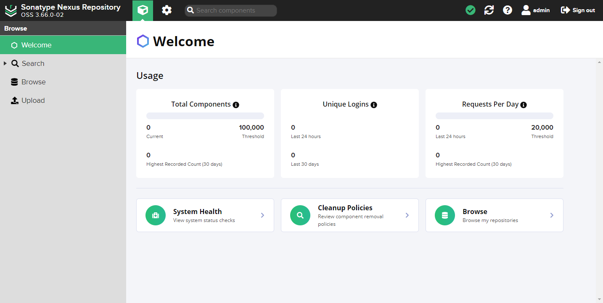

## 主页面功能

主页面功能描述。

### Search

搜索组件使您可以快速识别和访问有关特定组件的信息（例如：可用版本、安全性和许可证数据等），还可以添加其他条件进行搜索。

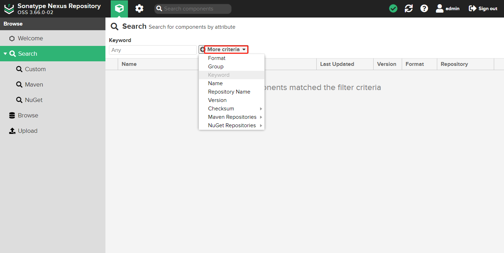

### Browse

这将显示所有存储库和存储库组的列表，当您选择组件或资产时，右侧会出现一个信息视图。

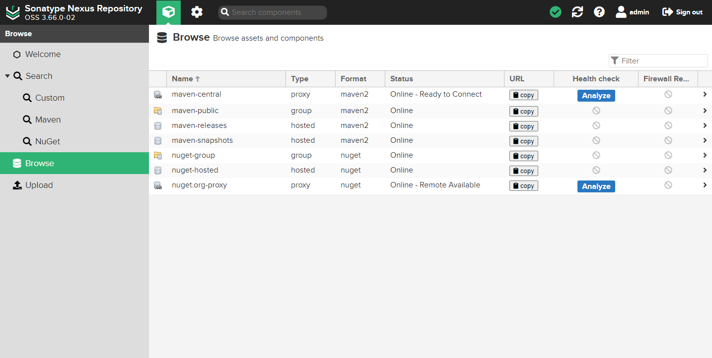

### Upload

当您的构建使用公共存储库中无法提供的专有或自定义依赖项时，可以将这些第三方组件上传到您的 `hosted` 托管的本地存储库中。

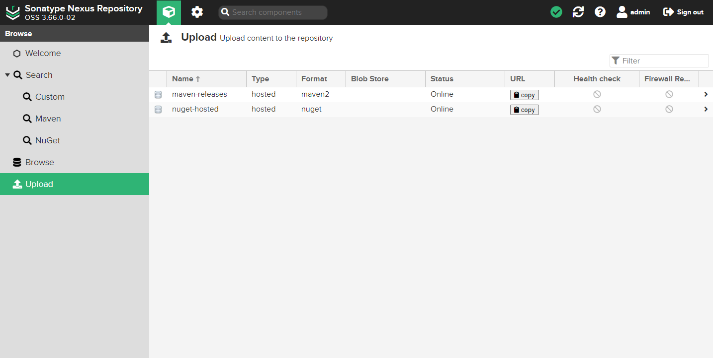

## 服务器管理和配置

简单介绍一些服务器管理和配置功能，这些功能和下面概述的功能只有授权用户才能访问。

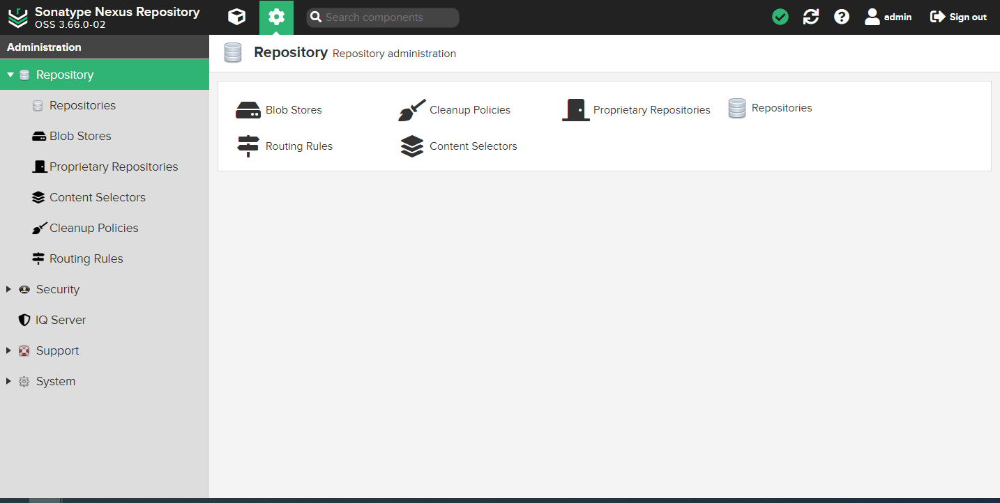

### Repository 管理存储库

负责管理所有存储库和相关配置。

- **Repositories**：管理存储库，查看官网 [管理存储库](https://help.sonatype.com/en/repository-management.html) 说明

    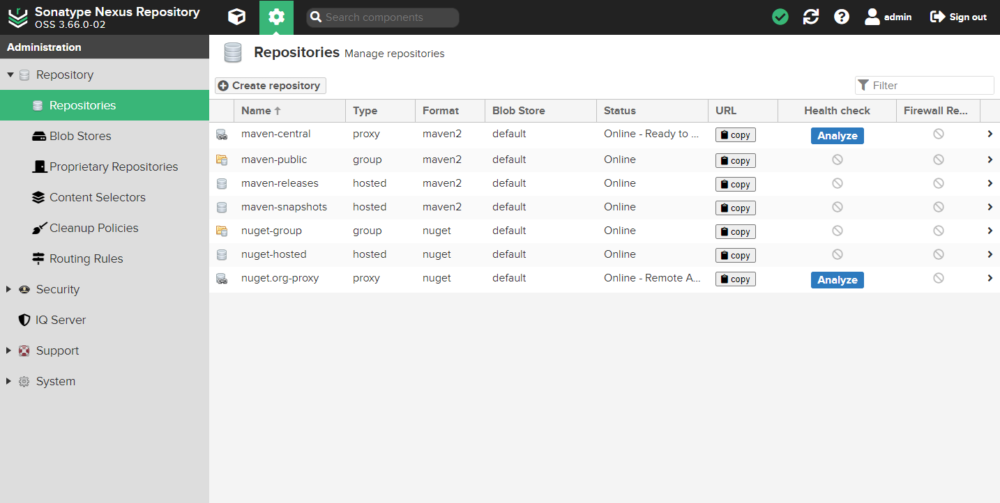

    存储库类型如下：

    - **proxy**：代理存储库。用来代理远程公共仓库。例如：Maven 中央仓库、JBoss 远程仓库
    - **hosted**：本地存储库。该仓库通常用来部署本地项目所产生的构件。`hosted` 宿主仓库又分为：`releases` 和 `snapshots`，分别表示依赖的版本的发行版、快照版。快照版依赖不能上传到发布版仓库，反之亦然。nexus 做了限制
    - **group**：存储库组，用来将多个代理存储库或本地存储库组合成一个存储库，为这些仓库提供统一的服务地址，以便 Maven 可以更加方便地获得这些仓库中的构件

    Nexus 服务提供了以下默认的 maven2 仓库，可供我们直接使用：

    - **maven-central**：代理存储库（Type：`proxy`）。代理 Maven 中央库，默认从 `https://repo1.maven.org/maven2/` 拉取 jar 包
    - **maven-releases**：发布版存储库（Type：`hosted`）。用于组织发布内部版本的存储库
    - **maven-snapshots**：快照版存储库（Type：`hosted`、Version policy：`Snapshot`），用于组织发布内部开发版本的存储库
    - **maven-public**：maven2 存储库集合（Type：`group`），用于整合以上三个仓库，用户可以直接使用集合仓库的地址拉取依赖 jar 包

- **Blob Stores**：配置 Blob 存储，查看官网 [配置 Blob 存储](https://help.sonatype.com/en/configuring-blob-stores.html) 说明

    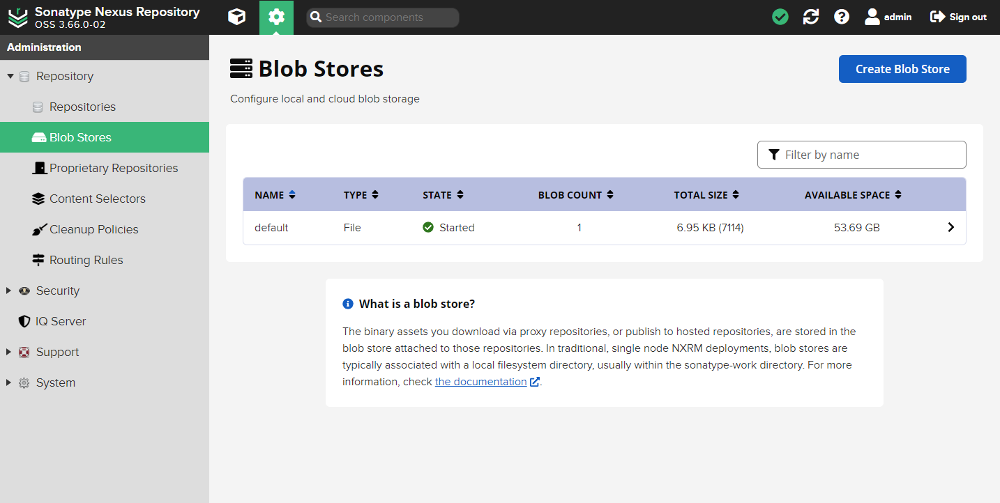

    Blob 存储类型如下：

    - **File**：文件 blob 存储允许 Nexus Repository 将 blob 作为文件存储在目录中。创建 Blob 存储期间提供的参数 Path 确定 Blob 文件的位置
    - **S3**：S3 Blob 存储将 Blob 作为对象保存在 AWS S3 上的 `bucket` 中。仅建议将 S3 Blob 存储用于 AWS 中托管的 Nexus 存储库安装

### Security

用于提供对与用户身份验证和授权相关的所有配置功能，包括 Privileges、Roles、Users，还有 LDAP、Atlassian Crowd（仅限专业版）、SSL 证书和用户令牌（仅限专业版）。

### IQ Server

管理 Sonatype 存储库防火墙和 Sonatype 生命周期配置。IQ Server 项目（对具有 nx-all 或 nx-settings 权限的用户可见）允许您配置 Sonatype Nexus Repository 到 IQ Server 的连接。更多文档可在 [Sonatype Lifecycle](https://help.sonatype.com/en/sonatype-lifecycle.html) 中找到。

### Support

用于管理和监视存储库管理器的功能，例如：日志记录和系统信息。

### System

用于开始和运行存储库管理器的常规配置，例如：HTTP 或电子邮件服务器设置，以及定期运行的功能和任务以及其他配置。

## 创建存储库

### 创建 Blob 存储

在创建 repository 之前，还需要先指定文件存储目录，便于统一管理。就需要创建 `Blob Stores`，不创建则使用的是 `default`。

在主页点击 *&#x2699;（管理） -> Repository-> Blob Stores -> Create Blob Store* 创建 Blob 存储。

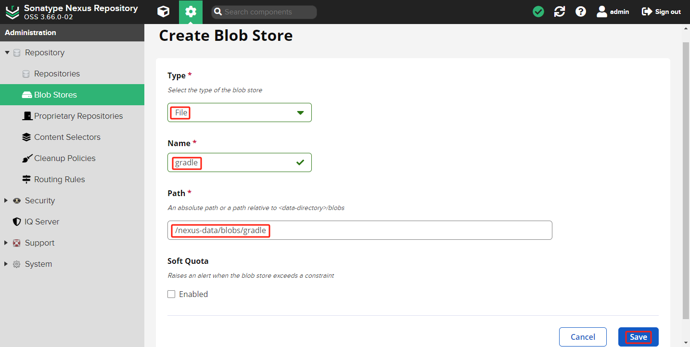

- **Type**：Blob 存储的类型为 *File*
- **Name**：Blob 存储的名称
- **Path**：Blob 存储的存放路径

创建完成后点击 *Save* 保存。

### 创建 proxy 存储库

在主页点击 *&#x2699;（管理） -> Repository-> Repositories* 进入存储库管理。

依次点击 *Create repository -> maven2(proxy)*。

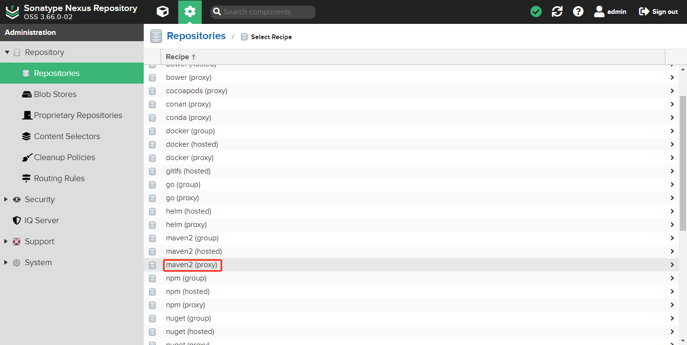

使用阿里云的 [maven 仓库文件](https://developer.aliyun.com/mvn/view)，创建 `gradle-public` 代理仓库。

配置 `proxy` 仓库名称 *Name*（例如：`gradle-public`）和 *Proxy URL*（例如：`https://maven.aliyun.com/repository/public`）。

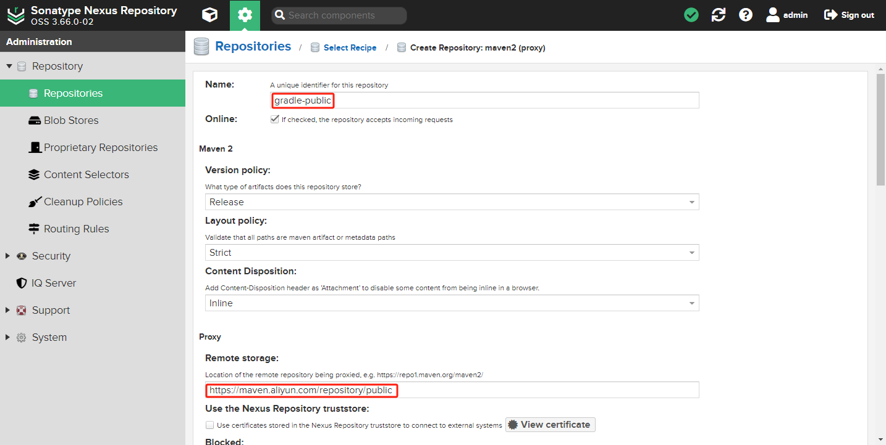

选择 *Blob store* 存储位置。

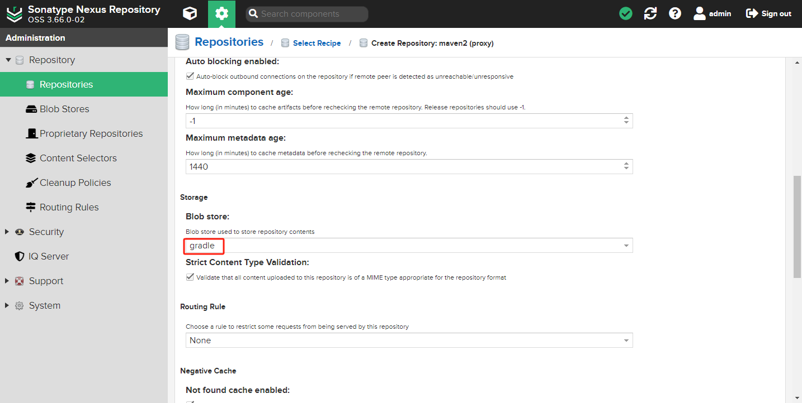

点击 *Create repository* 创建存储库。

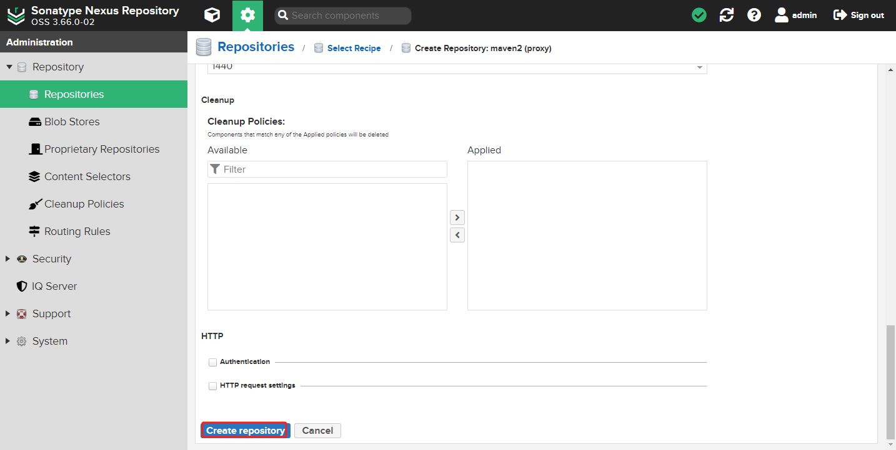

其他的可以采用默认，以后需要修改的可以再修改。

按上面的操作，依次添加以下代理存储库。

- **gradle-plugin**：`https://maven.aliyun.com/repository/gradle-plugin`
- **gradle-google**：`https://maven.aliyun.com/repository/google`
- **gradle-jcenter**：`https://maven.aliyun.com/repository/jcenter`

### 创建 hosted 存储库

在主页点击 *&#x2699;（管理） -> Repository-> Repositories* 进入存储库管理。

依次点击 *Create repository -> maven2(hosted)*。

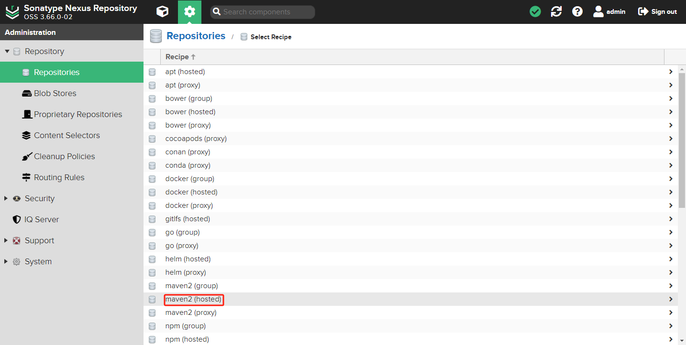

配置 `hosted` 仓库名称 *Name*（例如：`gradle-hosted`）和 *Blob store* 存储位置。


点击 *Create repository* 创建存储库。


其他的可以采用默认，以后需要修改的可以再修改。

### 创建 snapshot 存储库

在主页点击 *&#x2699;（管理） -> Repository-> Repositories* 进入存储库管理。

依次点击 *Create repository -> maven2(hosted)*。


配置 `snapshot` 仓库 *Name*（例如：`gradle-snapshot`）、*Versin policy*（`Snapshot`）和 *Blob store* 存储位置。

Hosted `Versin policy` 有三种方式：
 
- **Releases**：一般是已经发布的 Jar 包
- **Snapshot**：未发布的版本
- **Mixed**：混合的

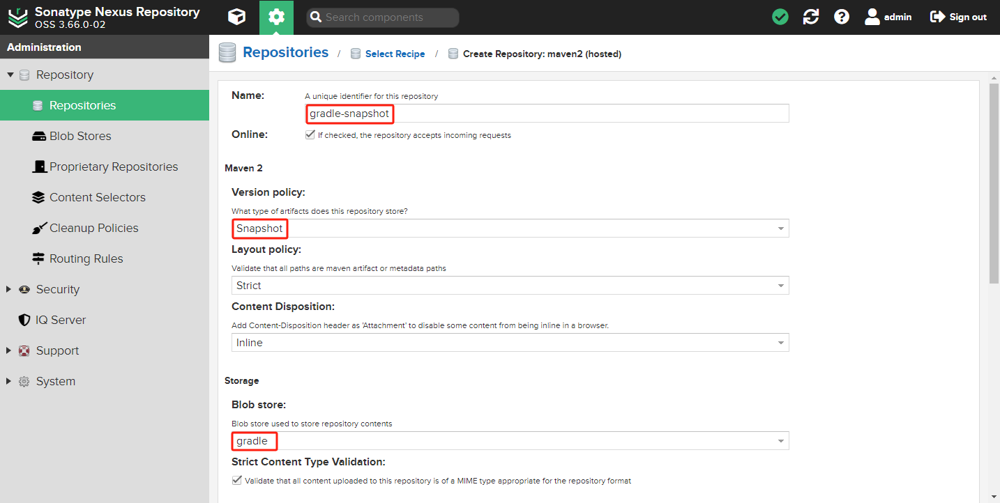

点击 *Create repository* 创建存储库。


其他的可以采用默认，以后需要修改的可以再修改。

### 创建 group 存储库

在主页点击 *&#x2699;（管理） -> Repository-> Repositories* 进入存储库管理。

依次点击 *Create repository -> maven2(group)*。

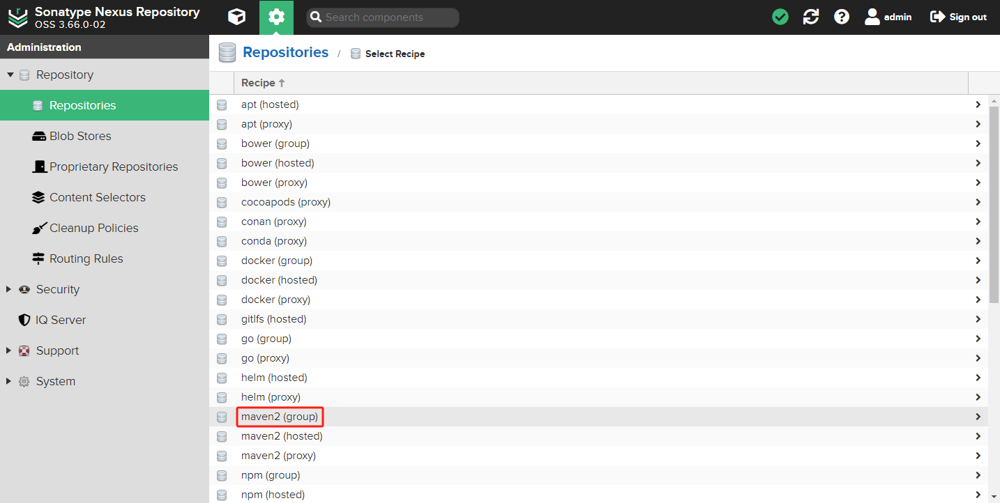

配置 `group` 仓库 *Name*（例如：`gradle-group`）和 *Blob store* 存储位置。

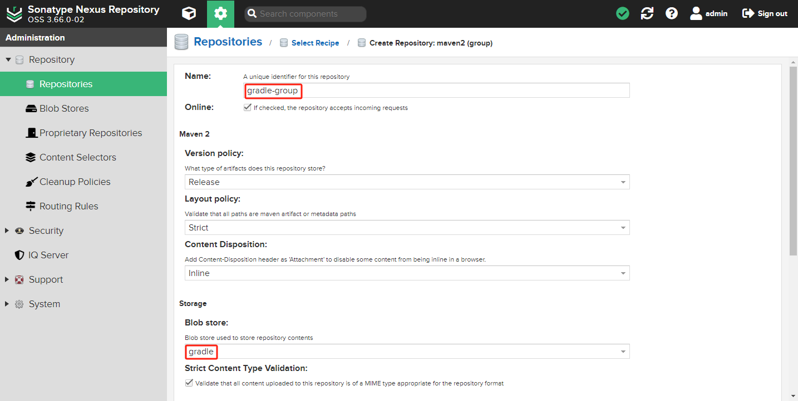

添加成员存储库 *Member repositories*，并点击 *Create repository* 创建存储库。

将上面添加的所有存储库，添加到 `gradle-group` 组存储库中。`maven-public` 是 Nexus 默认存在的组存储库，包含了 Maven 中央存储库。

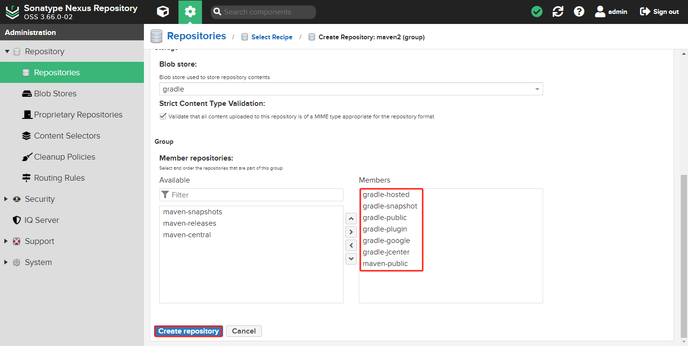

::: tip 注意顺序
建议将本地存储库放在列表中高于代理存储库的位置。对于代理存储库，存储库管理器可能需要检查远程存储库，这将比本地存储库查找产生更多开销

可以用 **拖动** 的方式修改顺序
:::

## 本地上传

在主页点击 *Upload*，选择要保存的存储库 `gradle-hosted`（之前创建的本地存储库）。这将弹出一个表单，供您选择要上传的文件并提供其他详细信息。

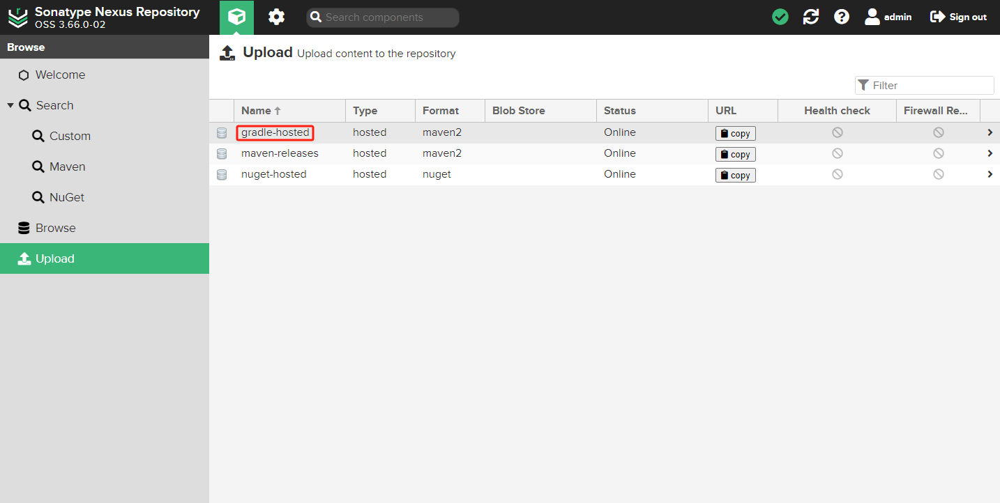

例如：上传 Gradle 软件包（`gradle-6.5-all.zip`。

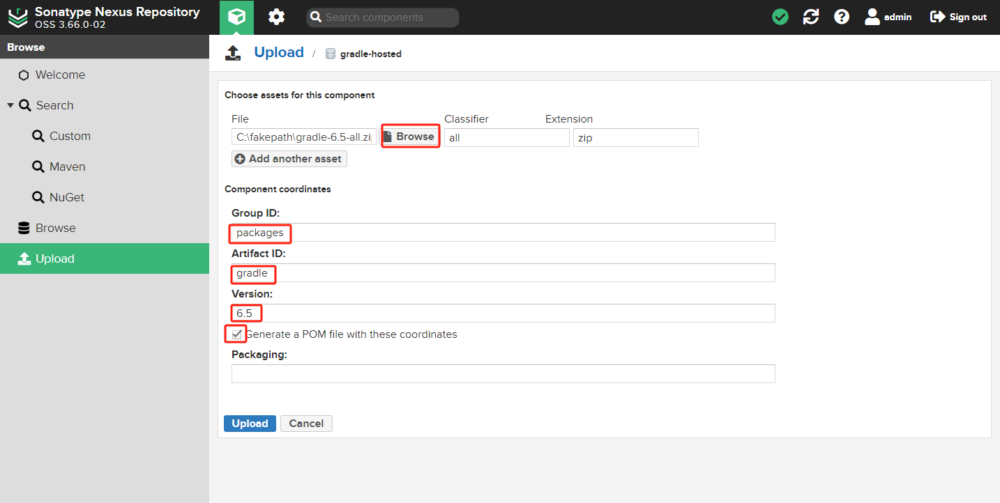

- **File**：本地保存文件地址
- **Extension**：包的后缀名。默认自动生成，否则手动填写
- **Group ID**：组 ID
- **Artifact ID**：包的名字
- **Version**：版本号
- **Generate a POM file with these coordinates**：是否生成 POM 文件。默认没有勾选，这里勾选

查看上传的包 `gradle-6.5-all.zip`。依次点击 *Browse -> gradle-hosted*。包含 pom、path 等信息。

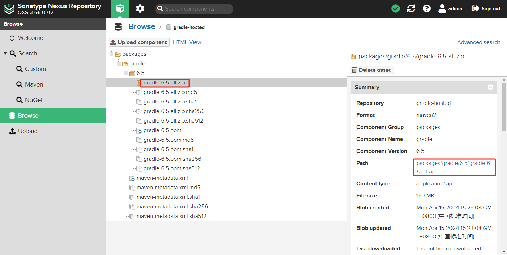

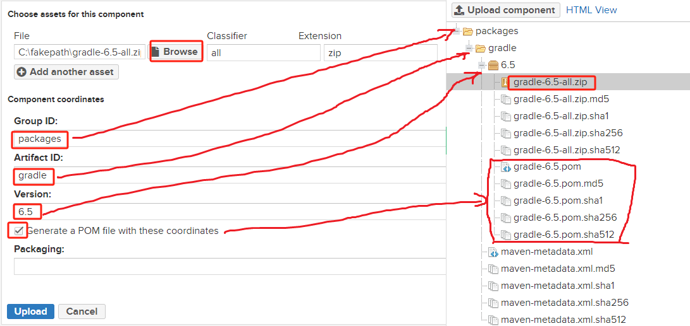

## 引用

在 Gradle 中配置 Nexus 仓库地址。

### Gradle 存储库配置

```gradle
repositories {
    maven {
        url "http://localhost:8081/repository/gradle-group/"
    }
}
```

### allowInsecureProtocol 参数

由于使用 Gradle 高版本进行构建时，Gradle 默认不接受 maven 通过不安全的 `http` 连接与存储库进行通信。参考 [gradle-7.0.2 官网描述](https://docs.gradle.org/7.0.2/dsl/org.gradle.api.artifacts.repositories.UrlArtifactRepository.html#org.gradle.api.artifacts.repositories.UrlArtifactRepository:allowInsecureProtocol)。

```gradle
repositories {
    maven {
        allowInsecureProtocol true
        url "http://localhost:8081/repository/gradle-group/"
    }
}
```

- **allowInsecureProtocol**：参数指定是否可以接受通过不安全的 HTTP 连接与存储库进行通信

### Gradle 安装包

Gradle 安装包不能自动上传到 Nexus 存储库，只能手动上传到 Nexus 存储库。

在 Gradle 项目中下载安装包方法：

1. 使用官网地址下载：`distributionUrl=https\://services.gradle.org/distributions/gradle-7.0.2-bin.zip`
2. 上传到 Nexus 存储库，从 Nexus 存储库下载：`distributionUrl=http\://localhost:8081/repository/gradle-group/packages/gradle/7.0.2/gradle-7.0.2-bin.zip`
3. 从国内腾讯源下载：`distributionUrl=https\://mirrors.cloud.tencent.com/gradle/gradle-7.0.2-bin.zip`

### Gradle 中的代理和身份验证

使用类似于以下示例的块配置身份验证：

```gradle
repositories {
    maven {    
        credentials {
            username "user"
            password "passwd"
        }
        url "http://localhost:8081/repository/gradle-group/"
    }
}
```

如果 Gradle 安装包从 Nexus 存储库中下载，而 Nexus 存储库又拒绝匿名用户访问，在配置 `distributionUrl` 时，在 URL 中包含用户名和密码即可。

```properties
distributionUrl=http\://user:passwd@localhost:8081/repository/gradle-group/packages/gradle/7.0.2/gradle-7.0.2-bin.zip
```
