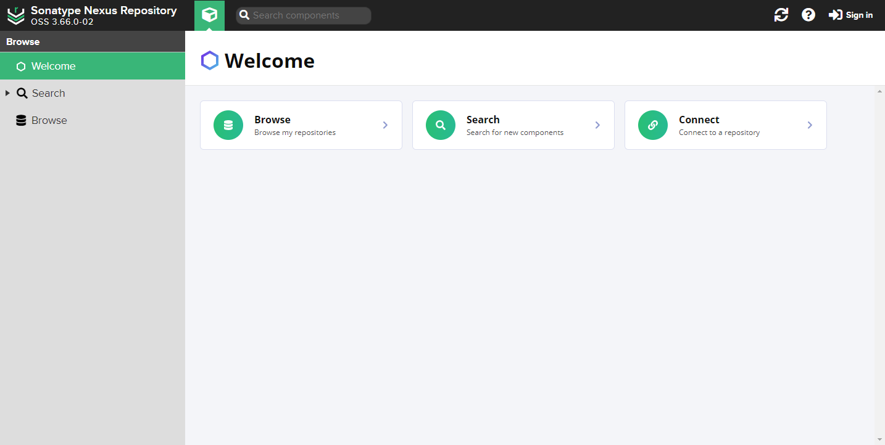
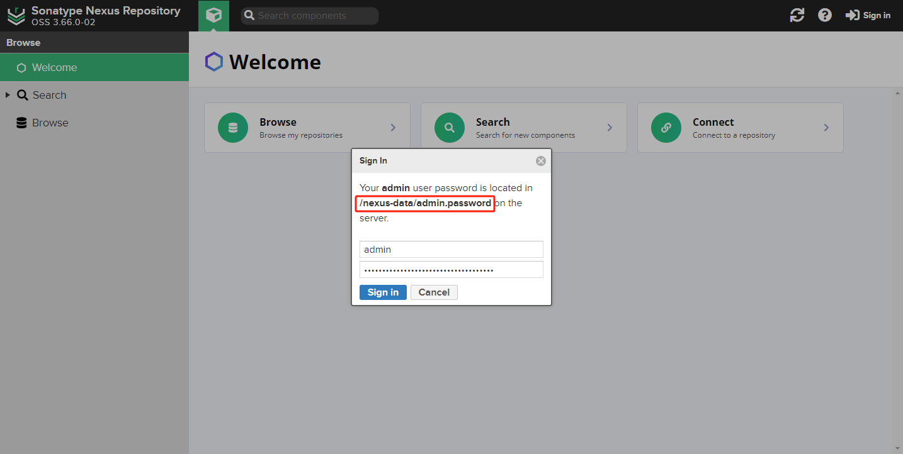
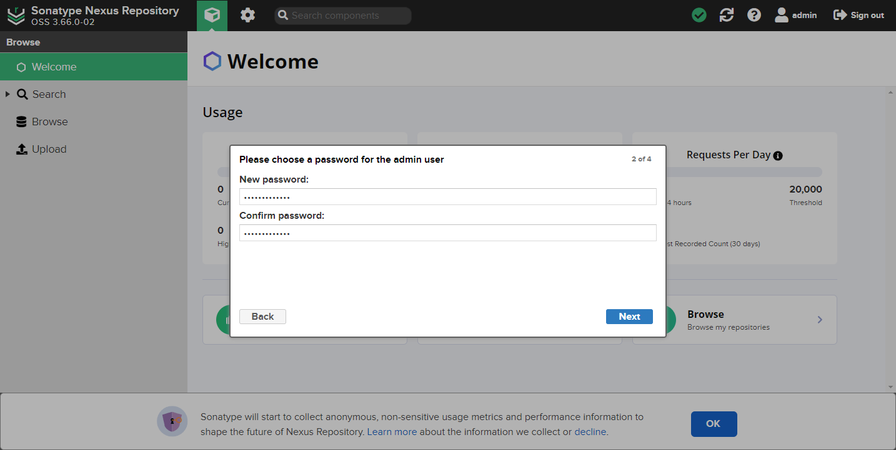
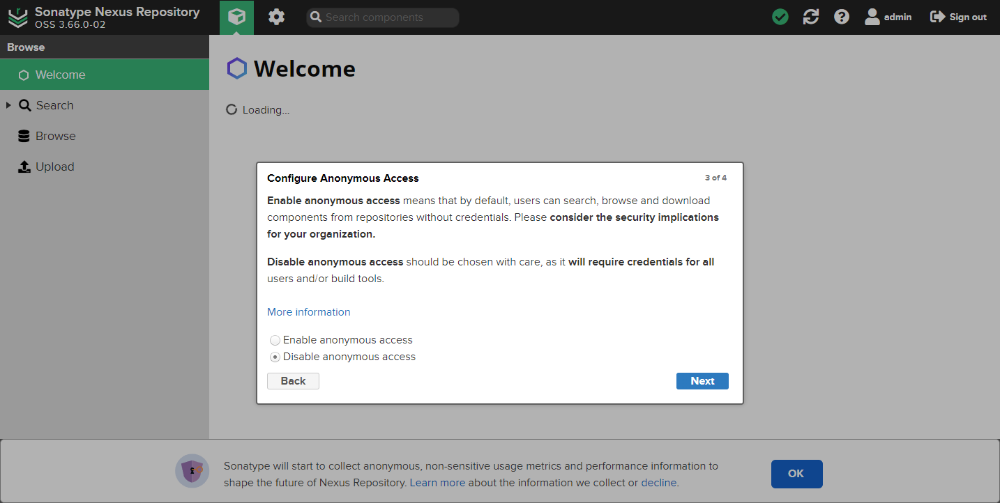
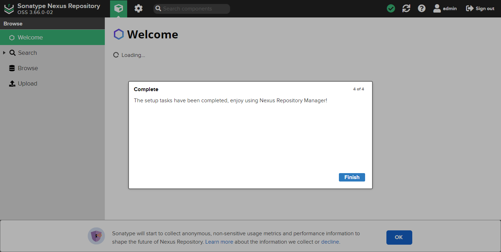

Nexus 3.x 官网 [下载地址](https://help.sonatype.com/en/download-archives---repository-manager-3.html)

Nexus Repository `3.66.0` 及之前版本需要 Java 8 运行时环境（JRE）。

版本 `3.67.0+` 还支持 Java 11 JRE。

## 基础环境

安装 JDK 环境，Nexus 需要 JDK 来运行。Nexus Repository `3.66.0` 及之前版本需要 Java 8 运行时环境（JRE），`3.67.0+` 还支持 Java 11 JRE。

- [Java 安装教程](../../dev_env/jdk.md)

Sonatype Nexus 存储库系统要求 CPU 最小 4 核，[参考官网](https://help.sonatype.com/en/sonatype-nexus-repository-system-requirements.html)。

## Linux 安装

### 创建用户

使用 `nexus` 用户启动 Nexus 服务。创建 `nexus` 用户密码，并加入 `sudoers` 组。

```bash
sudo useradd -s /bin/bash -m nexus
sudo passwd nexus

sudo vim /etc/sudoers  # 以下内容添加到最后
nexus ALL=(ALL) NOPASSWD:ALL
```

切换到 `nexus` 用户，创建安装目录并修改权限。

```bash
sudo su - nexus
sudo mkdir /opt/nexus
sudo chown -R nexus:nexus /opt/nexus
```

### 解压安装包

从官网下载 [nexus-3.66.0-02-unix.tar.gz](https://help.sonatype.com/en/download-archives---repository-manager-3.html) 安装包并解压。

```bash
cd /opt/nexus
tar -zxf nexus-3.66.0-02-unix.tar.gz
```

解压后有两个文件：

- **nexus-3.66.0-02**：安装目录（`$install-dir`）。包含 Nexus 运行所需的文件以及所有必需的其他组件，如：启动脚本、依赖 jar 包等
- **sonatype-work**：数据目录（`$data-dir`）。包含 Nexus 生成的配置文件、日志文件、仓库文件等

### 配置环境变量

在 `/etc/profile` 文件中添加以下内容，用于在系统任意地方都可以使用 `nexus` 命令。

```bash
export NEXUS_HOME=/home/nexus/nexus-3.66.0-02
export PATH=$PATH:$NEXUS_HOME/bin
```

使在不重启的情况下，更新 `/etc/profile` 文件。

```bash
source /etc/profile
```

### 添加系统服务

用 `systemctl` 命令管理 Nexus 服务。

在 `/etc/systemd/system/` 目录下，创建 `nexus.service` 文件并添加以下内容：

```sevice
[Unit]
Description=nexus service
After=syslog.target network.target

[Service]
Type=forking
LimitNPROC=65536
LimitNOFILE=65536
User=nexus
ExecStart=/opt/nexus/nexus-3.66.0-02/bin/nexus start
ExecStop=/opt/nexus/nexus-3.66.0-02/bin/nexus stop
Restart=on-abort

[Install]
WantedBy=multi-user.target
```

重新加载系统管理守护进程（`systemd`）的配置文件，并设置开机自启：

```bash
sudo systemctl daemon-reload
sudo systemctl enable nexus.service
```

### 访问服务

开启 Nexus 服务：

```bash
sudo systemctl start nexus.service
```

等待一会，用以下命令查看 `8081` 端口是否启动。

```bash
sudo netstat -anpt
```

查看 Nexus 服务 `log` 日志。

```bash
vim sonatype-work/nexus3/log/nexus.log
```

访问 `http://localhost:8081/` 地址。



### nexus 命令

`nexus` 命令如下：

- **./nexus start**：后台运行服务。在后台运行时，所有日志记录都将保存到应用程序日志文件（`sonatype-work/nexus3/log/nexus.log`）中
- **./nexus stop**：停止服务
- **./nexus run**：前台运行服务。在当前 shell 中运行并显示日志输出，<kbd>CTRL</kbd> + <kbd>C</kbd> 可以在相应的控制台上停止正在运行的应用程序
- **./nexus run-redirect**：前台运行服务
- **./nexus status**：查看服务状态
- **./nexus restart**：重启服务
- **./nexus force-reload**：重装服务

### 配置文件

查看官网 [配置文件](https://help.sonatype.com/en/configuring-the-runtime-environment.html) 说明。

Nexus 服务一些配置文件作用。

- **nexus-3.66.0-02/bin/nexus**：`nexus` 命令脚本文件
- **nexus-3.66.0-02/bin/nexus.rc**：配置 Nexus 服务运行用户文件
- **nexus-3.66.0-02/bin/nexus.vmoptions**：配置运行时环境。根据服务器内存设置合适参数，并可根据自身需求修改 Nexus 的数据和日志存储位置
- **nexus-3.66.0-02/etc/nexus-default.properties**：默认配置 Nexus 服务 IP 地址和端口文件。如果要修改 IP 或端口，将此文件在当前目录下复制为 `nexus.properties` 文件，在 `nexus.properties` 文件中修改
- **sonatype-work/nexus3/admin.password**：Nexus 服务的初始化密码文件
- **sonatype-work/nexus3/blobs**：所有未使用绝对存储路径定义的基于文件系统的 Blob 存储的父目录
- **sonatype-work/nexus3/log**：Nexus 服务的日志文件
- **sonatype-work/nexus3/log/nexus.log**：主存储库管理器应用程序日志，每天轮换和压缩。日志消息包含标准日志输出字段，包括日期/时间、日志级别、关联的线程、类和消息

## Docker 安装

### 拉取镜像

拉取 Gerrit 服务需要的镜像。

```bash
docker pull sonatype/nexus3
```

### 创建用户

使用 `nexus` 用户启动 Nexus 服务。

创建 `nexus` 用户，用户 UID 和 GID 值为 `200`。因为 Docker `nexus` 容器中 nexus 用户的 UID 和 GID 为 `200`，否则 nexus 容器启动失败。

```bash
sudo groupadd -g 200 nexus
sudo useradd -u 200 -g nexus -s /bin/bash -M nexus
```

### 创建挂载目录

创建挂载数据存储目录，并赋予 `nexus` 用户权限。

```bash
sudo mkdir -p /opt/nexus/nexus-data
sudo chown -R nexus:nexus /opt/nexus/
```

### 编辑 docker-compose.yaml 文件

使用 Docker Compose 创建 `nexus3` 服务。

在 `/opt/nexus/` 目录下创建 `docker-compose.yml` 部署文件，文件内容如下：

```yaml
version: "3"

services:
  nexus:
    image: sonatype/nexus3
    container_name: nexus3
    restart: always
    ports:
      - 8081:8081
    volumes:
      - /opt/nexus/nexus-data:/nexus-data
```

### 启动 nexus 服务

启动由 Docker Compose 项目定义的服务，并且让这些服务在后台以守护进程（`daemon`）模式运行。

在 `docker-compose.yml` 文件目录中使用以下命令启动服务。

```bash
sudo docker compose up -d
```

检查 nexus 容器日志，确保 Nexus 服务正常运行。

```bash
sudo docker logs -f nexus3
```

### 访问 Nexus 仓库

访问 `http://localhost:8081` 地址。


## 管理员登录 Nexus

点击 *Sign In* 登录，使用管理员 `admin` 用户登录，密码在 `admin.password` 文件中。

- Linux 安装 `admin.password` 文件位置

    ```bash
    cat /opt/nexus/sonatype-work/nexus3/admin.password
    ```

- Docker 安装 `admin.password` 文件位置

    ```bash
    cat /opt/nexus/nexus-data/admin.password
    ```



根据向导完成所需设置，点击 *Next*。


第一次登录需要修改密码，点击 *Next*。



是否启用匿名用户访问，点击 *Next*。



完成向导配置，点击 *Finish*。




